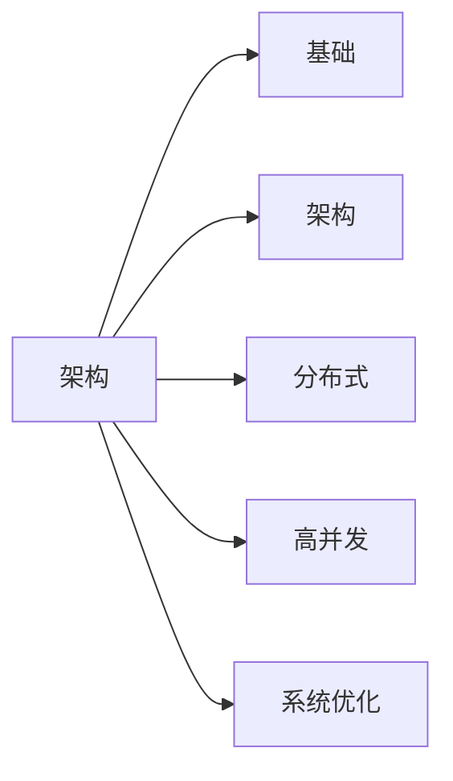

<!-- TOC -->

- [wt1814-note](#wt1814-note)
    - [总结](#总结)
    - [Java](#java)
        - [Java基础](#java基础)
        - [设计模式](#设计模式)
        - [JVM](#jvm)
        - [HotSpot](#hotspot)
        - [并发编程](#并发编程)
    - [数据库](#数据库)
        - [MySql](#mysql)
        - [搜索引擎ES](#搜索引擎es)
    - [SSM](#ssm)
        - [Spring](#spring)
        - [MyBatis](#mybatis)
    - [分布式框架](#分布式框架)
        - [SpringBoot](#springboot)
        - [SpringCloud](#springcloud)
        - [Dubbo](#dubbo)
        - [Zookeeper](#zookeeper)
        - [ServiceMesh](#servicemesh)
    - [分布式](#分布式)
        - [分布式理论](#分布式理论)
        - [分布式ID](#分布式id)
        - [分布式事务](#分布式事务)
        - [分布式锁](#分布式锁)
    - [高并发](#高并发)
        - [高并发相关概念](#高并发相关概念)
        - [缓存](#缓存)
            - [缓存介绍](#缓存介绍)
            - [Redis](#redis)
        - [限流降级](#限流降级)
        - [MQ](#mq)
            - [RocketMQ](#rocketmq)
            - [Kafka](#kafka)
    - [Error](#error)
    - [架构设计](#架构设计)
    - [项目构建基础](#项目构建基础)
    - [系统设计](#系统设计)
    - [Web服务器与中间件](#web服务器与中间件)
        - [Web服务器](#web服务器)
            - [tomcat](#tomcat)
        - [任务调度](#任务调度)
        - [安全框架shiro](#安全框架shiro)
        - [工作流](#工作流)
        - [规则引擎](#规则引擎)
        - [分布式文件存储](#分布式文件存储)
    - [计算机网络](#计算机网络)
        - [负载均衡](#负载均衡)
    - [网络IO/分布式通信](#网络io分布式通信)
        - [通信基础](#通信基础)
        - [webSocket协议](#websocket协议)
        - [NIO](#nio)
        - [Netty通信框架](#netty通信框架)
        - [其他](#其他)
    - [源码搭建汇总](#源码搭建汇总)
    - [Linux操作系统](#linux操作系统)
    - [Linux服务器搭建](#linux服务器搭建)
        - [Linux基础](#linux基础)
        - [Linux服务器](#linux服务器)
        - [DevOps介绍](#devops介绍)
        - [搭建-研发](#搭建-研发)
    - [Docker和k8s](#docker和k8s)
        - [搭建-需求、测试](#搭建-需求测试)
        - [监控和统计](#监控和统计)
    - [常用研发工具](#常用研发工具)
    - [1.1. 面试](#11-面试)
        - [1.1.1. 面试技巧](#111-面试技巧)
        - [1.1.2. 项目总结](#112-项目总结)
    - [算法](#算法)
    - [前端知识](#前端知识)
    - [测试](#测试)
    - [python](#python)

<!-- /TOC -->

# wt1814-note  
★★★★★★★★★★★★★★★★★★★★★★★★★★★★★★★★★
  

## 总结
[知识点概况](/docs/survey.md)  
[大总结1](/docs/summary.md)  
[大总结2](/docs/summaryTwo.md)  

## Java  
### Java基础
[Java基础](/docs/java/basis/JavaBasic.md)  
&emsp; [关键字](/docs/java/basis/keyword.md)  
&emsp; [内部类](/docs/java/basis/InnerClass.md)  
&emsp; [代码块](/docs/java/basis/CodeBlock.md)  
&emsp; [枚举和数据字典](/docs/java/basis/Enum.md)  
&emsp; [命名规范](/docs/java/basis/standard.md)  
[Java基础数据类型](/docs/java/basis/DataType.md)  
&emsp; [Object](/docs/java/basis/Object.md)  
&emsp; [String](/docs/java/basis/String.md)  
&emsp; [Java基本数据类型](/docs/java/basis/BasicsDataType.md)  
[Java集合框架](/docs/java/Collection/CollectionFramework.md)  
&emsp; [HashMap使用](/docs/java/Collection/HashMapUse.md)  
&emsp; [★★★HashMap源码](/docs/java/Collection/HashMapSource.md)  
&emsp; [★★★HashMap安全](/docs/java/Collection/HashMapSecurity.md)  
&emsp; [List和Set](/docs/java/Collection/Collection.md)  
[JDK1.8](/docs/java/JDK8/JDK8.md)  
&emsp; [Lambda](/docs/java/JDK8/Lambda.md)  
&emsp; [Stream](/docs/java/JDK8/Stream.md)  
&emsp; [Optional](/docs/java/JDK8/Optional.md)  
&emsp; [DateTime](/docs/java/JDK8/DateTime.md)  
[Java异常](/docs/java/basis/JavaException.md)  
[IO](/docs/java/IO/JavaIO.md)  
&emsp; [读取项目Resources下文件](/docs/java/IO/readResources.md)  
&emsp; [上传下载](/docs/java/IO/Upload.md)  
&emsp; [导入导出](/docs/java/IO/Import.md)  
&emsp; [阿里云OSS](/docs/java/IO/OSS.md)  
&emsp; [文件预览](/docs/java/IO/preview.md)  
[Java范型](/docs/java/basis/JavaParadigm.md)  
&emsp; [范型使用](/docs/java/basis/ParadigmUse.md)  
&emsp; [范型擦除](/docs/java/basis/ParadigmErase.md)  
[Java反射](/docs/java/basis/JavaReflex.md)  
&emsp; [Java反射运用](/docs/java/basis/JavaReflexUse.md)  
&emsp; [Java反射原理](/docs/java/basis/JavaReflexPrinciple.md)  
[自定义注解](/docs/java/basis/annotation.md)  
&emsp; [自定义注解+反射实现AOP](/docs/java/basis/annotationAndReflex.md)  
[SPI与线程上下文类加载器](/docs/java/basis/SPI.md)  
[SDK](/docs/java/basis/SDK.md)  
[Java探针](/docs/java/basis/probe.md)  
[对象池](/docs/java/basis/ObjectPool.md)  

### 设计模式  
[七大设计原则](/docs/java/Design/principles.md)  
&emsp; [面向抽象和面向接口](/docs/java/Design/abstract.md)  
&emsp; [UML](/docs/java/Design/UML.md)  
&emsp; [继承和组合/复用规则](/docs/java/Design/compose.md)  
[设计模式介绍](/docs/java/Design/design.md)  
&emsp; [创建型设计模式](/docs/java/Design/establish.md)  
&emsp; &emsp; [单例模式](/docs/java/Design/singleton.md)  
&emsp; &emsp; [单例与多例](/docs/java/Design/singletonMultiple.md)  
&emsp; &emsp; [简单工厂模式](/docs/java/Design/factory.md)  
&emsp; &emsp; [抽象工厂模式](/docs/java/Design/AbstractFactory.md)  
&emsp; &emsp; [建造者模式](/docs/java/Design/build.md)  
&emsp; &emsp; [原型模式](/docs/java/Design/prototype.md)  
&emsp; [结构型设计模式](/docs/java/Design/structure.md)  
&emsp; &emsp; [适配器模式](/docs/java/Design/adapter.md)   
&emsp; &emsp; [代理模式](/docs/java/Design/proxy.md)   
&emsp; &emsp; &emsp; [动态编程](/docs/java/Design/DynamicProgramming.md)  
&emsp; &emsp; &emsp; [JDK动态代理](/docs/java/Design/DynamicProxy.md)   
&emsp; &emsp; &emsp; [CGLIB代理](/docs/java/Design/CGLIB.md)   
&emsp; &emsp; [装饰器模式](/docs/java/Design/decorator.md)  
&emsp; &emsp; [桥接模式(if/else)](/docs/java/Design/Bridge.md)  
&emsp; &emsp; [外观模式/门面模式](/docs/java/Design/facade.md)   
&emsp; &emsp; [享元模式(池化技术)](/docs/java/Design/Enjoy.md)  
&emsp; [行为型设计模式](/docs/java/Design/behavior.md)  
&emsp; &emsp; [模板方法模式](/docs/java/Design/template.md)   
&emsp; &emsp; [策略模式(if/else)](/docs/java/Design/strategy.md)   
&emsp; &emsp; [责任链模式(if/else)](/docs/java/Design/chain.md)   
&emsp; &emsp; [观察者模式](/docs/java/Design/observer.md)   
[设计模式大讨论](/docs/java/Design/discuss.md)  
[设计模式混编](/docs/java/Design/zlc.md)  
[设计模式使用](/docs/java/Design/CommonlyUsed.md)  
&emsp; [Spring中经典的9种设计模式](/docs/java/Design/SpringDesign.md)  
&emsp; [8种Mybatis的设计模式](/docs/java/Design/MybatisDesign.md)  
&emsp; [【常用的设计模式】](/docs/java/Design/UsedDesign.md)  

### JVM  
[JVM总结](/docs/java/JVM/summary.md)  
[JDK、JRE、JVM](/docs/java/JVM/JDK、JRE、JVM.md)   
[编译成Class字节码文件](/docs/java/JVM/Class.md)  
&emsp; [字节码和汇编代码](/docs/java/JVM/Bytecode.md)  
[类加载](/docs/java/JVM/classLoading.md)  
&emsp; [JVM类的加载流程](/docs/java/JVM/classLoad.md)  
&emsp; [JVM类加载器详解（需要重写）](/docs/java/JVM/classLoader.md)  
[运行时数据区/内存结构](/docs/java/JVM/Memory.md)  
&emsp; [JVM内存结构](/docs/java/JVM/JVMMemory.md)  
&emsp; &emsp; [JVM栈](/docs/java/JVM/JVMStack.md)  
&emsp; &emsp; [逃逸分析](/docs/java/JVM/escape.md)  
&emsp; &emsp; [常量池详解](/docs/java/JVM/ConstantPool.md)  
&emsp; &emsp; [直接内存](/docs/java/JVM/DirectMemory.md)  
&emsp; &emsp; [类存储内存小结](/docs/java/JVM/MemorySummary.md)  
&emsp; [内存中的对象](/docs/java/JVM/MemoryObject.md)  
&emsp; &emsp; [对象的生命周期](/docs/java/JVM/ObjectPeriod.md)  
&emsp; &emsp; [Java对象大小](/docs/java/basis/ObjectSize.md)  
&emsp; [内存泄露/溢出](/docs/java/JVM/MemoryLeak.md)  
&emsp; [★★★JVM参数配置](/docs/java/JVM/ParameterConfiguration.md)  
[JVM执行](/docs/java/JVM/run.md)  
[GC](/docs/java/JVM/GC.md)  
&emsp; [GC-回收对象](/docs/java/JVM/GCProject.md)   
&emsp; [GC-回收位置/安全点](/docs/java/JVM/safePoint.md)  
&emsp; [回收算法与分代回收](/docs/java/JVM/generationRecovery.md)  
&emsp; &emsp; [Card Table & RSet](/docs/java/JVM/RSet.md)  
&emsp; [GC-垃圾回收器](/docs/java/JVM/GCReclaimer.md)  
&emsp; &emsp; [CMS回收器](/docs/java/JVM/CMS.md)  
&emsp; &emsp; [G1回收器](/docs/java/JVM/G1.md)  
&emsp; &emsp; [三色标记](/docs/java/JVM/TriMark.md)  
[JVM调优](/docs/java/JVM/tuning.md)  
&emsp; [JVM调优-基础](/docs/java/JVM/TuningBasic.md)  
&emsp; [JVM调优](/docs/java/JVM/tuningProblem.md)  
&emsp; [JVM问题排查](/docs/java/JVM/TroubleShooting.md)  
&emsp; &emsp; [MAT使用](/docs/java/JVM/mat.md)  
[Arthas](/docs/java/JVM/ArthasSummary.md)  
&emsp; [Arthas工具](/docs/java/JVM/Arthas.md)  
&emsp; [Arthas常用命令](/docs/java/JVM/ArthasCommand.md)  
&emsp; [线上Debug](/docs/java/JVM/OnlineDebug.md)  

<!-- 
&emsp; [JVM排查案例](/docs/java/JVM/case.md)  
-->

### HotSpot  
[HotSpot](/docs/java/HotSpot/HotSpot.md)  

### 并发编程  
[并发编程总结](/docs/java/concurrent/summary.md)  
[多线程和并发](/docs/java/concurrent/MultithreadingAndConcurrency.md)  
&emsp; [Thread.java](/docs/java/concurrent/thread.md)  
&emsp; &emsp; [Thread类详解](/docs/java/concurrent/threadClass.md)  
&emsp; &emsp; &emsp; [线程状态](/docs/java/concurrent/threadState.md)  
&emsp; &emsp; &emsp; [线程停止与中断](/docs/java/concurrent/interrupt.md)  
&emsp; &emsp; [线程基本操作](/docs/java/concurrent/threadOperation.md)  
[线程池-多线程](/docs/java/concurrent/ThreadPool.md)  
&emsp; [线程池框架](/docs/java/concurrent/Executor.md)  
&emsp; [线程池使用](/docs/java/concurrent/PoolUse.md)  
&emsp; [ThreadPoolExecutor详解](/docs/java/concurrent/ThreadPoolExecutor.md)  
&emsp; [线程池的正确使用](/docs/java/concurrent/ThreadPoolUse.md)  
&emsp; &emsp; [线程池的异常](/docs/java/concurrent/ThreadPoolException.md)  
&emsp; [ForkJoinPool详解](/docs/java/concurrent/ForkJoinPool.md)  
&emsp; [任务执行Future](/docs/java/concurrent/Future.md)  
&emsp; &emsp; [【CompletionService】](/docs/java/concurrent/CompletionService.md)  
&emsp; &emsp; [【CompletableFuture】](/docs/java/concurrent/CompletableFuture.md)  
&emsp; &emsp; [获取多线程执行结果](/docs/java/concurrent/execResult.md)  
[并发编程](/docs/java/concurrent/MultiThread.md)  
&emsp; [线程安全问题](/docs/java/concurrent/ConcurrentPrinciple.md)  
&emsp; &emsp; [CPU多级缓存及并发安全](/docs/java/concurrent/ConcurrencyProblem.md)  
&emsp; &emsp; [伪共享问题](/docs/java/concurrent/PseudoSharing.md)  
&emsp; &emsp; [硬件层解决并发安全](/docs/java/concurrent/HardwareConcurrencySolve.md)  
&emsp; &emsp; [Java解决并发安全](/docs/java/concurrent/ConcurrencySolve.md)  
&emsp; [线程安全解决方案](/docs/java/concurrent/ThreadSafety.md)  
&emsp; &emsp; [Synchronized介绍](/docs/java/concurrent/SynApply.md)  
&emsp; &emsp; [Synchronized使用](/docs/java/concurrent/SysUse.md)  
&emsp; &emsp; [Synchronized使用是否安全](/docs/java/concurrent/SynUse.md)  
&emsp; &emsp; [~~Synchronized底层原理~~](/docs/java/concurrent/SynBottom.md)  
&emsp; &emsp; [Synchronized优化](/docs/java/concurrent/SynOptimize.md)  
&emsp; &emsp; [Volatile](/docs/java/concurrent/Volatile.md)  
&emsp; &emsp; [ThreadLocal原理](/docs/java/concurrent/ThreadLocal.md)  
&emsp; &emsp; [ThreadLocal应用](/docs/java/concurrent/ThreadLocalUse.md)  
&emsp; &emsp; [FastThreadLocal](/docs/java/concurrent/FastThreadLocal.md)  
&emsp; [线程通信(生产者消费者问题)](/docs/java/concurrent/ThreadCommunication.md)  
&emsp; [线程活跃性](/docs/java/concurrent/Activity.md)  
[J.U.C包](/docs/java/concurrent/ConcurrentPackage.md)  
&emsp; [CAS](/docs/java/concurrent/CAS.md)  
&emsp; [AQS](/docs/java/concurrent/AQS.md)  
&emsp; &emsp; [LockSupport](/docs/java/concurrent/LockSupport.md)  
&emsp; [Lock](/docs/java/concurrent/Lock.md)  
&emsp; &emsp; [ReentrantLock使用](/docs/java/concurrent/ReentrantLockUse.md)  
&emsp; &emsp; [ReentrantLock解析](/docs/java/concurrent/ReentrantLock.md)  
&emsp; &emsp; [Condition](/docs/java/concurrent/Condition.md)  
&emsp; &emsp; [读写锁](/docs/java/concurrent/ReadWriteLock.md)  
&emsp; [Atmoic](/docs/java/concurrent/Atmoic.md)  
&emsp; &emsp; [AtomicStampedReference与AtomicMarkableReference](/docs/java/concurrent/AtomicStampedReference.md)  
&emsp; &emsp; [LongAdder](/docs/java/concurrent/LongAdder.md)  
&emsp; [Collections](/docs/java/concurrent/jihe.md)  
&emsp; &emsp; [CopyOnWriteArrayList](/docs/java/concurrent/CopyOnWriteArrayList.md)  
&emsp; &emsp; [ConcurrentHashMap，JDK1.8](/docs/java/concurrent/ConcurrentHashMap.md)  
&emsp; &emsp; [ConcurrentHashMap，JDK1.7](/docs/java/concurrent/ConcurrentHashMap7.md)  
&emsp; &emsp; [BlockingQueue](/docs/java/concurrent/BlockingQueue.md)  
&emsp; [tools](/docs/java/concurrent/tools.md)  
&emsp; &emsp; [CountDownLatch](/docs/java/concurrent/CountDownLatch.md)  
&emsp; &emsp; [CyclicBarrier](/docs/java/concurrent/CyclicBarrier.md)  
&emsp; &emsp; [Semaphore](/docs/java/concurrent/Semaphore.md)  
&emsp; &emsp; [Exchanger](/docs/java/concurrent/Exchanger.md)  

<!-- 
[并发框架Disruptor](/docs/java/concurrent/disruptor.md)  
-->

## 数据库  

### MySql
[数据建模](/docs/SQL/modeling.md)  
&emsp; [字段](/docs/SQL/Field.md)  
&emsp; [工具](/docs/SQL/modelingTools.md)  
[SQL语句](/docs/SQL/SQLSentence.md)  
&emsp; [基本查询语句](/docs/SQL/basicSelect.md)  
&emsp; &emsp; [limit](/docs/SQL/limit.md)  
&emsp; [连接查询](/docs/SQL/joinSelect.md)  
&emsp; [高级查询](/docs/SQL/trans.md)  
&emsp; [联合主键与复合主键](/docs/SQL/CompositeKey.md)  
[SQL其他](/docs/SQL/SQLOther.md)  
&emsp; [MySql函数](/docs/SQL/MySQLFunction.md)  
&emsp; [数据库对象](/docs/SQL/DatabaseObject.md)  
&emsp; [数据库连接池](/docs/SQL/connectionPool.md)  
[MySQL运维](/docs/SQL/MySqlMonitor.md)  
&emsp; [MySql审核平台](/docs/SQL/examine.md)  
[★★★索引事务锁](/docs/SQL/IndexTransactionLock.md)   
&emsp; [索引底层原理](/docs/SQL/IndexPrinciple.md)  
&emsp; &emsp; [联合索引](/docs/SQL/JointIndex.md)  
&emsp; [各种索引](/docs/SQL/IndexKnowledge.md)  
&emsp; [MySql事务](/docs/SQL/transaction.md)  
&emsp; [MySql-MVCC（读写问题）](/docs/SQL/MVCC.md)  
&emsp; [MySql锁（写写问题）](/docs/SQL/lock.md)  
&emsp; [MySql死锁和锁表](/docs/SQL/LockProblem.md)  
[★★★SQL优化](/docs/SQL/SQLOptimization.md)  
&emsp; [慢查询（监控）](/docs/SQL/Slowlog.md)  
&emsp; [SQL分析](/docs/SQL/Analysis.md)  
&emsp; &emsp; [explain](/docs/SQL/explain.md)  
&emsp; [~~SQL语句优化~~](/docs/SQL/SQLStatement.md)  
&emsp; [索引优化](/docs/SQL/index.md)  
&emsp; [系统优化](/docs/SQL/Fragment.md)  
&emsp; [优化案例](/docs/SQL/case.md)  
[数据库分布式](/docs/SQL/DistributedDatabase.md)  
&emsp; [大数据量操作](/docs/SQL/largeData.md)  
&emsp; [MySql瓶颈](/docs/SQL/Bottleneck.md)  
&emsp; [数据库分布式](/docs/SQL/Distributed.md)  
&emsp; [主从复制](/docs/SQL/replication.md)  
&emsp; &emsp; [主从复制原理](/docs/SQL/ReplicationPrinciple.md)  
&emsp; &emsp; [主从复制实现](/docs/SQL/ReplicationRealize.md)  
&emsp; &emsp; [主从复制的问题](/docs/SQL/replicationProblem.md)  
&emsp; &emsp; [高可用实现方案](/docs/SQL/Available.md)  
&emsp; &emsp; [读写分离实现](/docs/SQL/ReadWrite.md)  
&emsp; &emsp; [多数据源](/docs/SQL/MultipleSources.md)  
&emsp; [分区](/docs/SQL/partition.md)  
&emsp; [★★★分库分表](/docs/SQL/sub.md)  
&emsp; &emsp; [分库分表带来的问题](/docs/SQL/subProblem.md)  
&emsp; &emsp; [★★★分库分表查询](/docs/SQL/subSelect.md)  
&emsp; &emsp; [分库分表后分页查询](/docs/SQL/subSelectLimit.md)  
&emsp; &emsp; [分库分表后聚合查询](/docs/SQL/aggregate.md)  
&emsp; [★★★数据迁移](/docs/projectImplement/implementation.md)  
&emsp; [数据库分布式实现](/docs/SQL/subRealize.md)  
&emsp; &emsp; [ShardingSphere](/docs/SQL/shardingsphere.md)  
&emsp; &emsp; [MyCat中间件](/docs/SQL/MyCat.md)  
[★★★分库分表和ES](/docs/SQL/shardingAndEs.md)  
[MySql架构原理](/docs/SQL/MySqlPrinciple.md)   
&emsp; [MySql运行流程](/docs/SQL/Framework.md)   
&emsp; [InnoDB插入更新流程](/docs/SQL/insert.md)  
&emsp; [【Server层】之binLog日志](/docs/SQL/BinLog.md)  
&emsp; &emsp; [binLog日志介绍](/docs/SQL/BinLogIntro.md)  
&emsp; &emsp; [binLog日志使用](/docs/SQL/binLogUse.md)  
&emsp; [【存储引擎层】](/docs/SQL/MySqlStorage.md)  
&emsp; [存储引擎InnoDB体系结构](/docs/SQL/InnoDB.md)  
&emsp; [InnoDB内存结构-性能](/docs/SQL/memory.md)  
&emsp; &emsp; [BufferPool](/docs/SQL/bufferPoolNew.md)  
&emsp; &emsp; [ChangeBuffer](/docs/SQL/ChangeBuffer.md)  
&emsp; &emsp; [AdaptiveHashIndex](/docs/SQL/AdaptiveHashIndex.md)  
&emsp; [InnoDB磁盘结构-可靠性](/docs/SQL/disk.md)  
&emsp; &emsp; [redoLog日志](/docs/SQL/redoLog.md)  
&emsp; &emsp; [undoLog日志](/docs/SQL/undoLog.md)  
&emsp; &emsp; [数据落盘到表空间](/docs/SQL/TableSpace.md)  
&emsp; &emsp; [DoubleWrite](/docs/SQL/DoubleWrite.md)  
&emsp; [【server层和存储引擎层】两阶段提交和崩溃恢复](/docs/SQL/CrashRecovery.md)  

### 搜索引擎ES  
[ES基本概念](/docs/ES/basicConcepts.md)  
&emsp; [★★★~~ES底层数据结构~~](/docs/ES/BottomStructure.md)  
[ES使用](/docs/ES/useTutorials.md)  
&emsp; [★★★ES建模](/docs/ES/modeling.md)  
&emsp; &emsp; [★★★ES分片](/docs/ES/ESShare.md)  
&emsp; [★★★同步数据到ES](/docs/ES/synES.md)  
&emsp; [Elasticsearch操作客户端](/docs/ES/ElasticsearchREST.md)  
&emsp; &emsp; [ES可视化客户端](/docs/ES/visualization.md)  
&emsp; [Java客户端](/docs/ES/JavaRestClient.md)  
&emsp; &emsp; [【Java API】](/docs/ES/JavaSearch.md)  
&emsp; &emsp; [ES异步搜索](/docs/ES/AsyncSearch.md)  
&emsp; [索引基本操作](/docs/ES/index.md)  
&emsp; &emsp; [PB级别的大索引如何设计？](/docs/ES/IndexDesign.md)  
&emsp; &emsp; [索引管理](/docs/ES/indexMaintain.md)  
&emsp; [映射详解](/docs/ES/mapping.md)  
&emsp; [文档操作](/docs/ES/document.md)  
&emsp; &emsp; [***文档评分](/docs/ES/documentScore.md)  
&emsp; [检索操作](/docs/ES/search.md)  
&emsp; &emsp; [结构化检索](/docs/ES/Structured.md)  
&emsp; &emsp; [全文检索](/docs/ES/fullText.md)  
&emsp; &emsp; [排序/相关度/评分机制](/docs/ES/score.md)  
&emsp; &emsp; [多字段搜索](/docs/ES/MultiField.md)  
&emsp; &emsp; [聚合查询](/docs/ES/togetherSearch.md)  
&emsp; &emsp; [分页查询](/docs/ES/limitSearch.md)  
&emsp; &emsp; [多表关联](/docs/ES/multiTable.md)  
&emsp; &emsp; [高亮显示](/docs/ES/highLight.md)  
&emsp; [高级操作](/docs/ES/AdvancedOperations.md)  
&emsp; &emsp; [检索模版](/docs/ES/searchTemplate.md)  
&emsp; &emsp; [脚本查询](/docs/ES/ScriptQuery.md)  
&emsp; &emsp; [预匹配器](/docs/ES/PreMatching.md)  
&emsp; [ES自定义扩展词库](/docs/ES/thesaurus.md)  
&emsp; [★★★使用ES中的一些问题](/docs/ES/problem.md)  
[★★★ES原理](/docs/ES/principle.md)  
&emsp; [Elasticsearch搜索为什么那么快？](/docs/ES/SearchFast.md)  
&emsp; [ES集群运行原理](/docs/ES/ClusterPrinciple.md)  
&emsp; [ES增删改原理](/docs/ES/write.md)  
&emsp; [ES缓存](/docs/ES/ESCache.md)  
&emsp; [相关性和打分过程](/docs/ES/correlation.md)  
[★★★ES优化](/docs/ES/ESoptimization.md)  
&emsp; [ES优化](/docs/ES/optimization.md)  
&emsp; [搜索速度优化](/docs/ES/SearchSpeed.md)  
&emsp; [写入速度和磁盘使用量优化](/docs/ES/WriteSpeed.md)  
&emsp; [故障判断](/docs/ES/FaultJudgment.md)  
[ES运维](/docs/ES/Operation.md)  
&emsp; [ES搭建](/docs/ES/build.md)  
&emsp; &emsp; [ES配置文件](/docs/ES/configure.md)  
&emsp; &emsp; [内存设置](/docs/ES/heap.md)  
&emsp; [ES集群操作](/docs/ES/ClusterOperation.md)  
&emsp; [ES监控](/docs/ES/monitor.md)  
&emsp; [使用ES中的一些问题](/docs/ES/problem.md)  
[ELK/EFK](/docs/ES/EFK.md)    
&emsp; [EFK介绍](/docs/ES/EFKIntroduce.md)  
&emsp; [Elk搭建](/docs/devAndOps/build/elk.md)   
&emsp; [EFK使用](/docs/ES/EFKUse.md)  
&emsp; &emsp; [FileBeat和Logstash详解](/docs/ES/Logstash.md)  
&emsp; &emsp; [Kibana使用](/docs/ES/Kibana.md)  

[ES重制](/docs/ESRemake/ESRemake.md)    

-------

## SSM  
### Spring  
[Spring汇总](/docs/SSM/Spring/SpringSummary.md)  
[Spring介绍](/docs/SSM/Spring/Spring.md)  
[Spring使用](/docs/SSM/Spring/SpringUse.md)  
[学习Spring源码的感悟](/docs/SSM/Spring/thinking.md)  
[手写Spring](/docs/SSM/Spring/HandwrittenSpring.md)  
[Spring容器刷新（IOC）](/docs/SSM/Spring/SpringIOC.md)  
&emsp; [容器初始化详解](/docs/SSM/Spring/ContainerInit.md)  
[Spring依赖注入（DI）](/docs/SSM/Spring/SpringDI.md)  
&emsp; [循环依赖](/docs/SSM/Spring/feature/CircularDepend.md)  
&emsp; [SpringBean生命周期](/docs/SSM/Spring/SpringBean.md)  
[Spring容器扩展](/docs/SSM/Spring/feature/ContainerFeature.md)  
&emsp; [可二次开发常用接口(扩展性)](/docs/SSM/Spring/feature/SecendDeve.md)  
&emsp; &emsp; [FactoryBean](/docs/SSM/Spring/feature/FactoryBean.md)  
&emsp; &emsp; [事件多播器](/docs/SSM/Spring/feature/EventMulticaster.md)  
&emsp; &emsp; [事件](/docs/SSM/Spring/feature/Event.md)  
&emsp; &emsp; [Aware接口](/docs/SSM/Spring/feature/Aware.md)  
&emsp; &emsp; [后置处理器](/docs/SSM/Spring/feature/BeanFactoryPostProcessor.md)  
&emsp; &emsp; [InitializingBean](/docs/SSM/Spring/feature/InitializingBean.md)  
&emsp; [自定义XML schema扩展](/docs/SSM/Spring/feature/XMLSchema.md)  
[SpringAOP](/docs/SSM/Spring/SpringAOP.md)  
&emsp; [AOP基本概念](/docs/SSM/Spring/AOP.md)  
&emsp; [SpringAOP教程](/docs/SSM/Spring/SpringAOPUse.md)  
&emsp; [SpringAOP解析](/docs/SSM/Spring/SpringAOPAnalysis.md)  
[Spring事务](/docs/SSM/Spring/transaction.md)  
&emsp; [Spring事务](/docs/SSM/Spring/SpringTransaction.md)  
&emsp; [Spring事务问题](/docs/SSM/Spring/SpringTransactionInvalid.md)  
[SpringMVC](/docs/SSM/Spring/SpringMVC.md)  
&emsp; [SpringMVC使用教程](/docs/SSM/Spring/SpringMVCUse.md)  
&emsp; [SpringMVC解析](/docs/SSM/Spring/SpringMVCAnalysis.md)    
&emsp; [过滤器、拦截器、监听器](docs/web/subassembly.md)  

### MyBatis  
[MyBatis](/docs/SSM/MyBatis/MybatisSummary.md)  
[MyBatis使用](/docs/SSM/MyBatis/MybatisUse.md)  
&emsp; [MyBatis使用教程](/docs/SSM/MyBatis/Mybatis.md)  
&emsp; [MyBatis高级使用](/docs/SSM/MyBatis/MybatisSenior.md)  
&emsp; &emsp; [mybatis-generator](/docs/SSM/MyBatis/MybatisGenerator.md)  
&emsp; &emsp; [MyBatis大数据量查询](/docs/SSM/MyBatis/BigData.md)  
&emsp; &emsp; [PageHelper](/docs/SSM/MyBatis/PageHelper.md)  
[MyBatis解析](/docs/SSM/MyBatis/MybatisAnalysis.md)  
&emsp; [MyBatis架构](/docs/SSM/MyBatis/MybatisFramework.md)  
&emsp; [MyBatis SQL执行解析](/docs/SSM/MyBatis/MybatisExecutor.md)  
&emsp; &emsp; [sqlSession详解](/docs/SSM/MyBatis/selSession.md)  
&emsp; [Spring整合MyBatis原理](/docs/SSM/MyBatis/SpringMybatisPrinciple.md)  
&emsp; [MyBatis缓存](/docs/SSM/MyBatis/MybatisCache.md)  
&emsp; [MyBatis插件解析](/docs/SSM/MyBatis/MybatisPlugins.md)  
&emsp; &emsp; [MyBatis分页](/docs/SSM/MyBatis/MybatisPage.md)  
&emsp; [MyBatis日志体系](/docs/SSM/MyBatis/MybatisLog.md)   

------------

## 分布式框架  

### SpringBoot  
[SpringBoot总结](/docs/microService/SpringBoot/SpringBootSummary.md)  
[SpringBoot](/docs/microService/SpringBoot/SpringBoot.md)  
&emsp; [SpringBoot高级](/docs/microService/SpringBoot/BootHeigh.md)  
[SpringBoot源码](/docs/microService/SpringBoot/SpringBootSource.md)  
&emsp; [SpringBoot启动过程](/docs/microService/SpringBoot/SpringBootRun.md)  
&emsp; &emsp; [SpringApplication初始化](/docs/microService/SpringBoot/SpringApplicationInit.md)  
&emsp; &emsp; &emsp; [SPI及SpringFactoriesLoader](/docs/microService/SpringBoot/SpringFactoriesLoader.md)  
&emsp; &emsp; [run()方法运行过程](/docs/microService/SpringBoot/runProcess.md)  
&emsp; &emsp; [SpringBoot事件监听](/docs/microService/SpringBoot/EventListeners.md)  
&emsp; &emsp; [SpringBoot内置生命周期事件详解](/docs/microService/SpringBoot/SpringBootEvent.md)  
&emsp; &emsp; [SpringBoot事件回调机制](/docs/microService/SpringBoot/eventCallback.md)  
&emsp; [SpringBoot自动配置](/docs/microService/SpringBoot/AutomaticAssembly.md)  
&emsp; &emsp; [注解@SpringBootApplication(启动对象)](/docs/microService/SpringBoot/SpringBootApplication.md)  
&emsp; &emsp; [加载自动配置流程](/docs/microService/SpringBoot/ApplicationProcess.md)  
&emsp; &emsp; [内置Tomcat](/docs/microService/SpringBoot/Tomcat.md)  
[自定义strater](/docs/microService/SpringBoot/SpringBootStarter.md)  

### SpringCloud    
[Spring Cloud Netflix](/docs/microService/SpringCloudNetflix/Netflix.md)  
[注册中心和配置中心](/docs/microService/SpringCloudNetflix/register.md)  
&emsp; [Spring Cloud Eureka](/docs/microService/SpringCloudNetflix/Eureka.md)  
&emsp; [XXXnacos](/docs/microService/SpringCloudNetflix/nacos.md)  
[GateWay](/docs/microService/SpringCloudNetflix/GateWay.md)  
&emsp; [XXXSpring Cloud GateWay](/docs/microService/SpringCloudNetflix/CloudGateWay.md)  
&emsp; [Spring Cloud Zuul](/docs/microService/SpringCloudNetflix/Zuul.md)  
[Spring Cloud Ribbon](/docs/microService/SpringCloudNetflix/Ribbon.md)  
[Spring Cloud Feign](/docs/microService/SpringCloudNetflix/Feign.md)  
[Spring Cloud Hytrix](/docs/microService/SpringCloudNetflix/Hytrix.md)  
[链路](/docs/microService/SpringCloudNetflix/link.md)   
&emsp; [Spring Cloud Sleuth](/docs/microService/SpringCloudNetflix/Sleuth.md)  
&emsp; [链路SkyWalking](/docs/microService/SpringCloudNetflix/SkyWalking.md)  
[Spring Cloud Admin](/docs/microService/SpringCloudNetflix/SpringBootAdmin.md)  

### Dubbo  
[Dubbo总结](/docs/microService/dubbo/DubboSummary.md)  
[分布式服务治理](/docs/microService/dubbo/CloudAlibaba.md)  
[Spring Cloud Alibaba](/docs/microService/dubbo/SpringCloudAlibaba.md)  
[RPC介绍](/docs/microService/RPC.md)  
[Dubbo介绍](/docs/microService/dubbo/Dubbo.md)   
[Dubbo使用教程](/docs/microService/dubbo/DubboUse.md)  
&emsp; [Dubbo高级特性](/docs/microService/dubbo/DubboActualCombat.md)  
&emsp; [Dubbo-admin](/docs/microService/dubbo/DubboAdmin.md)  
&emsp; [Dubbo使用常见问题](/docs/microService/dubbo/problem.md)  
[Dubbo详解](/docs/microService/dubbo/DubboExplanate.md)  
&emsp; [Dubbo框架设计](/docs/microService/dubbo/design.md)  
&emsp; [暴露和引用服务](/docs/microService/dubbo/realization.md)  
&emsp; &emsp; [Dubbo和ZK](/docs/microService/dubbo/design.md)  
&emsp; &emsp; [Dubbo心跳机制](/docs/microService/dubbo/heartbeat.md)  
&emsp; &emsp; [Dubbo序列化和协议](/docs/microService/dubbo/Agreement.md)  
&emsp; &emsp; [Dubbo协议长连接](/docs/microService/dubbo/LongConnection.md)  
&emsp; [远程调用](/docs/microService/dubbo/remote.md)  
&emsp; &emsp; [Dubbo调用介绍](/docs/microService/dubbo/RemoteIntroduce.md)  
&emsp; &emsp; [Dubbo降级、容错、负载](/docs/microService/dubbo/Load.md)  
&emsp; [扩展点加载(SPI)](/docs/microService/dubbo/SPI.md)  
&emsp; &emsp; [获得指定拓展对象](/docs/microService/dubbo/getExtension.md)  
&emsp; &emsp; [获得自适应的拓展对象](/docs/microService/dubbo/getAdaptiveExtension.md)  
[Dubbo运行流程源码解析](/docs/microService/dubbo/DubboSource.md)  
&emsp; [初始化源码解析](/docs/microService/dubbo/dubboSpring.md)  
&emsp; [服务暴露源码解析](/docs/microService/dubbo/export.md)  
&emsp; [服务引用源码解析](/docs/microService/dubbo/introduce.md)  
&emsp; [服务调用源码解析](/docs/microService/dubbo/call.md)  
&emsp; [再次理解dubbo-rpc包](/docs/microService/dubbo/dubboRPC.md)  
&emsp; [netty在dubbo中的使用](/docs/microService/dubbo/dubboNetty.md)  

<!-- 
[Dubbo集群容错源码解析](/docs/microService/dubbo/DubboColonySource.md)  
&emsp; [服务目录源码解析](/docs/microService/dubbo/Directory.md)  
&emsp; [服务路由源码解析](/docs/microService/dubbo/Router.md)  
&emsp; [集群源码解析](/docs/microService/dubbo/Cluster.md)  
&emsp; [负载均衡源码解析](/docs/microService/dubbo/LoadBalance.md)  
-->

### Zookeeper
[Zookeeper原理](/docs/microService/dubbo/Zookeeper.md)  
&emsp; [ZAB](/docs/microService/dubbo/ZAB.md)  
&emsp; [Watcher](/docs/microService/dubbo/Watcher.md)  
[Zookeeper使用](/docs/microService/dubbo/ZookeeperUse.md)  
[Zookeeper问题](/docs/microService/dubbo/ZookeeperProblem.md)  

### ServiceMesh

## 分布式

### 分布式理论  
[分布式理论](/docs/microService/thinking/DistributedThink.md)  
[分布式和集群](/docs/system/distributed.md)   
[分布式理论CAP](/docs/microService/thinking/DistributedTheory.md)  
[分布式算法](/docs/microService/thinking/DistributedAlgorithm.md)  
&emsp; [一致性哈希](/docs/microService/thinking/consistent.md)  

### 分布式ID
[分布式ID常见解决方案](/docs/microService/thinking/DistributedID.md)  

### 分布式事务
[分布式事务](/docs/microService/thinking/DistriTransaction.md)  
&emsp; [单体服务多数据源(Spring分布式事务)](/docs/microService/thinking/SingleServiceMultipleSources.md)  
&emsp; [DTP及XA](/docs/microService/thinking/DTPAndXA.md)  
&emsp; &emsp; [JTA+Atomic/单体服务多数据源(Spring分布式事务)](/docs/microService/thinking/JTA.md)  
&emsp; [TCC汇总](/docs/microService/thinking/TCCSummary.md)  
&emsp; &emsp; [TCC](/docs/microService/thinking/TCC.md)   
&emsp; &emsp; [TCC问题](/docs/microService/thinking/TCCProblem.md)   
&emsp; &emsp; [TCC问题1](/docs/microService/thinking/TCCProblemOne.md)   
&emsp; [Saga](/docs/microService/thinking/Event.md)  
&emsp; [★★★消息模式](/docs/microService/thinking/news.md)   
&emsp; [分布式事务的选型和使用](/docs/microService/thinking/DistributedTransactionSelection.md)  
&emsp; [分布式事务框架](/docs/microService/thinking/framework.md)   
&emsp; &emsp; [★★★阿里Seata](/docs/microService/thinking/Seata.md)  

### 分布式锁
[分布式锁](/docs/microService/thinking/Lock.md)  
&emsp; [RedisLock](/docs/microService/thinking/redisLock.md)  
&emsp; [使用redis分布式锁的注意点](/docs/microService/thinking/redisLockProblems.md)  
&emsp; [Redisson](/docs/microService/thinking/Redisson.md)  
&emsp; &emsp; [SpringBoot整合Redisson](/docs/microService/thinking/BootRedisson.md)  
&emsp; [ZK分布式锁](/docs/microService/thinking/ZKLock.md)  
&emsp; [MySql分布式锁](/docs/microService/thinking/MySqlLock.md)  

------------

## 高并发
### 高并发相关概念
[高并发相关概念](/docs/system/DistributedHighConcurrency.md)   
[系统性能指标](/docs/system/performance.md)  
[并发系统三高](/docs/system/threeHigh.md)  
&emsp; [高可用建设](/docs/system/highAvailability.md)  
&emsp; [秒杀系统设计](/docs/system/seckill.md)  
&emsp; &emsp; [Redis实现库存扣减](/docs/system/stock.md)  
[资源限制](/docs/system/ResourceConstraints.md)  

### 缓存  
[缓存](/docs/cache/Cache.md)  

#### 缓存介绍
[缓存算法](/docs/cache/CacheAlgorithm.md)  
[二级缓存](/docs/microService/Redis/doubleCache.md)   
&emsp; [j2Cache框架集成Caffeine+Redis二级缓存](/docs/microService/Redis/Caffeine.md)  
[分布式缓存问题](/docs/cache/DistributedCache.md)  
&emsp; [查询缓存](/docs/cache/SelectCache.md)  
&emsp; [更新缓存](/docs/cache/CacheUpdate.md)  
[Redis热点key](/docs/cache/hotspotKey.md)  

#### Redis
[学习Redis的总结](/docs/microService/Redis/RedisSummary.md)  
[Redis使用](/docs/microService/Redis/RedisUse.md)  
&emsp; [Redis安装](/docs/microService/Redis/RedisInstall.md)  
&emsp; &emsp; [Redis配置文件介绍](/docs/microService/Redis/RedisConf.md)  
&emsp; [SpringBoot整合Redis](/docs/microService/Redis/SpringBootRedis.md)  
&emsp; [Redis客户端使用及开发规范](/docs/microService/Redis/RedisStandard.md)  
&emsp; &emsp; [BigKey](/docs/microService/Redis/BigKey.md)  
[Redis数据类型](/docs/microService/Redis/RedisStructure.md)  
&emsp; [Redis基本数据类型](/docs/microService/Redis/RedisBasicStructure.md)  
&emsp; &emsp;  [Redis配置文件介绍](/docs/microService/Redis/RedisConf.md)  
&emsp; [Redis扩展数据类型](/docs/microService/Redis/ExtendedDataType.md)  
&emsp; &emsp; [BitMap实现签到](/docs/microService/Redis/BitMap.md)  
&emsp; [Redis底层实现](/docs/microService/Redis/RedisBottom.md)  
&emsp; &emsp; [数据结构](/docs/microService/Redis/dataStructure.md)  
&emsp; &emsp; [SDS](/docs/microService/Redis/SDS.md)  
&emsp; &emsp; [Dictht](/docs/microService/Redis/Dictht.md)  
&emsp; &emsp; [数据类型](/docs/microService/Redis/dataType.md)  
[Redis内置功能](/docs/microService/Redis/BuiltIn.md)    
&emsp; [RedisPipeline/批处理](/docs/microService/Redis/RedisPipeline.md)  
&emsp; [Redis事务](/docs/microService/Redis/RedisTransaction.md)  
&emsp; [Redis和Lua](/docs/microService/Redis/lua.md)  
&emsp; [Redis实现队列](/docs/microService/Redis/Message.md)  
&emsp; &emsp; [发布订阅](/docs/microService/Redis/Subscribe.md)  
[Redis高可用](/docs/microService/Redis/RedisDeploy.md)  
&emsp; [Redis主从复制](/docs/microService/Redis/RedisMasterSlave.md)  
&emsp; [Redis读写分离](/docs/microService/Redis/RedisWriteRead.md)  
&emsp; [Redis哨兵模式](/docs/microService/Redis/RedisSentry.md)  
&emsp; [Redis集群模式](/docs/microService/Redis/RedisCluster.md)  
[Redis原理](/docs/microService/Redis/RedisPrinciple.md)  
&emsp; [Redis为什么那么快？](/docs/microService/Redis/RedisFast.md)  
&emsp; &emsp; [Redis虚拟内存机制](/docs/microService/Redis/RedisVM.md)  
&emsp; &emsp; [Redis事件/Reactor（IO多路复用）](/docs/microService/Redis/RedisEvent.md)  
&emsp; &emsp; [Redis多线程模型](/docs/microService/Redis/RedisMultiThread.md)  
&emsp; &emsp; [Redis协议](/docs/microService/Redis/RESP.md)  
&emsp; [Redis过期键删除](/docs/microService/Redis/Keydel.md)  
&emsp; [Redis内存淘汰](/docs/microService/Redis/RedisEliminate.md)  
&emsp; [Redis持久化](/docs/microService/Redis/RedisPersistence.md)  
&emsp; &emsp; [AOF重写阻塞](/docs/microService/Redis/Rewrite.md)  
[Redis运维](/docs/microService/Redis/RedisOperation.md)  
&emsp; [Redis常见问题与优化](/docs/microService/Redis/problem.md)  

### 限流降级
[分布式限流](/docs/microService/thinking/CurrentLimiting.md)   
&emsp; [如何计算服务限流的配额？](/docs/microService/thinking/limitingQuota.md)  
&emsp; [限流Sentinel](/docs/microService/thinking/Sentinel.md)  
[服务降级](/docs/microService/thinking/Demotion.md)  

### MQ    
[MQ](/docs/microService/mq/mq.md)  
&emsp; [消息积压](/docs/microService/mq/MessageBacklog.md)  
&emsp; [消息推拉机制](/docs/microService/mq/PushPull.md)  
[RocketMQ和Kafka](/docs/microService/mq/RocketMQAndKafka.md)  

#### RocketMQ  
[RocketMQ搭建](/docs/devAndOps/build/RocketBuild.md)  
[SpringBoot整合RocketMQ](/docs/microService/mq/Rocket/BootRocket.md)  

#### Kafka  
[kafka](/docs/microService/mq/kafka/kafka.md)   
[kafka基本概念](/docs/microService/mq/kafka/kafkaConcepts.md)  
&emsp; [生产者](/docs/microService/mq/kafka/kafkaProducerUse.md)  
&emsp; [消息分区](/docs/microService/mq/kafka/topic.md)  
&emsp; [分区保持顺序](/docs/microService/mq/kafka/order.md)  
&emsp; [消费者](/docs/microService/mq/kafka/kafkaConsumerUse.md)  
&emsp; [服务端](/docs/microService/mq/kafka/kafkaServer.md)  
[【kafka特性】](/docs/microService/mq/kafka/kafkaCharacteristic.md)  
&emsp; [【高性能】-内存](/docs/microService/mq/kafka/Memory.md)  
&emsp; [【高性能】-持久化/磁盘IO-顺序读写](/docs/microService/mq/kafka/kafkaPersistence.md)  
&emsp; [【高性能】-零拷贝的使用](/docs/microService/mq/kafka/networkIO.md)  
&emsp; [【高可用】-副本机制](/docs/microService/mq/kafka/kafkaReplica.md)  
&emsp; [【高可用】-如何保证消息队列不丢失?](/docs/microService/mq/kafka/kafkaReliability.md)  
&emsp; [【高可用】-kafka幂等性](/docs/microService/mq/kafka/kafkaIdempotent.md)  
&emsp; [【高可用】-kafka事务](/docs/microService/mq/kafka/kafkaTraction.md)  
[kafka应用](/docs/microService/mq/kafka/kafkaUse.md)  
&emsp; [kafka安装](/docs/microService/mq/kafka/kafkaInstall.md)  
&emsp; [kafka-SpringBoot](/docs/microService/mq/kafka/kafkaSpringBoot.md)  
&emsp; [kafka高级应用](/docs/microService/mq/kafka/advanced.md)  
&emsp; [kafka集群管理](/docs/microService/mq/kafka/colony.md)  
[kafka源码](/docs/microService/mq/kafka/kafkaSource.md)  
&emsp; [kafka生产者](/docs/microService/mq/kafka/kafkaProducer.md)  
&emsp; [kafka消费者](/docs/microService/mq/kafka/kafkaConsumer.md)  
<!-- 
[kafkaStreams](/docs/microService/mq/kafka/kafkaStreams.md)  
-->

--------------------

## Error  
[多线程串线了](/docs/Error/ThreadCrossed.md)  
[熔断降级处理](/docs/Error/hystrix.md)  
[Redis高并发](/docs/Error/redisConcurrent.md)  
[Redis内存增长异常排查](/docs/Error/RedisMemoryGrowth.md)  
[redis scan命令](/docs/Error/redisScan.md)  
<!-- [雪花利用ZK生成workId]()   -->

## 架构设计  
[IaaS、PaaS、SaaS](/docs/system/SaaS.md)  
[软件架构设计模式](/docs/system/designPattern.md)  
&emsp; [DDD](/docs/system/DDD.md)  
&emsp; [响应式编程](/docs/SystemDesign/reactor.md)  
[架构图](/docs/system/diagram.md)  
[技术选型](/docs/system/TechnicalSelection.md)  
[架构的方方面面](/docs/system/AllAspects.md)  
[架构质量属性](/docs/system/QualityAttribute.md)  
&emsp; [容灾和备份](/docs/system/backups.md)  
&emsp; [系统瓶颈](/docs/system/Bottleneck.md)  
&emsp; [JAVA线上故障排查](/docs/Linux/problem.md)  
[脚手架介绍](/docs/system/Scaffolding.md)  
[事件和驱动](/docs/system/EventsAndMessages.md)  
[前后端分离-跨域和内外网隔离](/docs/web/Cross.md)  

## 项目构建基础
[版本号](/docs/web/Version.md)  
[编码规范](/docs/java/Design/CodingSpecification.md)  
[MVC三层架构上再加一层Manager层](/docs/web/Manager.md)  
[项目构建基础](/docs/web/BuildFoundation.md)  
&emsp; [接口管理](/docs/web/InterfaceManagement.md)  
&emsp; &emsp; [Swagger](/docs/web/Swagger.md)  
&emsp; &emsp; [接口管理平台](/docs/web/Mock.md)  
&emsp; [Controller层简洁又优雅](/docs/web/Controller.md)  
&emsp; [统一格式返回](/docs/web/UnifiedFormat.md)  
&emsp; [统一响应处理](/docs/web/ResponseProcessing.md)  
&emsp; [统一异常处理](/docs/web/ExceptionHandler.md)  
&emsp; [统一日志记录](/docs/web/unifiedLog.md)  
&emsp; [日志系统](/docs/web/log.md)  
&emsp; &emsp; [log4j2](/docs/web/log4j2.md)  
&emsp; [代码分层](/docs/web/CodeLayering.md)  
&emsp; [SpringTest](/docs/web/test.md)  
&emsp; [乱码](/docs/web/garbled.md)  
&emsp; [工具类hutool](/docs/web/hutool.md)  
[JavaBean](/docs/web/JavaBean.md)  
&emsp; [POJO](/docs/web/POJO.md)  
&emsp; [@DateTimeFormat和@jsonFormat](/docs/web/DateTimeFormat.md)  
&emsp; [BeanUtils](/docs/web/BeanUtils.md)  
&emsp; [参数校验](/docs/web/Validation.md)  
&emsp; &emsp; [普通项目参数校验](/docs/web/GeneralValidation.md)  
&emsp; [Lombok](/docs/web/Lombok.md)  
[★★★API接口设计](/docs/web/API.md)    
&emsp; [RESTful风格](/docs/web/interface/RESTful.md)  
&emsp; [★★★接口幂等](/docs/web/interface/idempotent.md)  
&emsp; [接口防刷/反爬虫](/docs/web/interface/brush.md)  
&emsp; [接口安全](/docs/web/interface/security.md)  
&emsp; [★★★接口响应时间问题](/docs/web/interface/timeout.md)  
&emsp; [接口预警](/docs/web/interface/EarlyWarn.md)  
[Http](/docs/web/http.md)   
&emsp; [RestTemplate](/docs/web/Resttemplate.md)  
&emsp; [Http重试](/docs/web/httpRetry.md)   
[数据相关](/docs/web/Data.md)  
&emsp; [格式化](/docs/web/Format.md)  
&emsp; [数据脱敏](/docs/web/sensitive.md)  
&emsp; [加密算法](/docs/web/encryption.md)  
[安全检查](/docs/web/safe.md)  
&emsp; [源码安全](/docs/web/codeSecurity.md)   
&emsp; [安全架构](/docs/system/safe/safe.md)  
[其他](/docs/web/other.md)  

## 系统设计  
[工具类](/docs/SystemDesign/tools.md)  
[登录](/docs/SystemDesign/Login.md)  
[单点登录SSO](/docs/SystemDesign/SSO.md)  
[OAuth2](/docs/SystemDesign/OAuth2.md)  
[登录-JWT和session](/docs/SystemDesign/JWT.md)  
[Token、Cookie、Session、跨域](/docs/SystemDesign/Token.md)  
[权限系统](/docs/SystemDesign/power.md)  

## Web服务器与中间件  
[Web服务器与中间件](/docs/frame/OtherMiddleware.md)  

### Web服务器  
[Java应用服务器](/docs/webContainer/tomcat/applicationServer.md)  
[***Undertow替换Tomcat](/docs/webContainer/tomcat/Undertow.md)  

#### tomcat
[tomcat](/docs/webContainer/tomcat/tomcat.md)  
[tomcat类加载器](/docs/webContainer/tomcat/tomcatClassLoader.md)  
[tomcat日志](/docs/webContainer/tomcat/tomcatLog.md)  
[tomcat调优](/docs/webContainer/tomcat/TomcatTuning.md)  

### 任务调度
[任务调度目录](/docs/frame/dispatch.md)  
[延时队列/延时任务](/docs/frame/delayQueue.md)  
[分布式调度](/docs/frame/taskSheduling.md)  
&emsp; [XXL-JOB](/docs/frame/XXL-JOB.md)  
[时间轮算法](/docs/microService/dubbo/timeWheel.md)  

### 安全框架shiro  
[shiro](/docs/system/shiro.md)  
[Spring Security](/docs/system/SpringSecurity.md)  
[数据权限](/docs/system/DataPermissions.md)  
[CAS集成](/docs/system/CAS.md)  

### 工作流
[工作流](docs/middleware/workflow.md)  

### 规则引擎
[规则引擎](docs/middleware/RulesEngine.md)  

### 分布式文件存储  
[分布式文件存储](/docs/File/FileStore.md)  

-------------

## 计算机网络  
[OSI七层网络模型](/docs/network/OSI.md)  
[应用层](/docs/network/application.md)  
&emsp; [DNS](docs/network/DNS.md)  
&emsp; [HTTP](/docs/network/HTTP.md)  
&emsp; [HTTPS](/docs/network/HTTPS.md)  
[传输层](/docs/network/transfer.md)  
&emsp; [TCP](/docs/network/TCP.md)  
&emsp; &emsp; [TCP传输阶段](/docs/network/TCPTransfer.md)  
&emsp; &emsp; [TIME_WAIT问题](/docs/network/timewait.md)  
&emsp; &emsp; [TCP粘包](/docs/network/TCPSticking.md)   
&emsp; &emsp; [长短连接](/docs/network/connection.md)  
&emsp; [UDP](/docs/network/UDP.md)  
[网络的性能指标](/docs/network/standard.md)  
[网络工具](/docs/network/NetTools.md)  
&emsp; [网络抓包](/docs/network/wireshark.md)  
&emsp; [网络监控](/docs/network/NetMonitor.md)  

<!-- 
出口ip
https://help.aliyun.com/document_detail/122217.html
-->

### 负载均衡  
[负载均衡](/docs/system/loadBalance/loadBalance.md)  
[DNS轮询](/docs/system/loadBalance/DNS.md)  
[Http重定向](/docs/system/loadBalance/redirect.md)  
[反向代理负载均衡](/docs/system/loadBalance/AgentLoad.md)  
&emsp; [LVS](/docs/system/loadBalance/LVS.md)  
&emsp; [Nginx](/docs/system/loadBalance/Nginx/nginx.md)  
&emsp; &emsp; [Nginx介绍](/docs/system/loadBalance/Nginx/nginxIntroduce.md)  
&emsp; &emsp; [Nginx使用](/docs/system/loadBalance/Nginx/nginxUser.md)   
&emsp; &emsp; &emsp; [Nginx配置参数中文说明](/docs/system/loadBalance/Nginx/nginxConfig.md)   
&emsp; &emsp; &emsp; [Nginx负载](/docs/system/loadBalance/Nginx/nginxLoad.md)   
&emsp; &emsp; &emsp; [Nginx日志](/docs/system/loadBalance/Nginx/nginxLog.md)   
&emsp; &emsp; [Nginx运维](/docs/system/loadBalance/Nginx/nginxOperation.md)  
&emsp; &emsp; [Nginx执行原理](/docs/system/loadBalance/Nginx/nginxPrinciple.md)  
&emsp; [Keepalived](/docs/system/loadBalance/Keepalived.md)  
[IP负载均衡](/docs/system/loadBalance/IPLoad.md)  
[数据链路负载均衡](/docs/system/loadBalance/LinkLoad.md)  
[CDN](/docs/system/loadBalance/CDN.md)  

## 网络IO/分布式通信  
### 通信基础
[通信基础](/docs/microService/communication/Netty/basics.md)   
&emsp; [序列化](/docs/microService/communication/serializbale.md)  
&emsp; [【网络IO】](/docs/microService/communication/NetworkIO.md)  
&emsp; &emsp; [服务器处理连接的架构演变](/docs/microService/communication/ProcessingLinks.md)  
&emsp; &emsp; [五种I/O模型](/docs/microService/communication/IO.md)  
&emsp; &emsp; [I/O多路复用epoll](/docs/microService/communication/Netty/epoll.md)  
&emsp; &emsp; [多路复用之Reactor模式](/docs/microService/communication/Netty/Reactor.md)  
&emsp; &emsp; [IO性能优化之零拷贝](/docs/microService/communication/Netty/zeroCopy.md)  
&emsp; &emsp; [IO性能优化之零拷贝重制](/docs/microService/communication/Netty/zeroCopyRemake.md)  

### webSocket协议  
[webSocket协议](/docs/webSocket/Summary.md)  
&emsp; [Socket编程](/docs/microService/communication/Socket.md)  
&emsp; [4种Web端即时通信](/docs/webSocket/LongPolling.md)  
&emsp; &emsp; [配置中心使用长轮询推送](/docs/webSocket/Configuration.md)  
&emsp; [WebSocket协议](/docs/webSocket/WebSocket.md)  
&emsp; [WebSocket编码](/docs/webSocket/WebSocketCode.md)  
&emsp; [IM系统](/docs/webSocket/IM.md)  

### NIO 
[NIO](/docs/microService/communication/NIO.md)  
&emsp; [NIO Channel](/docs/microService/communication/NIO/Channel.md)  
&emsp; [NIO Buffer](/docs/microService/communication/NIO/Buffer.md)  
&emsp; [Java中的零拷贝](/docs/microService/communication/NIO/JavaZeroCopy.md)  
&emsp; [NIO Selector](/docs/microService/communication/NIO/Selector.md)  

### Netty通信框架
[Netty总结](/docs/microService/communication/Netty/netty.md)   
[Netty介绍](/docs/microService/communication/Netty/concepts.md)  
[Netty运行流程介绍](/docs/microService/communication/Netty/operation.md)   
[Netty核心组件](/docs/microService/communication/Netty/components.md)   
&emsp; [Channel相关](/docs/microService/communication/Netty/channel.md)   
[Netty逻辑架构](/docs/microService/communication/Netty/Architecture.md)   
[Netty高性能](/docs/microService/communication/Netty/performance.md)  
&emsp; [Reactor与EventLoop](/docs/microService/communication/Netty/NettyReactor.md)  
&emsp; [~~Netty中的零拷贝~~](/docs/microService/communication/Netty/nettyZeroCopy.md)  
[Netty开发](/docs/microService/communication/Netty/Development.md)  
&emsp; [TCP粘拆包与Netty编解码](/docs/microService/communication/Netty/Decoder.md)  
&emsp; [Netty实战](/docs/microService/communication/Netty/actualCombat.md)  
&emsp; [Netty多协议开发](/docs/microService/communication/Netty/MultiProtocol.md)  
[Netty源码](/docs/microService/communication/Netty/source.md)    
&emsp; [Netty源码搭建](/docs/microService/communication/Netty/build.md)  
&emsp; [Netty服务端创建](/docs/microService/communication/Netty/principle.md)  
&emsp; [Netty客户端创建](/docs/microService/communication/Netty/customer.md)  
&emsp; [NioEventLoop](/docs/microService/communication/Netty/NioEventLoop.md)  
&emsp; &emsp; [NioEventLoop的启动](/docs/microService/communication/Netty/NioEventLoopStart.md)  
&emsp; &emsp; [NioEventLoop的执行](/docs/microService/communication/Netty/NioEventLoopRun.md)  
&emsp; [内存分配-ByteBuf](/docs/microService/communication/Netty/byteBuf.md)    
&emsp; &emsp; [内存分配-ByteBuf](/docs/microService/communication/Netty/byteBufIntro.md)    
&emsp; &emsp; [内存分配-分配器ByteBufAllocator](/docs/microService/communication/Netty/ByteBufAllocator.md)    
&emsp; &emsp; [内存分配-非池化内存分配](/docs/microService/communication/Netty/Unpooled.md)    
&emsp; &emsp; [~~内存分配-池化内存分配~~](/docs/microService/communication/Netty/Pooled.md)    
&emsp; &emsp; [池化内存分配](/docs/microService/communication/Netty/byteBufTwo.md)    

### 其他  
[请求合并](/docs/webSocket/RequestMerge.md)  

----------

## 源码搭建汇总  
[源码搭建汇总](/docs/java/basis/SourceBuild.md)  
[JDK源码](/docs/java/basis/JDKSource.md)  
[Spring源码搭建](/docs/SSM/Spring/SpringBuild.md)  
[MyBatis源码搭建](/docs/SSM/MyBatis/MyBatisBuild.md)  
[SpringBoot源码搭建](/docs/microService/SpringBoot/SpringBootBuild.md)  
[Dubbo源码搭建](/docs/microService/dubbo/sourceBuild.md)  
[Netty源码搭建](/docs/microService/communication/Netty/NettyBuild.md)  

## Linux操作系统  
<!-- 
xshell 工具Tabby 
https://mp.weixin.qq.com/s/Cs-WzMm-8VZbLoq9CA-qWw
https://mp.weixin.qq.com/s/V5Mg7CRDsOS_NPm6J6PLtA
-->
[操作系统](/docs/Linux/operating.md)  
[Linux系统性能](/docs/Linux/systemPerformance.md)  
&emsp; [Linux性能优化常用命令汇总](/docs/Linux/PerformanceCommand.md)  
&emsp; [Linux性能优化](/docs/Linux/LinuxPerformanceOptimization.md)  
&emsp; [cpu](/docs/Linux/cpu.md)  
&emsp; [内存](/docs/Linux/memory.md)  
&emsp; [硬盘](/docs/Linux/HardDisk.md)  
&emsp; [网络](/docs/Linux/NetWork.md)  
&emsp; [Linux性能优化实战-倪朋飞](/docs/Linux/Actual/Actual.md)  
&emsp; &emsp; [如何学习Linux性能优化？](/docs/Linux/Actual/how.md)  
&emsp; &emsp; [CPU性能篇](/docs/Linux/Actual/cpu.md)  
&emsp; &emsp; &emsp; [基础篇：到底应该怎么理解“平均负载”？](/docs/Linux/Actual/AverageLoad.md)  
&emsp; &emsp; &emsp; [基础篇：经常说的 CPU 上下文切换是什么意思？（上）](/docs/Linux/Actual/ContextSwitching-upper.md)  
&emsp; &emsp; &emsp; [基础篇：经常说的 CPU 上下文切换是什么意思？（下）](/docs/Linux/Actual/ContextSwitching-down.md)  
&emsp; &emsp; &emsp; [基础篇：某个应用的CPU使用率居然达到100%，我该怎么办？](/docs/Linux/Actual/Cpu100.md)  
&emsp; &emsp; &emsp; [案例篇：系统的 CPU 使用率很高，但为啥却找不到高 CPU 的应用？](/docs/Linux/Actual/CpuTop.md)  
[Linux系统内核](/docs/Linux/Linux.md)  

[堆外内存](/docs/system/OutHeapMemory.md)  
[centos增加内存](/docs/system/centosMemory.md)  

[页缓存](/docs/system/PageCache.md)  

## Linux服务器搭建
<!-- 
ideaserver jdk   tomcat

mysql  redis   rocketmq

nacos  xxl-job  sentinel  skywalking

es   esHD   kibana  logstash   filebeat

nginx  

maven   git  jenkins docker  Kubernetes

prometheus
-->

### Linux基础  
[CentOS](/docs/devAndOps/centOS/centOS.md)  
[Linux目录和版本](/docs/Linux/catalogue.md)  
[Linux命令](/docs/Linux/Command.md)  
&emsp; [Linux命令-实操](/docs/Linux/operation.md)  
&emsp; [Linux命令](/docs/Linux/LinuxCommand.md)  
&emsp; &emsp; [文本处理](/docs/Linux/textProcessing.md)  
&emsp; &emsp; [网络通讯](/docs/Linux/NetworkCommunication.md)  
&emsp; &emsp; [进程管理](/docs/Linux/ProcessManagement.md)  
&emsp; &emsp; [***日志操作命令](/docs/Linux/LogOperation.md)  
&emsp; [shell编程](/docs/Linux/shell.md)  
[Linux多种安装软件方式](/docs/Linux/build/InstallMethod.md) 
[1. yum](/docs/devAndOps/centOS/yum.md)  
[Linux启动脚本](/docs/devAndOps/centOS/LinuxRestart.md)  
[nohup xxx &后台进程关闭](/docs/devAndOps/centOS/nohup.md)  
[Python3](/docs/devAndOps/centOS/Python3.md)  

### Linux服务器  
[防火墙](/docs/Linux/build/firewall.md)  
[堡垒机](/docs/Linux/build/FortressMachine.md)  
[DNS服务器](/docs/Linux/build/DNS.md)  
[扩容](/docs/devAndOps/centOS/dilatation.md)  

### DevOps介绍    
[CI/CD](/docs/devAndOps/build/CICD.md)  
[Devops](/docs/devAndOps/build/devOps.md)  
[GIT](/docs/devAndOps/git/command.md)  
[GitLab](/docs/devAndOps/git/GitLab.md)  
[Gradle](/docs/devAndOps/git/Gradle.md)  
[Maven](/docs/devAndOps/maven/maven.md)  
&emsp; [Maven作用域](/docs/devAndOps/maven/MavenScope.md)  
&emsp; [Maven配置](/docs/devAndOps/maven/MavenConfig.md)  
&emsp; [Maven私服](/docs/devAndOps/maven/Nexus.md)  
&emsp; [项目循环依赖-分离接口](/docs/web/SeparationInterface.md)  
[JMH](/docs/java/JVM/JMH.md)  
[多种发布方式](/docs/system/publishe.md)  
&emsp; [灰度发布](/docs/system/grayscalePublishe.md)  
[Jenkins](/docs/devAndOps/jenkins/Jenkins.md)  
&emsp; [6.Docker搭建Jenkins](/docs/devAndOps/jenkins/DockerJenkins.md)  
&emsp; [Jenkins构建Java项目](/docs/devAndOps/jenkins/JenkinsJava.md)  

### 搭建-研发
[Linux定时执行脚本](/docs/devAndOps/build/TimingScript.md)  
[3. JDK安装](/docs/devAndOps/build/JDKBuild.md)  
[4. Git安装](/docs/devAndOps/git/GitBuild.md)  
[5. GitLab搭建](/docs/devAndOps/git/GitLab.md)  
[Maven安装](/docs/devAndOps/maven/mavenLinux.md)  
[tomcat安装](/docs/devAndOps/build/tomcatBuild.md)  
[arthas](/docs/devAndOps/build/arthas.md)  

[MySql](/docs/devAndOps/build/MySql.md)   
[MHA搭建MySql主从](/docs/devAndOps/build/MySqlAvailability.md)   
[MySql审核平台archery](/docs/devAndOps/build/SqlArchery.md)  
[Redis](/docs/devAndOps/build/Redis.md)  
[RocketMQ搭建](/docs/devAndOps/build/RocketBuild.md)  

[xxl-job搭建](/docs/devAndOps/build/xxljob.md)  
[nacos搭建](/docs/devAndOps/build/nacosBuild.md)  
[sentinel](/docs/devAndOps/build/sentinel.md)  
[skywalking](/docs/devAndOps/build/skywalking.md)  

[VMWare esxi创建虚拟机](/docs/devAndOps/centOS/VMWareEsxi.md)  
[网络](/docs/devAndOps/build/network.md)  
[Nginx搭建](/docs/devAndOps/build/nginx.md)   

[6. ELK搭建](/docs/devAndOps/build/elk.md)   

[docsify](/docs/devAndOps/build/docsify.md)  
[3. ideaServer](/docs/devAndOps/build/ideaServer.md)  

## Docker和k8s
[从上往下学Docker](/docs/devAndOps/docker/summary.md)  
&emsp; [容器化Docker](/docs/devAndOps/docker/introduce.md)  
&emsp; [Docker架构](/docs/devAndOps/docker/principle.md)  
&emsp; [Docker使用教程](/docs/devAndOps/docker/use.md)  
&emsp; &emsp; [2.1.Docker安装](/docs/devAndOps/docker/install.md)  
&emsp; &emsp; [Docker常用命令](/docs/devAndOps/docker/command.md)  
&emsp; &emsp; [Docker实用命令](/docs/devAndOps/docker/UtilityCommand.md)  
&emsp; &emsp; [对象标签使用](/docs/devAndOps/docker/objectLabel.md)  
&emsp; &emsp; [DockerFile](/docs/devAndOps/docker/file.md)  
&emsp; &emsp; [ENTRYPOINT和CMD](/docs/devAndOps/docker/ENTRYPOINT.md)  
&emsp; [2.2.Docker私服](/docs/devAndOps/docker/registry.md)  
&emsp; [镜像详解](/docs/devAndOps/docker/image.md)  
&emsp; [容器详解](/docs/devAndOps/docker/container.md)  
&emsp; &emsp; [文件：挂载/修改内部文件/数据卷](/docs/devAndOps/docker/mount.md)  
&emsp; &emsp; [网络：容器间通信](/docs/devAndOps/docker/network.md)  
&emsp; [Docker工具](/docs/devAndOps/docker/tools.md)  
[docker-compose](/docs/devAndOps/docker/docker-compose.md)  
[Kubernetes](/docs/devAndOps/k8s/Kubernetes.md)      
&emsp; [k8s整体架构](/docs/devAndOps/k8s/principle.md)  
&emsp; [k8s使用教程](/docs/devAndOps/k8s/use.md)  
&emsp; &emsp; [k8s常用命令](/docs/devAndOps/k8s/k8scommand.md)  
&emsp; &emsp; [k8s master节点安装](/docs/devAndOps/k8s/master.md)  
&emsp; &emsp; [k8s node节点安装](/docs/devAndOps/k8s/node.md)  
&emsp; &emsp; [k8s卸载和dashboard安装](/docs/devAndOps/k8s/dashboard.md)  
&emsp; &emsp; [k8s安装应用](/docs/devAndOps/k8s/application.md)  
&emsp; [组件详解](/docs/devAndOps/k8s/assembly.md)  
&emsp; &emsp; [Pod详解](/docs/devAndOps/k8s/pod.md)  
&emsp; &emsp; &emsp; [k8s自动伸缩](/docs/devAndOps/k8s/Stretch.md)  
&emsp; &emsp; [Service详解](/docs/devAndOps/k8s/service.md)  
&emsp; &emsp; [k8s网络配置](/docs/devAndOps/k8s/k8snetwork.md)  
&emsp; [k8s运维](/docs/devAndOps/k8s/tools.md)  
&emsp; &emsp; [k8s监控](/docs/devAndOps/k8s/Monitor.md)  
&emsp; [Kuboard介绍](/docs/devAndOps/k8s/kuboard.md)  
[Docker部署springBoot](/docs/devAndOps/docker/springBootDocker.md)  
[6.Jenkins+Docker一键部署](/docs/devAndOps/jenkins/JenkinsDocker.md)  

### 搭建-需求、测试
[连接内网vpn](/docs/Linux/enterprise/vpn.md)  
[多人协作confluence](/docs/Linux/enterprise/confluence.md)  
[jira](/docs/devAndOps/build/jira.md)  
[Jmeter](/docs/devAndOps/test/Jmeter.md)  
[LDAP自助修改密码服务](/docs/devAndOps/build/LDAP.md)  

### 监控和统计
[监控](/docs/devAndOps/monitor/indicators.md)  
&emsp; [监控系统](/docs/devAndOps/monitor/monitor.md)  
[prometheus](/docs/devAndOps/monitor/prometheus.md)  
&emsp; [prometheus介绍](/docs/devAndOps/monitor/prometheusDesc.md)  
&emsp; [prometheus使用](/docs/devAndOps/monitor/prometheusUse.md)  
&emsp; [prometheus+SpringBoot](/docs/devAndOps/monitor/prometheusSpringBoot.md)  
[统计PV](/docs/devAndOps/monitor/StatisticsPV.md)  

## 常用研发工具  
[Idea](/docs/software/idea/idea.md)  
[postman](/docs/software/postman.md)  
[抓包Charles](/docs/software/charles.md)  
[markdown和博客](/docs/software/markdown.md)  
[visual studio code](/docs/software/visualStudioCode.md)  
[MAC系统](/docs/software/MAC.md)  
[Json](/docs/software/Json.md)  
[开发软件汇总](/docs/software/DevelopmentSoftware.md)  

--------

## 1.1. 面试
[面试](/docs/recruit/interview.md)  

### 1.1.1. 面试技巧  
[总体流程](/docs/recruit/1resumeCreate.md)  
[力挽狂澜不会回答的问题](/docs/recruit/NoAnswer.md)  
[难点](/docs/recruit/4difficultProblem.md)  
[HR/总监面](/docs/recruit/HrInterview.md)  
[职业规划](/docs/recruit/CareerPlanning.md)  
[问面试官](/docs/recruit/3askProblem.md)  
[个人简历](/docs/recruit/PersonalResume.md)  
[简历](/docs/recruit/Resume.md)  
[全部经历](/docs/recruit/AllExperiences.md)  

### 1.1.2. 项目总结  
[监控插件](/docs/recruit/project/monitor.md)   
[支付项目](/docs/recruit/project/payment.md)  
[二清项目](/docs/recruit/project/erqing.md)  

---------------

## 算法  
[红黑树](/docs/function/redBlack.md)  
[复杂数据结构](/docs/function/otherStructure.md)  
&emsp; [跳跃表](/docs/function/SkipList.md)  
&emsp; [位图BitMap](/docs/function/BitMap.md)  
&emsp; [BloomFilter](/docs/function/BloomFilter.md)  
&emsp; &emsp; [计数式布隆过滤器](/docs/function/countingBloomFilter.md)  
&emsp; &emsp; [布谷鸟过滤器](/docs/function/CuckooFilter.md)  
&emsp; [HyperLogLog](/docs/function/HyperLogLog.md)  
&emsp; [Trie](/docs/function/Trie.md)  
[大数据和空间限制](/docs/function/bigdata.md)  
&emsp; [内存只有 2G，如何对 100 亿数据进行排序？](/docs/function/SmallMemory.md)  

## 前端知识  
[跨平台uni-app](/docs/front/uniapp.md)  
[nodejs](/docs/front/nodejs.md)  

## 测试  
[测试](/docs/test/test.md)  
[allure](/docs/devAndOps/test/allure.md)  

## python
[python](/docs/python/python.md)  

