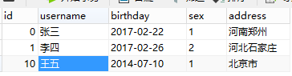
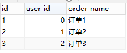
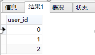
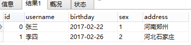
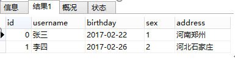
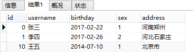
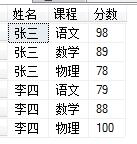
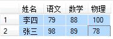
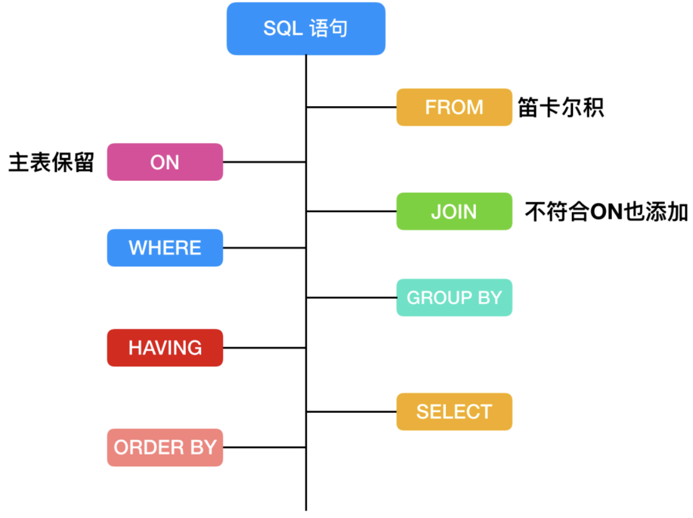

<!-- TOC -->

- [1. SQL语句的四大分类](#1-sql语句的四大分类)
- [2. 查询语句](#2-查询语句)
    - [2.1. 基本查询语句](#21-基本查询语句)
        - [2.1.1. 基本查询结构：](#211-基本查询结构)
        - [2.1.2. 基本查询详解：](#212-基本查询详解)
            - [2.1.2.1. Distinct关键字](#2121-distinct关键字)
                - [2.1.2.1.1. Distinct多列操作：](#21211-distinct多列操作)
                - [2.1.2.1.2. Distinct与Count（聚合函数）](#21212-distinct与count聚合函数)
                - [2.1.2.1.3. Distinct与group by比较（都能将结果去重）](#21213-distinct与group-by比较都能将结果去重)
            - [2.1.2.2. TOP关键字](#2122-top关键字)
            - [2.1.2.3. Like关键字](#2123-like关键字)
            - [2.1.2.4. Group By关键字，分组函数，结合聚合函数](#2124-group-by关键字分组函数结合聚合函数)
                - [2.1.2.4.1. Group By 和 Order By和Top](#21241-group-by-和-order-by和top)
                - [2.1.2.4.2. Having关键字与Where的区别](#21242-having关键字与where的区别)
                - [2.1.2.4.3. Group By多字段分组](#21243-group-by多字段分组)
            - [2.1.2.5. Order By关键字](#2125-order-by关键字)
            - [2.1.2.6. Limit，分页](#2126-limit分页)
    - [2.2. 子查询](#22-子查询)
        - [2.2.1. 子查询的位置](#221-子查询的位置)
        - [2.2.2. 子查询的分类](#222-子查询的分类)
            - [2.2.2.1. 标量子查询：](#2221-标量子查询)
            - [2.2.2.2. 列子查询：](#2222-列子查询)
            - [2.2.2.3. 行子查询：](#2223-行子查询)
        - [2.2.3. 关键字ALL SOME ANY](#223-关键字all-some-any)
        - [2.2.4. 关键字In与exists](#224-关键字in与exists)
            - [2.2.4.1. 关键字In](#2241-关键字in)
                - [2.2.4.1.1. 关键字in与关键字or与关键字between](#22411-关键字in与关键字or与关键字between)
                - [2.2.4.1.2. 关键字in超过1000个条件的处理](#22412-关键字in超过1000个条件的处理)
            - [2.2.4.2. 关键字Exists](#2242-关键字exists)
            - [2.2.4.3. In与Exists区别](#2243-in与exists区别)
    - [2.3. 连接查询](#23-连接查询)
        - [2.3.1. 连接类型选择](#231-连接类型选择)
        - [2.3.2. 自连接](#232-自连接)
            - [2.3.2.1. 用SQL自连接查询处理列之间的关系](#2321-用sql自连接查询处理列之间的关系)
            - [2.3.2.2. SQL自连接查询表示其它关系](#2322-sql自连接查询表示其它关系)
        - [2.3.3. 子查询与连接查询的区别](#233-子查询与连接查询的区别)
    - [2.4. 组合查询，UNION、INTERSECT、EXCEPT](#24-组合查询unionintersectexcept)
        - [2.4.1. UNION运算符：并集](#241-union运算符并集)
    - [2.5. 查询结果集](#25-查询结果集)
        - [2.5.1. 行列转换](#251-行列转换)
        - [2.5.2. 列转行（将原表字段值转为结果集中字段名）](#252-列转行将原表字段值转为结果集中字段名)
        - [2.5.3. 行转列（将原表字段名转为结果集中字段值）](#253-行转列将原表字段名转为结果集中字段值)
    - [2.6. 查询SQL的执行顺序](#26-查询sql的执行顺序)
        - [2.6.1. FROM 连接](#261-from-连接)
        - [2.6.2. ON 过滤](#262-on-过滤)
        - [2.6.3. JOIN 连接](#263-join-连接)
        - [2.6.4. WHERE 过滤](#264-where-过滤)
        - [2.6.5. GROUP BY](#265-group-by)
        - [2.6.6. HAVING](#266-having)
        - [2.6.7. SELECT](#267-select)
        - [2.6.8. DISTINCT](#268-distinct)
        - [2.6.9. ORDER BY](#269-order-by)

<!-- /TOC -->

# 1. SQL语句的四大分类  
&emsp; sql语句被分为四大类：数据定义语言DDL、数据查询语言DQL、数据操纵语言DML、数据控制功能DCL。  
* 数据定义语言DDL（Data Ddefinition Language）  
&emsp; CREATE,DROP,ALTER  
&emsp; 主要为以上操作 即对逻辑结构等有操作的，其中包括表结构，视图和索引。  

* 数据查询语言DQL（Data Query Language）  
&emsp; SELECT  
&emsp; 这个较为好理解 即查询操作，以select关键字。各种简单查询，连接查询等 都属于DQL。  

* 数据操纵语言DML（Data Manipulation Language）  
&emsp; INSERT,UPDATE,DELETE  
&emsp; 主要为以上操作 即对数据进行操作的，对应上面所说的查询操作 DQL与DML共同构建了多数初级程序员常用的增删改查操作。而查询是较为特殊的一种 被划分到DQL中。  

* 数据控制功能DCL（Data Control Language）  
&emsp; GRANT,REVOKE,COMMIT,ROLLBACK  
&emsp; 主要为以上操作 即对数据库安全性完整性等有操作的，可以简单的理解为权限控制等。  

# 2. 查询语句  

## 2.1. 基本查询语句  
&emsp; 数据库表中的一行就叫做一条记录/结果集，一列是一个属性。  

### 2.1.1. 基本查询结构：
&emsp; 基本查询语句：  

    SELECT select_list [INTO new_table_name] 
    [FROM table_source] [WHERE search_condition] 
    /[JOIN 表名] [ON 连接条件] [WHERE search_condition] 
    [GROUP BY group_by_expression] 
    [HAVING search_condition] 
    [ORDER BY order_expression [ASC | DESC]]
    [ LIMIT {[offset,]rowcount | row_count OFFSET offset}]  

&emsp; group by必须放在order by和limit之前。  

    SELECT语句有哪几部分构成？作用分别是什么？
    1.SELECT关键字；
    2.谓词：DISTINCT，TOP n；
    3.查询字段：*或用，分隔的字段列表；
    4.FROM子句：用，分隔的表或视图列表；
    5.WHERE子句：查询条件；
    6.GROUP BY子句：分组字段；
    7.HAVING子句：针对分组字段的查询条件；
    8.ORDER BY子句：排序字段列表；
    9.limit子句：分页。  

&emsp; 执行顺序：from -> on -> join -> where -> group by ->  avg,sum.... ->having -> select -> distinct -> order by -> top，limit，下文讲解。  

### 2.1.2. 基本查询详解：  
&emsp; ***《MySQL必知必会》***  

#### 2.1.2.1. Distinct关键字  

```sql
select distinct expression[,expression...] from tables [where conditions];
```
&emsp; 针对NULL的处理：distinct对NULL不进行过滤，即返回的结果中是包含NULL值的。  

##### 2.1.2.1.1. Distinct多列操作：  
1. DISTINCT必须放在第一个参数前。  
&emsp; distinct name,id 过滤掉name和id两个字段都重复的记录。select id,distinct name from user，sql语句会报错，因为distinct必须放在要查询字段的开头。所以一般distinct用来查询不重复记录的条数。  
&emsp; 如果要查询不重复的记录，可以使用group by：  
&emsp; select id,name from user group by name;  
2. DISTINCT表示对后面的所有参数的拼接，取不重复的记录。即distinct作用在多个字段的时候，将所有字段值都相同的记录“去重”。  

##### 2.1.2.1.2. Distinct与Count（聚合函数）  
&emsp; COUNT()会过滤掉为NULL的项。  

```sql
select *, count(distinct name) from table group by name; 
```

##### 2.1.2.1.3. Distinct与group by比较（都能将结果去重）  

|数据分布|去重方式|原因|
|---|---|---|
|离散|group|distinct空间占用较大，在时间复杂度允许的情况下，group可以发挥空间复杂度优势|
|集中|distinct|distinct空间占用较小，可以发挥时间复杂度优势|  
&emsp; 两个极端：  
* 数据列的所有数据都一样，即去重计数的结果为1时，用distinct最佳。
* 如果数据列唯一，没有相同数值，用group最好。

#### 2.1.2.2. TOP关键字  
&emsp; select top 1 搜索最**  
&emsp; 例：从select结果中显示前4行，select top 4 * from Employee;  

#### 2.1.2.3. Like关键字  
&emsp; Sql模糊查询like条件中特殊字符需要转义后才能搜索到结果：  

|字符|作用|转义字符|
|---|---|---|
|'|包裹搜索条件|\'|
|%|代替任意数目的任意字符|\%|
|_|代替一个任意字符|\_|
|\\|转义符号|\\\\\\\\|  

&emsp; 反斜线\的处理：由于MySQL在字符串中使用C转义语法(例如，用‘\n’代表一个换行字符)，在LIKE字符串中，必须将用到的‘\’双写。例如，若要查找‘\n’,必须将其写成‘\\n’。而若要查找‘\’,则必须将其写成like‘%\\\\%’;原因是反斜线符号会被语法分析程序剥离一次，在进行模式匹配时，又会被剥离一次，最后会剩下一个反斜线符号接受匹配。  

```sql
SELECT * FROM E_MDM_MATERIAL WHERE LONG_DESC LIKE '%\\\\\\\\%';
```  
#### 2.1.2.4. Group By关键字，分组函数，结合聚合函数  
&emsp; Group By分组函数中，查询只能得到组相关的信息。组相关的信息（统计信息）：count,sum,max,min,avg。  
&emsp; select 类别, sum(数量) as 数量之和 from A group by类别order by 类别desc执行出错。在select指定的字段要么包含在Group By语句的后面，作为分组的依据；要么就要被包含在聚合函数中。group by是对结果集分组，而不是查询字段分组。  
&emsp; Group By含有去重效果。  

##### 2.1.2.4.1. Group By 和 Order By和Top  
&emsp; SQL语句查询记录中重复最多的记录。  

```sql
SELECT top 1 NAME FROM a1 GROUP BY NAME ORDER BY COUNT(*) DESC;
```  

##### 2.1.2.4.2. Having关键字与Where的区别  

&emsp; 关键字having相当于where条件。当使用了分组查询group by，又要加条件时，使用having非where。（在SQL中增加HAVING子句原因是，WHERE关键字无法与合计函数一起使用）也可以Having和Where的联合使用。  
&emsp; where子句的作用是在对查询结果进行分组前将不符合where条件的行去掉，即在分组之前过滤数据，where条件中不能包含聚组函数，使用where条件过滤出特定的行。having子句的作用是筛选满足条件的组，即在分组之后过滤数据，条件中经常包含聚组函数，使用having条件过滤出特定的组，也可以使用多个分组标准进行分组。  
* having只能用于group by（分组统计语句中）；
* where是用于在初始表中筛选查询，having用于在where和group by结果分组中查询；
* having子句中的每一个元素也必须出现在select列表中；
* having语句可以使用聚合函数，而where不使用；

&emsp; 示例：Having和Where的联合使用方法  

```sql
select SUM(数量)from A where 数量 >8 group by 类别having SUM(数量) > 10
```
&emsp; 当一个语句中同时含有where、group by、having及聚集函数时，执行顺序如下：1.执行where子句查找符合条件的数据；2.使用group by子句对数据进行分组；对group by子句形成的组运行聚集函数计算每一组的值；3.最后用having子句去掉不符合条件的组。  

##### 2.1.2.4.3. Group By多字段分组  
&emsp; GROUP BY X意思是将所有具有相同X字段值的记录放到一个分组里。  
&emsp; GROUP BY X, Y意思是将所有具有相同X字段值和Y字段值的记录放到一个分组里。   

#### 2.1.2.5. Order By关键字  


#### 2.1.2.6. Limit，分页  
1. 直接使用数据库提供的SQL语句  
&emsp; 语句样式: MySQL中,可用如下方法: SELECT * FROM 表名称 LIMIT M,N  
&emsp; 适应场景: 适用于数据量较少的情况(元组百/千级)  
&emsp; 原因/缺点: 全表扫描,速度会很慢 且 有的数据库结果集返回不稳定(如某次返回1,2,3,另外的一次返回2,1,3). Limit限制的是从结果集的M位置处取出N条输出,其余抛弃.  

2. 建立主键或唯一索引, 利用索引(假设每页10条)  
&emsp; 语句样式: MySQL中,可用如下方法: SELECT * FROM 表名称 WHERE id_pk > (pageNum*10) LIMIT M  
&emsp; 适应场景: 适用于数据量多的情况(元组数上万)  
&emsp; 原因: 索引扫描,速度会很快. 有朋友提出: 因为数据查询出来并不是按照pk_id排序的，所以会有漏掉数据的情况，只能方法3  

3. 基于索引再排序  
&emsp; 语句样式: MySQL中,可用如下方法: SELECT * FROM 表名称 WHERE id_pk > (pageNum*10) ORDER BY id_pk ASC LIMIT M  
&emsp; 适应场景: 适用于数据量多的情况(元组数上万). 最好ORDER BY后的列对象是主键或唯一所以,使得ORDERBY操作能利用索引被消除但结果集是稳定的(稳定的含义,参见方法1)  
&emsp; 原因: 索引扫描,速度会很快. 但MySQL的排序操作,只有ASC没有DESC(DESC是假的,未来会做真正的DESC,期待...).  

4. 基于索引使用prepare  
&emsp; 第一个问号表示pageNum，第二个？表示每页元组数  
&emsp; 语句样式: MySQL中,可用如下方法: PREPARE stmt_name FROM SELECT * FROM 表名称 WHERE id_pk > (？* ？) ORDER BY id_pk ASC LIMIT M  
&emsp; 适应场景: 大数据量  
&emsp; 原因: 索引扫描,速度会很快. prepare语句又比一般的查询语句快一点。  

5. 利用MySQL支持ORDER操作可以利用索引快速定位部分元组,避免全表扫描  
&emsp; 比如: 读第1000到1019行元组(pk是主键/唯一键)。  
&emsp; SELECT * FROM your_table WHERE pk>=1000 ORDER BY pk ASC LIMIT 0,20  

6. 利用"子查询/连接+索引"快速定位元组的位置,然后再读取元组。  
&emsp; 比如(id是主键/唯一键,蓝色字体时变量)  
&emsp; 利用子查询示例：  

```java
SELECT * FROM your_table WHERE id <= 
(SELECT id FROM your_table ORDER BY id desc LIMIT ($page-1)*$pagesize ORDER BY id desc 
LIMIT $pagesize
```
&emsp; 利用连接示例:    

```sql
SELECT * FROM your_table AS t1 
JOIN (SELECT id FROM your_table ORDER BY id desc LIMIT ($page-1)*$pagesize AS t2 
WHERE t1.id <= t2.id ORDER BY t1.id desc LIMIT $pagesize;
```  

----
## 2.2. 子查询  
&emsp; 子查询（嵌套查询）：在一个select语句中，嵌入了另外一个select语句，那么被嵌入的select语句称之为子查询语句，外部那个select语句则称为主查询。子查询是辅助主查询的，要么充当条件，要么充当数据源。  

### 2.2.1. 子查询的位置  
1. 子查询能够出现在Where子句中（子查询在where字句中与比较运算符、列表运算符in、存在运算符exists等一起构成查询条件，完成有关操作）；
2. 也能够出现在From子句中，作为一个临时表使用；
3. 也能够出现在Select list中，作为一个字段值（select子查询返回的结果集必须是单行）来返回。

### 2.2.2. 子查询的分类  
#### 2.2.2.1. 标量子查询：
&emsp; 子查询返回的结果是一个数据(一行一列)。子查询返回的值是max,min,avg等聚合函数得到的值作为一个数据。  
&emsp; 因为标量子查询只返回一个值，也可以使用其他运算符和标量子查询进行比较,如">, >=, <, <="等。  
&emsp; 示例：查询班级学生的平均身高
```sql
SELECT * FROM students WHERE age > (SELECT AVG(age) FROM students);  #其中第二个select语句就是一个标量子查询
```  

#### 2.2.2.2. 列子查询：  
&emsp; 返回的结果是一列(一列多行)。格式：主查询where条件in(列子查询)  
&emsp; 示例：查询还有学生在班的所有班级名字  

```sql
#1.找出学生表中所有的班级id，2.找出班级表中对应的名字
SELECT NAME FROM classes WHERE id IN (SELECT cls_id FROM students);
```

#### 2.2.2.3. 行子查询：
&emsp; 返回的结果是一行(一行多列)。格式：主查询 where (字段1,2,...) = (行子查询)。行元素: 将多个字段合成一个行元素,在行级子查询中会使用到行元素。  
&emsp; 示例：查找班级年龄最大,身高最高的学生  

```sql
SELECT * FROM students WHERE (height,age) = (SELECT MAX(height),MAX(age) FROM students);
```

### 2.2.3. 关键字ALL SOME ANY
&emsp; 逻辑运算符（NOT、AND、OR）, 比较运算符（=、<>、!=、>、>=、!>、<、<=、!<）。三者都作用于比较运算符和子查询之间，一般和嵌套查询一起用，some和any等效。  

### 2.2.4. 关键字In与exists
&emsp; 示例：一个user和一个order表，具体表的内容如下  
&emsp; user表：  
  
&emsp; order表：  
  

#### 2.2.4.1. 关键字In
&emsp; in查询里面的数量最大只能1000。  
&emsp; 确定给定的值是否与子查询或列表中的值相匹配。in在查询的时候，首先查询子查询的表，然后将内表和外表做一个笛卡尔积，然后按照条件进行筛选。所以相对内表比较小的时候，in的速度较快。  
&emsp; 具体sql语句如下：  

```sql
select * from user where user.id in (select order.user_id from order)
```
&emsp; 执行流程：  
1. 在数据库内部，执行子查询语句，执行如下代码：select order.user_id from order;执行完毕后，得到结果如下：
  
2. 将查询到的结果和原有的user表做一个笛卡尔积，结果如下：
  
3. 再根据user.id IN order.user_id的条件，将结果进行筛选（既比较id列和user_id 列的值是否相等，将不相等的删除）。最后，得到两条符合条件的数据。
  

##### 2.2.4.1.1. 关键字in与关键字or与关键字between  
&emsp; number in(01,02,03)等效于numer = 01 or number = 02 or number = 03  

##### 2.2.4.1.2. 关键字in超过1000个条件的处理  
......

#### 2.2.4.2. 关键字Exists  
&emsp; exists指定一个子查询，检测行的存在。遍历循环外表，然后看外表中的记录有没有和内表的数据一样的。匹配上就将结果放入结果集中。exists内层查询语句不返回查询的记录，而是返回一个真假值。  
&emsp; select user.* from user where exists(select order.user_id from order where user.id = order.user_id);  
&emsp; 这条sql语句的执行结果和上面的in的执行结果是一样的。  
  
&emsp; 但是，不一样的是它们的执行流程完全不一样：  
&emsp; 1.使用exists关键字进行查询的时候，首先查询的不是子查询的内容，而是查主查询的表，即先执行的sql语句是：select user.* from user;  
&emsp; 得到的结果如下：  
  
&emsp; 2.然后，根据表的每一条记录，执行exists(select order.user_id from order where user.id = order.user_id)，依次去判断where后面的条件是否成立：。如果成立则返回true不成立则返回false。如果返回的是true的话，则该行结果保留，如果返回的是false的话，则删除该行，最后将得到的结果返回。  

#### 2.2.4.3. In与Exists区别  
&emsp; in和exists的区别: 如果子查询得出的结果集记录较少，主查询中的表较大且又有索引时应该用in, 反之如果外层的主查询记录较少，子查询中的表大，又有索引时使用exists。  

----

## 2.3. 连接查询  
&emsp; Where，1992年语法；Join on，1999年语法。  

### 2.3.1. 连接类型选择  
&emsp; 内连接、左外连接、右外连接、全外连接。  
&emsp; 左外连接：根据两张表的关系（外键关联），笛卡尔过滤，也就是求出两张表的交集， 如果交集中，左边表的行， 在右边表中没有匹配，则该条记录左边表有数据， 右边表所有的字段都为null（如果左表数据，在右表中有多行匹配，则查询结果左表为多行显示。）。  

&emsp; 在实际运用中如果连接类型选择不当， 不但出现效率低并且可能还会出现逻辑的错误。  
&emsp; 1.查两表关联列相等的数据用内连接。  
&emsp; 2.Col_L是Col_R的子集时用右外连接。（左边表是右边表的子集，用右外）  
&emsp; 3.Col_R是Col_L的子集时用左外连接。（右边表是左边表的子集，用左外）  

### 2.3.2. 自连接  
&emsp; 处理列与列之间的逻辑关系；  

#### 2.3.2.1. 用SQL自连接查询处理列之间的关系  
&emsp; SQL自连接解决了列与列之间的逻辑关系之层次关系。当所要查询的信息都出于同一个表，而又不能直接通过该表的各个列的直接层次关系得到最终结果的时候，那么应该考虑使用表的自连接查询。  

```sql
SELECT FIRST.CNumber， SECOND.PCNumber FROM Course FIRST， Course SECOND WHERE FIRST.PCNumber=SECOND.CNumber；  
```
&emsp; 在这个代码中，只涉及到一个表，即课程信息表COURSE(CNumber，CName， PCNumber)，其中CNumber是该课程的课程号，PCNumber是该课程的先修课课程号。查询结果集是FIRST表中的课程号CNumber和该课程号所对应的间接先修课课程号。  

#### 2.3.2.2. SQL自连接查询表示其它关系  
&emsp; SQL自连接查询还可用于处理列之间的顺序关系、因果关系等多种逻辑关系。此外，SQL自身查询还可以用于处理单列本身的逻辑关系。  
&emsp; 对单列的逻辑关系的处理，示例：  

```sql
SELECT FIRST.Num， FIRST Stop， SECOND.Stop FROM Route FIRST， Route SECOND WHERE FIRST.NUM=SECOND.NUM；
```
&emsp; 表Route（Num， Stop），可以表示某一线路的火车的车站线路信息。Num表示该车的车次号，Stop表示该车次停靠的城市名称。上面的代码，可以求出某一线路的火车可以联通的任意两个城市的名称。原来表Route中的每一个元组，只能表示车号和该车的某一站点的信息，实际上，这是“1Vs1”的映射关系。  

&emsp; 对单一的列进行连接处理，示例：  

```sql
SELECT FIRST.Num， SECOND.Num， FIRST.Stop FROM Route FIRST， Route SECOND WHERE FRIST.Stop=SECOND.Stop；
```
&emsp; 上面的SQL代码，求出了路经相同城市的车次的信息。原表中的车次和车站是“1Vs1”关系，通过自连接后，得到了车次和车站的“多Vs1”关系。  

### 2.3.3. 子查询与连接查询的区别  
&emsp; 表连接都可以用子查询，但不是所有子查询都能用表连接替换，子查询比较灵活，方便，形式多样，适合用于作为查询的筛选条件，而表连接更适合查看多表的数据  
&emsp; 子查询不一定需要两个表有关联字段，而连接查询必须有字段关联（所谓的主外键关系）  
&emsp; 连接查询的性能优于子查询。  

## 2.4. 组合查询，UNION、INTERSECT、EXCEPT
### 2.4.1. UNION运算符：并集  
&emsp; UNION运算符通过组合其他两个结果表（例如TABLE1和TABLE2）并消去表中任何重复行而派生出一个结果表。当ALL随UNION一起使用时（即UNION ALL），不消除重复行。两种情况下，派生表的每一行不是来自TABLE1就是来自TABLE2。  
&emsp; UNION内部的SELECT语句必须拥有相同数量的列。列也必须拥有相似的数据类型。同时，每条SELECT语句中的列的顺序必须相同。默认地，UNION 操作符选取不同的值。如果允许重复的值，请使用UNION ALL。另外，UNION 结果集中的列名总是等于UNION中第一个SELECT语句中的列名。  

&emsp; UNION：  
(1)其目的是将两个SQL语句的结果合并起来；  
(2)它的一个限制是两个SQL语句所产生的栏位需要是同样的资料种类；  
(3)UNION只是将两个结果联结起来一起显示，并不是联结两个表；  
(4)UNION在进行表链接后会筛选掉重复的记录。  

&emsp; UNION ALL：  
(1)这个指令的目的也是要将两个 SQL 语句的结果合并在一起；  
(2)UNION ALL 和 UNION 不同之处在于 UNION ALL 会将每一个符合条件的资料都列出来，无论资料值有无重复；  
(3)UNION ALL只是简单的将两个结果合并后就返回。这样，如果返回的两个结果集中有重复的数据，那么返回的结果集就会包含重复的数据了。  

&emsp; 从效率上说，sql union all的执行效率要比sql union效率要高很多，这是因为使用sql union需要进行排重，而sql union all是不需要排重的，这一点非常重要，因为对于一些单纯地使用分表来提高效率的查询，完全可以使用sql union all。  


---
## 2.5. 查询结果集  
### 2.5.1. 行列转换  
&emsp; 行列互转，可以分为静态互转，即事先知道要处理多少行（列）；动态互转，事先不知道处理多少行(列)。以下讨论静态互转。数据如下：  
  
  

### 2.5.2. 列转行（将原表字段值转为结果集中字段名）  
&emsp; 在日常的工作中，使用数据库查看数据是很经常的事，数据库的数据非常多，如果此时的数据设计是一行行的设计话，就会有多行同一个用户的数据，查看起来比较费劲，如果数据较多时，不方便查看，为了更加方便工作中查看数据，如果可以随时切换行列数据的显示更好。  
&emsp; 使用case when then else end函数结合聚合函数、group by。或其他同义的函数。  
&emsp; 第1步，创建伪列。第2步，分组求和。  

```sql
select 姓名,
SUM(case 课程 when  '语文' then 分数 else 0 end) as 语文, --伪列
SUM(case 课程 when  '数学' then 分数 else 0 end) as 数学, --伪列
SUM(case 课程 when  '物理' then 分数 else 0 end) as 物理  --伪列
from scores group by 姓名
```  

### 2.5.3. 行转列（将原表字段名转为结果集中字段值）  
&emsp; 使用union all函数。  

```sql
select 姓名,'语文' as 课程, 语文 as 分数 from scores2 
union all select 姓名, '数学' as 课程, 数学 as 分数 from scores2 
union all select 姓名, '物理' as 课程, 物理 as 分数 from scores2 
order by 姓名 desc
```
----

## 2.6. 查询SQL的执行顺序  

```sql
SELECT DISTINCT
    < select_list >
FROM
    < left_table > < join_type >
JOIN < right_table > ON < join_condition >
WHERE
    < where_condition >
GROUP BY
    < group_by_list >
HAVING
    < having_condition >
ORDER BY
    < order_by_condition >
LIMIT < limit_number >
```  
&emsp; 查询语句如上，sql的执行顺序。  
  

### 2.6.1. FROM 连接  
&emsp; 首先，对 SELECT 语句执行查询时，对FROM 关键字两边的表执行连接，会形成笛卡尔积，这时候会产生一个虚表VT1(virtual table)。  

&emsp; ***笛卡尔积：***  

    笛卡尔乘积是指在数学中，两个集合X和Y的笛卡尔积，又称直积，表示为X × Y，第一个对象是X的成员而第二个对象是Y的所有可能有序对的其中一个成员。
    假设集合A={a, b}，集合B={0, 1, 2}，则两个集合的笛卡尔积为{(a, 0), (a, 1), (a, 2), (b, 0), (b, 1), (b, 2)}。

&emsp; ***虚表：***  

    在 MySQL 中，有三种类型的表
    一种是永久表，永久表就是创建以后用来长期保存数据的表
    一种是临时表，临时表也有两类，一种是和永久表一样，只保存临时数据，但是能够长久存在的；还有一种是临时创建的，SQL 语句执行完成就会删除。
    一种是虚表，虚表其实就是视图，数据可能会来自多张表的执行结果。

### 2.6.2. ON 过滤  
&emsp; 然后对 FROM 连接的结果进行 ON 筛选，创建 VT2，把符合记录的条件存在 VT2 中。  

### 2.6.3. JOIN 连接
&emsp; 第三步，如果是 OUTER JOIN(left join、right join) ，那么这一步就将添加外部行，如果是 left join 就把 ON 过滤条件的左表添加进来，如果是 right join ，就把右表添加进来，从而生成新的虚拟表 VT3。  

### 2.6.4. WHERE 过滤
&emsp; 第四步，是执行 WHERE 过滤器，对上一步生产的虚拟表引用 WHERE 筛选，生成虚拟表 VT4。  

&emsp; ***WHERE 和 ON 的区别***  
* 如果有外部列，ON 针对过滤的是关联表，主表(保留表)会返回所有的列;
* 如果没有添加外部列，两者的效果是一样的;

&emsp; 应用  
* 对主表的过滤应该使用 WHERE;
* 对于关联表，先条件查询后连接则用 ON，先连接后条件查询则用 WHERE;

### 2.6.5. GROUP BY
&emsp; 根据 group by 字句中的列，会对 VT4 中的记录进行分组操作，产生虚拟机表 VT5。果应用了group by，那么后面的所有步骤都只能得到的 VT5 的列或者是聚合函数（count、sum、avg等）。  

### 2.6.6. HAVING
&emsp; 紧跟着 GROUP BY 字句后面的是 HAVING，使用 HAVING 过滤，会把符合条件的放在 VT6。  

### 2.6.7. SELECT
&emsp; 第七步才会执行 SELECT 语句，将 VT6 中的结果按照 SELECT 进行刷选，生成 VT7。  

### 2.6.8. DISTINCT
&emsp; 在第八步中，会对 TV7 生成的记录进行去重操作，生成 VT8。事实上如果应用了 group by 子句那么 distinct 是多余的，原因同样在于，分组的时候是将列中唯一的值分成一组，同时只为每一组返回一行记录，那么所以的记录都将是不相同的。  

### 2.6.9. ORDER BY
&emsp; 应用 order by 子句。按照 order_by_condition 排序 VT8，此时返回的一个游标，而不是虚拟表。sql 是基于集合的理论的，集合不会预先对他的行排序，它只是成员的逻辑集合，成员的顺序是无关紧要的。  

