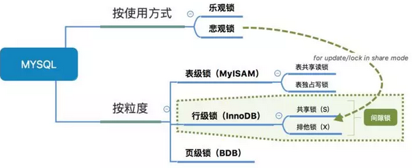
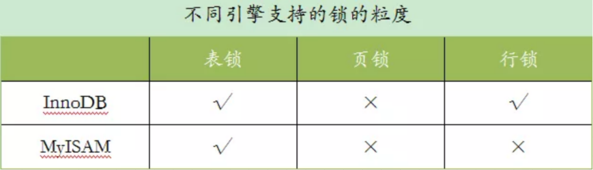
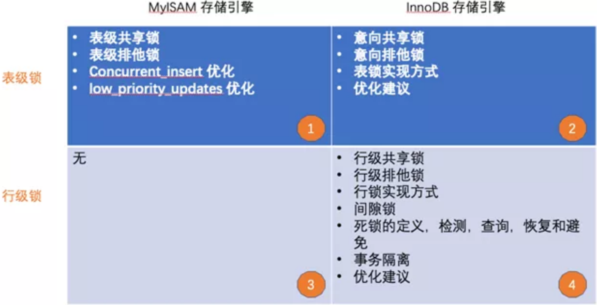
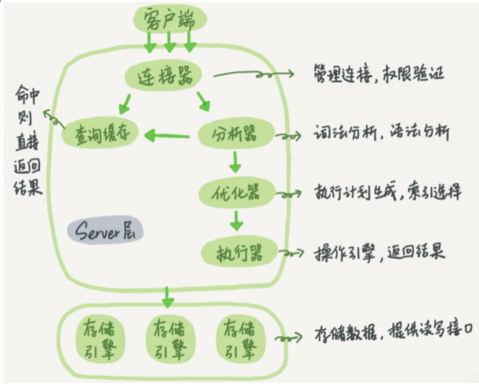
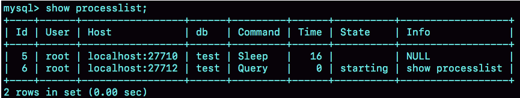

<!-- TOC -->

- [1. MySql存储引擎](#1-mysql存储引擎)
    - [1.1. InnoDB存储引擎](#11-innodb存储引擎)
        - [1.1.1. InnoDB的逻辑存储结构](#111-innodb的逻辑存储结构)
        - [1.1.2. InnoDB的索引](#112-innodb的索引)
        - [1.1.3. InnoDB的特性](#113-innodb的特性)
    - [1.2. MyISAM存储引擎](#12-myisam存储引擎)
        - [1.2.1. MyISAM的索引](#121-myisam的索引)
        - [1.2.2. MyISAM的特性：](#122-myisam的特性)
- [2. MySql的事务](#2-mysql的事务)
    - [2.1. 事务简介：](#21-事务简介)
    - [2.2. 数据库并发带来哪些问题?](#22-数据库并发带来哪些问题)
    - [2.3. 事务的隔离级别](#23-事务的隔离级别)
    - [2.4. Mysql事务实现原理](#24-mysql事务实现原理)
        - [2.4.1. 原子性的实现](#241-原子性的实现)
        - [2.4.2. 持久性的实现](#242-持久性的实现)
        - [2.4.3. 隔离性的实现](#243-隔离性的实现)
        - [2.4.4. 一致性的实现](#244-一致性的实现)
    - [2.5. 事务SQL语句](#25-事务sql语句)
- [3. MySql的锁](#3-mysql的锁)
    - [3.1. 数据库锁简介](#31-数据库锁简介)
    - [3.2. 锁的粒度，表锁、行锁、页锁](#32-锁的粒度表锁行锁页锁)
        - [3.2.1. 页锁：](#321-页锁)
        - [3.2.2. 表锁](#322-表锁)
        - [3.2.3. 行锁](#323-行锁)
        - [3.2.4. 间隙锁](#324-间隙锁)
    - [3.3. 锁类别，读锁、写锁：](#33-锁类别读锁写锁)
        - [3.3.1. MyISAM存储引擎和表级锁：](#331-myisam存储引擎和表级锁)
        - [3.3.2. InnoDB 存储引擎和表级锁](#332-innodb-存储引擎和表级锁)
        - [3.3.3. InnoDB 存储引擎和行级锁](#333-innodb-存储引擎和行级锁)
    - [3.4. 锁使用方式：乐观锁、悲观锁](#34-锁使用方式乐观锁悲观锁)
    - [3.5. 死锁](#35-死锁)
- [4. 多版本并发控制](#4-多版本并发控制)
- [5. MySql Server系统架构](#5-mysql-server系统架构)
    - [5.1. 连接器](#51-连接器)
    - [5.2. 查询缓存](#52-查询缓存)
    - [5.3. 分析器](#53-分析器)
    - [5.4. 优化器](#54-优化器)
    - [5.5. 执行器](#55-执行器)
- [6. MySQL查询过程](#6-mysql查询过程)
- [7. MySql日志文件](#7-mysql日志文件)

<!-- /TOC -->

# 1. MySql存储引擎
1. MySQL是插件式的存储引擎，其中存储引擎分很多种。只要实现符合mysql存储引擎的接口，可以开发自己的存储引擎!  
2. 所有跨存储引擎的功能都是在服务层实现的。  
3. MySQL的存储引擎是针对表的，不是针对库的。也就是说在一个数据库中可以使用不同的存储引擎。但是不建议这样做。  

## 1.1. InnoDB存储引擎  
&emsp; MySQL5.5及之后版本默认的存储引擎：InnoDB。  

### 1.1.1. InnoDB的逻辑存储结构  
&emsp; 从InnoDb存储引擎的逻辑存储结构看，所有数据都被逻辑地存放在一个空间中，称之为表空间（tablespace）。表空间又由段（segment），区（extent），页（page）组成。页在一些文档中有时候也称为块（block）。InnoDb逻辑存储结构图如下：  
  
* 表空间（tablespace）：  
&emsp; 表空间是Innodb存储引擎逻辑的最高层，所有的数据都存放在表空间中。  
&emsp; 默认情况下，Innodb存储引擎有一个共享表空间ibdata1,即所有数据都存放在这个表空间中内。  
&emsp; 如果启用了innodbfileper_table参数，需要注意的是每张表的表空间内存放的只是数据、索引、和插入缓冲Bitmap，其他类的数据，比如回滚(undo)信息、插入缓冲检索页、系统事物信息，二次写缓冲等还是放在原来的共享表内的。  
* 段（segment）：  
&emsp; 表空间由段组成，常见的段有数据段、索引段、回滚段等。  
&emsp; InnoDB存储引擎表是索引组织的，因此数据即索引，索引即数据。数据段即为B+树的叶子结点，索引段即为B+树的非索引结点。  
&emsp; 在InnoDB存储引擎中对段的管理都是由引擎自身所完成，DBA不能也没必要对其进行控制。  
* 区（extent）：  
&emsp; 区是由连续页组成的空间，在任何情况下每个区的大小都为1MB。  
&emsp; 为了保证区中页的连续性，InnoDB存储引擎一次从磁盘申请4~5个区。  
&emsp; 默认情况下，InnoDB存储引擎页的大小为16KB，一个区中一共64个连续的区。  
* 页（page）：  
&emsp; 页是InnoDB磁盘管理的最小单位。  
&emsp; 在InnoDB存储引擎中，默认每个页的大小为16KB。  
&emsp; 从InnoDB1.2.x版本开始，可以通过参数innodbpagesize将页的大小设置为4K，8K，16K。  
&emsp; InnoDB存储引擎中，常见的页类型有：数据页，undo页，系统页，事务数据页，插入缓冲位图页，插入缓冲空闲列表页等。  

### 1.1.2. InnoDB的索引  
.......

### 1.1.3. InnoDB的特性  
* 支持事务  
* 支持行锁，采用MVCC来支持高并发  
* 支持外键  
* 支持崩溃后的安全恢复  
* 不支持全文索引  

## 1.2. MyISAM存储引擎  
### 1.2.1. MyISAM的索引  

### 1.2.2. MyISAM的特性：  
&emsp; MyISAM引擎是MySQL 5.1及之前版本的默认引擎，它的特性是：  
* 不支持事务  
* 不支持行锁，读取时对需要读到的所有表加锁，写入时则对表加排它锁  
* 不支持外键  
* 不支持崩溃后的安全恢复  
* 在表有读取查询的同时，支持往表中插入新纪录  
* 支持BLOB和TEXT的前500个字符索引，支持全文索引  
* 支持延迟更新索引，极大提升写入性能  
* 对于不会进行修改的表，支持压缩表，极大减少磁盘空间占用  

# 2. MySql的事务  
&emsp; MySql的事务基于InnoDB存储引擎讲解。  

## 2.1. 事务简介：  
&emsp; 事务的定义：事务是逻辑上的一组操作，要么都执行，要么都不执行。  
&emsp; ***事务的四大特性(ACID)：***  
&emsp; 原子性(Atomicity)：事务是最小的执行单位，不允许分割。事务的原子性确保动作要么全部完成，要么完全不起作用；  
&emsp; 一致性(Consistency)：执行事务前后，数据保持一致，多个事务对同一个数据读取的结果是相同的；  
&emsp; 隔离性(Isolation）：并发访问数据库时，一个用户的事务不被其他事务所干扰，各并发事务之间数据库是独立的；  
&emsp; 持久性(Durability）：一个事务被提交之后。它对数据库中数据的改变是持久的，即使数据库发生故障也不应该对其有任何影响。  

## 2.2. 数据库并发带来哪些问题?  
&emsp; 多事务的并发进行一般会造成以下几个问题：  
* 脏读（Dirty read）: （一个线程读了另一个线程未提交的数据。）当一个事务正在访问数据并且对数据进行了修改，而这种修改还没有提交到数据库中，这时另外一个事务也访问了这个数据，然后使用了这个数据。因为这个数据是还没有提交的数据，那么另外一个事务读到的这个数据是“脏数据”，依据“脏数据”所做的操作可能是不正确的。  
* 丢失修改（Lost to modify）: （一个线程覆盖了另一个线程的数据。）指在一个事务读取一个数据时，另外一个事务也访问了该数据，那么在第一个事务中修改了这个数据后，第二个事务也修改了这个数据。这样第一个事务内的修改结果就被丢失，因此称为丢失修改。例如：事务1读取某表中的数据A=20，事务2也读取A=20，事务1修改A=A-1，事务2也修改A=A-1，最终结果A=19，事务1的修改被丢失。  
* 不可重复读（Unrepeatableread）: （一个线程多次读，另一线程中间修改了数据。）指在一个事务内多次读同一数据。在这个事务还没有结束时，另一个事务也访问该数据。那么，在第一个事务中的两次读数据之间，由于第二个事务的修改导致第一个事务两次读取的数据可能不太一样。这就发生了在一个事务内两次读到的数据是不一样的情况，因此称为不可重复读。  
* 幻读（Phantom read）: （一个线程多次读，另一线程中间新增了数据。）幻读与不可重复读类似。它发生在一个事务（T1）读取了几行数据，接着另一个并发事务（T2）插入了一些数据时。在随后的查询中，第一个事务（T1）就会发现多了一些原本不存在的记录，就好像发生了幻觉一样，所以称为幻读。  

    不可重复度和幻读区别：  
    不可重复读的重点是修改比如多次读取一条记录发现其中某些列的值被修改，幻读的重点在于新增或者删除比如多次读取一条记录发现记录增多或减少了。  

## 2.3. 事务的隔离级别  
&emsp; MySQL的事务隔离级别解决并发事务问题。数据库的事务隔离越严格，并发副作用越小，但付出的代价也就越大。这是因为事务隔离实质上是将事务在一定程度上"串行"进行，这显然与"并发"是矛盾的。  
&emsp; SQL标准定义了四个隔离级别：  
* READ-UNCOMMITTED(读取未提交)：最低的隔离级别，允许读取尚未提交的数据变更，可能会导致脏读、幻读或不可重复读。  
* READ-COMMITTED(读取已提交)：允许读取并发事务已经提交的数据，可以阻止脏读，但是幻读或不可重复读仍有可能发生。  
* REPEATABLE-READ(可重复读)：对同一字段的多次读取结果都是一致的，除非数据是被本身事务自己所修改，可以阻止脏读和不可重复读，但幻读仍有可能发生。  
* SERIALIZABLE(可串行化)：最高的隔离级别，完全服从ACID的隔离级别。所有的事务依次逐个执行，这样事务之间就完全不可能产生干扰，也就是说，该级别可以防止脏读、不可重复读以及幻读。  

|隔离级别 	|读数据一致性     	|脏读 	|不可重复读  	|幻读|
|---|---|---|---|---|
|未提交读(Read uncommitted)	|最低级别 	|是	|是	|是|
|已提交读(Read committed)	|语句级	|否 	|是	|是|
|可重复读(Repeatable read)	|事务级 	|否 	|否 	|是|
|可序列化(Serializable) 	|最高级别，事务级   	|否	|否 	|否| 

## 2.4. Mysql事务实现原理  
&emsp; 实现事务采取了哪些技术以及思想？  
* 原子性：使用 undo log ，从而达到回滚；  
* 持久性：使用 redo log，从而达到故障后恢复；  
* 隔离性：使用锁以及MVCC,运用的优化思想有读写分离，读读并行，读写并行；  
* 一致性：通过回滚，以及恢复，和在并发环境下的隔离做到一致性。  

&emsp; 原子性，持久性，隔离性的目的也是为了保障数据的一致性！  
&emsp; 总之，ACID只是个概念，事务最终目的是要保障数据的可靠性，一致性。  

### 2.4.1. 原子性的实现  

### 2.4.2. 持久性的实现  

### 2.4.3. 隔离性的实现  

### 2.4.4. 一致性的实现  


## 2.5. 事务SQL语句  


# 3. MySql的锁  
## 3.1. 数据库锁简介  
&emsp; ***存储引擎与锁：***  
* InnoDB：对于UPDATE、DELETE、INSERT语句，InnoDB会自动给涉及数据集加排他锁（X)。  
* MyISAM：MyISAM在执行查询语句SELECT前，会自动给涉及的所有表加读锁，在执行更新操作（UPDATE、DELETE、INSERT等）前，会自动给涉及的表加写锁，这个过程并不需要用户干预。  

&emsp; ***事务和锁的关联：***  
1. 事务与锁是不同的。事务具有ACID（原子性、一致性、隔离性和持久性），锁是用于解决隔离性的一种机制。  
2. 事务的隔离级别通过锁的机制来实现。另外锁有不同的粒度，同时事务也是有不同的隔离级别的。  
3. 开启事务就自动加锁。  

&emsp; ***锁的分类：***
  
* 按使用方式：乐观锁、悲观锁。  
* 按粒度：表级锁、行级锁、页级锁。锁的粒度取决于具体的存储引擎。InnoDB实现了行级锁，页级锁，表级锁。  
* 锁类别：有共享锁（读锁）和排他锁（写锁）。锁类别取决于存储引擎执行的sql语句。  

## 3.2. 锁的粒度，表锁、行锁、页锁  
&emsp; 在数据库中，锁的粒度的不同可以分为表锁、页锁、行锁，这些锁的粒度之间也是会发生升级的，锁升级的意思就是将当前锁的粒度降低，数据库可以把一个表的1000个行锁升级为一个页锁，或者将页锁升级为表锁。  
&emsp; 不同的存储引擎支持的锁粒度是不一样的：  
  
&emsp; InnoDB行锁和表锁都支持！InnoDB只有通过索引条件检索数据才使用行级锁，否则，InnoDB将使用表锁。即InnoDB的行锁是基于索引的！  
&emsp; MyISAM只支持表锁！  

### 3.2.1. 页锁：  
&emsp; 页级锁定是MySQL中比较独特的一种锁定级别，在其他数据库管理软件中也并不是太常见。页级锁定的特点是锁定颗粒度介于行级锁定与表级锁之间，所以获取锁定所需要的资源开销，以及所能提供的并发处理能力也同样是介于上面二者之间。另外，页级锁定和行级锁定一样，会发生死锁。  
&emsp; 在数据库实现资源锁定的过程中，随着锁定资源颗粒度的减小，锁定相同数据量的数据所需要消耗的内存数量是越来越多的，实现算法也会越来越复杂。不过，随着锁定资源颗粒度的减小，应用程序的访问请求遇到锁等待的可能性也会随之降低，系统整体并发度也随之提升。  
&emsp; 使用页级锁定的主要是BerkeleyDB存储引擎。  

### 3.2.2. 表锁  
&emsp; 特点：对整张表加锁。开销小，加锁快；不会出现死锁；锁定粒度大，发生锁冲突的概率最高，并发度最低。  
&emsp; 存储引擎的支持：使用表级锁定的主要是MyISAM，MEMORY，CSV等一些非事务性存储引擎。  
&emsp; 如何加表锁？MyISAM在执行查询语句（SELECT）前，会自动给涉及的所有表加读锁，在执行更新操作（UPDATE、DELETE、INSERT等）前，会自动给涉及的表加写锁。这个过程并不需要用户干预，因此，用户一般不需要直接用LOCK TABLE命令给MyISAM表显式加锁。  

### 3.2.3. 行锁  
&emsp; 行级锁：对某行记录加锁。开销大，加锁慢；会出现死锁；锁定粒度最小，发生锁冲突的概率最低，并发度也最高。  
&emsp; 使用行级锁定的主要是InnoDB存储引擎。  
&emsp; ***适用场景：*** 从锁的角度来说，表级锁更适合于以查询为主，只有少量按索引条件更新数据的应用，如Web应用。  
&emsp; 而行级锁则更适合于有大量按索引条件并发更新少量不同数据，同时又有并发查询的应用，如一些在线事务处理（OLTP）系统。  
&emsp; ***行锁与索引：*** InnoDB行锁是通过给索引上的索引项加锁来实现的，只有通过索引条件检索数据，InnoDB才使用行级锁，否则，InnoDB将使用表锁。  

### 3.2.4. 间隙锁  

&emsp; 当使用范围条件（> 、< 、between......）检索数据，InnoDB会给符合条件的已有数据记录的索引项加锁。对于键值在条件范围内但并不存在的记录，叫做“间隙（GAP)”，InnoDB也会对这个“间隙”加锁，这就是间隙锁。间隙锁和行锁合称（Next-Key锁）。  
&emsp; InnoDB 除了通过范围条件加锁时使用间隙锁外，如果使用相等条件请求给一个不存在的记录加锁，InnoDB 也会使用间隙锁。  

&emsp; 假如emp表中只有101条记录，其empid的值分别是1,2,...,100,101，下面的 SQL：  

```sql
select * from emp where empid > 100 for update;
```  
&emsp; 这是一个范围条件的检索，InnoDB 不仅会对符合条件的empid值为101的记录加锁，也会对empid大于101（这些记录并不存在）的“间隙”加锁。  

&emsp; InnoDB 使用间隙锁的目的：  
&emsp; 一方面是为了防止幻读。对于上例，如果不使用间隙锁，其他事务插入了 empid大于 100的任何记录，本事务再次执行 select 语句，就会发生幻读。  
&emsp; 另一方面，也是为了满足恢复和复制的需要。    

&emsp; InnoDB使用间隙锁的危害：因为执行SELECT语句中，如果通过范围查找的话，间隙锁会锁定整个范围内所有的索引键值，即使这个键值并不存在。这个就是间隙锁最致命的缺点，就是当锁定一个范围键值之后，即使某些不存在的键值也会被无辜的锁定，而造成在锁定的时候无法插入锁定值范围内的任何数据，在某些场景下这可能会针对性造成很大的危害。  

## 3.3. 锁类别，读锁、写锁：  
  

### 3.3.1. MyISAM存储引擎和表级锁：  
&emsp; MyISAM在执行查询语句（select）前，会自动给涉及的所有表加读锁，在执行增删改操作前，会自动给涉及的表加写锁。  

&emsp; 表锁下分为两种模式：表读锁（Table Read Lock）、表写锁（Table Write Lock）。读锁和写锁是互斥的，读写操作是串行。在表读锁和表写锁的环境下：读读不阻塞，读写阻塞，写写阻塞！  
* 读读不阻塞：当前用户在读数据，其他的用户也在读数据，不会加锁！  
* 读写阻塞：当前用户在读数据，其他的用户不能修改当前用户读的数据，会加锁！  
* 写写阻塞：当前用户在修改数据，其他的用户不能修改当前用户正在修改的数据，会加锁！  

  

### 3.3.2. InnoDB 存储引擎和表级锁
&emsp; InnoDB 存储引擎表锁：当没有对数据表中的索引数据进行查询时，会执行表锁操作。采用两种意向锁（Intention Locks。
* 意向共享锁（IS）：事务打算给数据行加行共享锁，事务在给一个数据行加共享锁前，必须先取得该表的 IS 锁。  
* 意向排他锁（IX）：事务打算给数据行加行排他锁，事务在给一个数据行加排他锁前，必须先取得该表的 IX 锁。  

&emsp; 意向共享锁和意向排他锁是数据库主动加的，不需要手动处理。对于 UPDATE、DELETE 和 INSERT 语句，InnoDB 会自动给数据集加排他锁。  

### 3.3.3. InnoDB 存储引擎和行级锁  
&emsp; InnoDB 存储引擎行锁，当数据查询时针对索引数据进行时，会使用行级锁。  
* 共享锁（S）：当一个事务读取一条记录的时候，不会阻塞其他事务对同一记录的读请求，但会阻塞对其的写请求。当读锁释放后，才会执行其他事务的写操作。  
&emsp; 例如：select … lock in share mode  
* 排他锁（X）：当一个事务对一条记录进行写操作时，会阻塞其他事务对同一表的读写操作，当该锁释放后，才会执行其他事务的读写操作。  
&emsp; 例如：select … for update  

&emsp;在高并发的情况下，多个事务同时请求更新数据，由于资源被占用等待事务增多。  
&emsp;如此，会造成性能问题，可以通过innodb_lock_wait_timeout 来解决。innodb_lock_wait_timeout 是事务等待获取资源的最长时间，单位为秒。如果超过时间还未分配到资源，则会返回应用失败。  

&emsp; 四种锁的兼容情况：  
  
<center>共享锁，排他锁，意向共享锁，意向排他锁兼容图例</center>    
&emsp; 如果一个事务请求的锁模式与当前的锁兼容， InnoDB 就将请求的锁授予该事务；反之， 如果两者不兼容，该事务就要等待锁释放。  


## 3.4. 锁使用方式：乐观锁、悲观锁  
&emsp; 乐观锁是一种思想，具体实现是，表中有一个版本字段，第一次读的时候，获取到这个字段。处理完业务逻辑开始更新的时候，需要再次查看该字段的值是否和第一次的一样。如果一样更新，反之拒绝。之所以叫乐观，因为这个模式没有从数据库加锁，等到更新的时候再判断是否可以更新。  
&emsp; 悲观锁是数据库层面加锁，都会阻塞去等待锁。  

## 3.5. 死锁  
&emsp; insert、delete、update这些操作，独占锁占用事务时间过长，是会锁表的。  
&emsp; 解决方案：操作要进行拆分，重整数据库策略，比如限制处理1000条。删除操作，删除数据的速度和创建的索引数量是成正比的。所以在超大型数据库中，删除时处理好索引关系非常重要。推荐的折中方法：在删除数据之前删除表中索引，然后删除其中无用数据，删除完成后重新创建索引。  


# 4. 多版本并发控制  
&emsp; 每种存储引擎对MVCC的实现方式不同，InnoDB引擎的简单实现方式如下：  
&emsp; InnoDB通过为每个数据航增加两个隐含值的方式来实现。这两个隐含值记录了行的创建时间，以及过期时间。每一行存储事件发生时的系统版本号。每一次开始一个新事务时版本号会自动加1，每个事务都会保存开始时的版本号，每个查询根据事务的版本号来查询结果。  

------
# 5. MySql Server系统架构  
  
&emsp; MySQL主要分为Server层和存储引擎层。
1. Server层包括连接器、查询缓存、分析器、优化器、执行器等，涵盖MySQL的大多数核心服务功能，以及所有的内置函数（如日期、时间、数学和加密函数等），所有跨存储引擎的功能都在这一层实现，比如存储过程、触发器、视图等，还有一个通用的日志模块binglog日志模块。  
2. 存储引擎：主要负责数据的存储和读取，采用可以替换的插件式架构，支持 InnoDB、MyISAM、Memory等多个存储引擎，其中InnoDB引擎有自有的日志模块 redolog模块。  
&emsp; InnoDB从MySQL5.5.5版本开始成为了默认存储引擎。即执行create table建表的时候，如果不指定引擎类型，默认使用的就是InnoDB。也可以通过指定存储引擎的类型来选择别的引擎，比如在create table语句中使用engine=memory, 来指定使用内存引擎创建表。不同存储引擎的表数据存取方式不同，支持的功能也不同。  

## 5.1. 连接器  
&emsp; 连接器主要和身份认证和权限相关的功能相关。主要负责用户登录数据库，进行用户的身份认证，包括校验账户密码，权限等操作，如果用户账户密码已通过，连接器会到权限表中查询该用户的所有权限，之后在这个连接里的权限逻辑判断都是会依赖此时读取到的权限数据，也就是说，后续只要这个连接不断开，即时管理员修改了该用户的权限，该用户也是不受影响的。  


&emsp; 第一步，先连接到这个数据库上，这时候使用的是连接器。连接器负责跟客户端建立连接、获取权限、维持和管理连接。连接命令一般是这么写的：  

    mysql -h$ip -P$port -u$user -p
&emsp; 输完命令之后，就需要在交互对话里面输入密码。虽然密码也可以直接跟在-p后面写在命令行中，但这样可能会导致密码泄露。  
&emsp; 连接命令中的mysql是客户端工具，用来跟服务端建立连接。在完成经典的TCP握手后，连接器就要开始认证身份。  
&emsp; 如果用户名或密码不对，就会收到一个"Access denied for user"的错误，然后客户端程序结束执行。  
&emsp; 如果用户名密码认证通过，连接器会到权限表里面查出拥有的权限。之后，这个连接里面的权限判断逻辑，都将依赖于此时读到的权限。  
&emsp; 这就意味着，一个用户成功建立连接后，即使用管理员账号对这个用户的权限做了修改，也不会影响已经存在连接的权限。修改完成后，只有再新建的连接才会使用新的权限设置。  
&emsp; 连接完成后，如果没有后续的动作，这个连接就处于空闲状态，可以在show processlist命令中看到它。文本中这个图是show processlist的结果，其中的Command列显示为“Sleep”的这一行，就表示现在系统里面有一个空闲连接。  
  
&emsp; 客户端如果太长时间没动静，连接器就会自动将它断开。这个时间是由参数wait_timeout控制的，默认值是8小时。  
&emsp; 如果在连接被断开之后，客户端再次发送请求的话，就会收到一个错误提醒： Lost connection to MySQL server during query。这时候如果你要继续，就需要重连，然后再执行请求了。  
&emsp; 数据库里面，长连接是指连接成功后，如果客户端持续有请求，则一直使用同一个连接。短连接则是指每次执行完很少的几次查询就断开连接，下次查询再重新建立一个。  
&emsp; 建立连接的过程通常是比较复杂的，所以建议在使用中要尽量减少建立连接的动作，也就是尽量使用长连接。  
&emsp; 但是全部使用长连接后，你可能会发现，有些时候MySQL占用内存涨得特别快，这是因为MySQL在执行过程中临时使用的内存是管理在连接对象里面的。这些资源会在连接断开的时候才释放。所以如果长连接累积下来，可能导致内存占用太大，被系统强行杀掉（OOM），从现象看就是MySQL异常重启了。  

&emsp; 怎么解决这个问题呢？可以考虑以下两种方案。  
&emsp; 定期断开长连接。使用一段时间，或者程序里面判断执行过一个占用内存的大查询后，断开连接，之后要查询再重连。  
&emsp; 如果用的是MySQL 5.7或更新版本，可以在每次执行一个比较大的操作后，通过执行 mysql_reset_connection来重新初始化连接资源。这个过程不需要重连和重新做权限验证，但是会将连接恢复到刚刚创建完时的状态。  

## 5.2. 查询缓存  
&emsp; 查询缓存主要用来缓存所执行的SELECT语句以及该语句的结果集。  
&emsp; 连接建立后，执行查询语句的时候，会先查询缓存，MySQL会先校验这个sql 是否执行过，以Key-Value的形式缓存在内存中，Key是查询预计，Value是结果集。如果缓存key被命中，就会直接返回给客户端，如果没有命中，就会执行后续的操作，完成后也会把结果缓存起来，方便下一次调用。当然在真正执行缓存查询的时候还是会校验用户的权限，是否有该表的查询条件。  
&emsp; MySQL查询不建议使用缓存，因为查询缓存失效在实际业务场景中可能会非常频繁，假如对一个表更新的话，这个表上的所有的查询缓存都会被清空。对于不经常更新的数据来说，使用缓存还是可以的。所以，一般在大多数情况下都是不推荐去使用查询缓存的。  
&emsp; 在MySQL也提供了“按需使用”的方式。可以将参数query_cache_type设置成DEMAND，这样对于默认的SQL语句都不使用查询缓存。而对于你确定要使用查询缓存的语句，可以用SQL_CACHE显式指定，像下面这个语句一样：  
&emsp; mysql> select SQL_CACHE * from T where ID=10；  
&emsp; MySQL8.0版本后删除了缓存的功能，官方也是认为该功能在实际的应用场景比较少，所以干脆直接删掉了。  


## 5.3. 分析器  
&emsp; MySQL没有命中缓存，那么就会进入分析器，解析SQL语句。分析器解析步骤：  
&emsp; 第一步，词法分析，一条SQL语句有多个字符串组成，首先要提取关键字，比如select，提出查询的表，提出字段名，提出查询条件等等。做完这些操作后，就会进入第二步。  
&emsp; 第二步，语法分析，主要就是判断输入的sql是否正确，是否符合MySQL的语法。如果语句不对，就会收到“You have an error in your SQL syntax”的错误提醒，比如下面这个语句select少打了开头的字母“s”。  
    
    mysql> elect * from t where ID=1;
    ERROR 1064 (42000): You have an error in your SQL syntax; check the manual that corresponds to your MySQL server version for the right syntax to use near 'elect * from t where ID=1' at line 1  
&emsp; 完成这2步之后，MySQL就准备开始执行了，但是如何执行，怎么执行是最好的结果呢？这个时候需要使用优化器。  


## 5.4. 优化器  
&emsp; 优化器是在表里面有多个索引的时候，决定使用哪个索引；或者在一个语句有多表关联（join）的时候，决定各个表的连接顺序。可以说，经过了优化器之后可以说这个语句具体该如何执行就已经定下来。  
&emsp; 有的时候MySQL优化器采取它认为合适的索引来检索sql语句，但是可能它所采用的索引并不是我们想要的。这时就可以采用force index来强制优化器使用制定的索引。  


## 5.5. 执行器  
&emsp; MySQL通过分析器知道了要做什么，通过优化器知道了该怎么做，于是就进入了执行器阶段，开始执行语句。  
&emsp; 开始执行的时候，要先判断一下你对这个表T有没有执行查询的权限，如果没有，就会返回没有权限的错误，如下所示(在工程实现上，如果命中查询缓存，会在查询缓存放回结果的时候，做权限验证。查询也会在优化器之前调用precheck验证权限)。  
    
    mysql> select * from T where ID=10;
    ERROR 1142 (42000): SELECT command denied to user 'b'@'localhost' for table 'T'
&emsp; 如果有权限，就打开表继续执行。打开表的时候，执行器就会根据表的引擎定义，去使用这个引擎提供的接口。  
&emsp; 比如这个例子中的表T中，ID字段没有索引，那么执行器的执行流程是这样的：  
&emsp; 调用InnoDB引擎接口取这个表的第一行，判断ID值是不是10，如果不是则跳过，如果是则将这行存在结果集中；  
&emsp; 调用引擎接口取“下一行”，重复相同的判断逻辑，直到取到这个表的最后一行。  
&emsp; 执行器将上述遍历过程中所有满足条件的行组成的记录集作为结果集返回给客户端。  
&emsp; 至此，这个语句就执行完成了。  

&emsp; 对于有索引的表，执行的逻辑也差不多。第一次调用的是“取满足条件的第一行”这个接口，之后循环取“满足条件的下一行”这个接口，这些接口都是引擎中已经定义好的。  
&emsp; 会在数据库的慢查询日志中看到一个rows_examined的字段，表示这个语句执行过程中扫描了多少行。这个值就是在执行器每次调用引擎获取数据行的时候累加的。  
&emsp; 在有些场景下，执行器调用一次，在引擎内部则扫描了多行，因此引擎扫描行数跟rows_examined并不是完全相同的。  


# 6. MySQL查询过程  
&emsp; 很多的查询优化工作实际上就是遵循一些原则让MySQL的优化器能够按照预想的合理方式运行而已。  
&emsp; 当向MySQL发送一个请求的时候，MySQL到底做了些什么呢？  
  
&emsp; MySQL整个查询执行过程，总的来说分为5个步骤：  
1. 客户端向MySQL服务器发送一条查询请求。  
2. 服务器首先检查查询缓存，如果命中缓存，则立刻返回存储在缓存中的结果。否则进入下一阶段。  
3. 服务器进行SQL解析、预处理、再由优化器生成对应的执行计划。  
4. MySQL根据执行计划，调用存储引擎的API来执行查询。  
5. 将结果返回给客户端，同时缓存查询结果。  

----
# 7. MySql日志文件  
* 错误日志：记录出错信息，也记录一些警告信息或者正确的信息。
* 查询日志：记录所有对数据库请求的信息，不论这些请求是否得到了正确的执行。
* 慢查询日志：设置一个阈值，将运行时间超过该值的所有SQL语句都记录到慢查询的日志文件中。
* 二进制日志：记录对数据库执行更改的所有操作。
* 中继日志：中继日志也是二进制日志，用来给slave 库恢复
* 事务日志：重做日志redo和回滚日志undo
