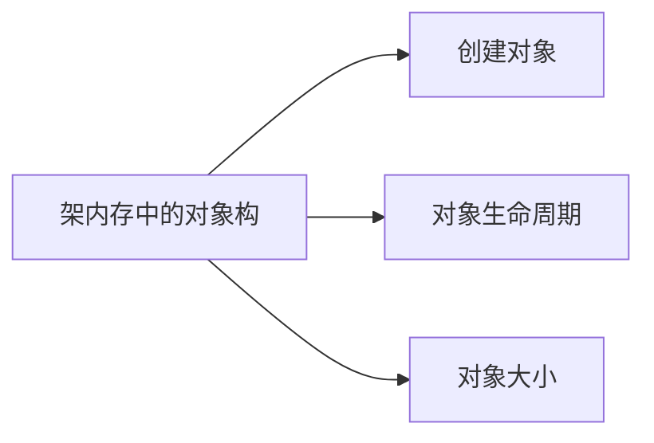

```mermaid
graph LR
    1[内存中的对象] --> 2[创建对象]
    1[内存中的对象] --> 3[对象生命周期]
    1[架内存中的对象构] --> 4[对象大小]
```

&emsp; &emsp; [对象创建](/docs/java/JVM/ObjectCreat.md)  
&emsp; &emsp; [对象的生命周期](/docs/java/JVM/ObjectPeriod.md)  
&emsp; &emsp; [Java对象大小](/docs/java/basis/ObjectSize.md)  
