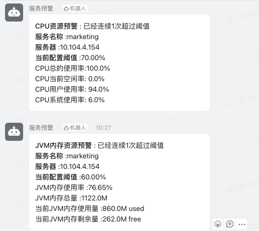

<!-- TOC -->

- [1. 服务监控预警插件](#1-服务监控预警插件)
    - [1.1. 适用场景和解决问题](#11-适用场景和解决问题)
    - [1.2. 使用方法](#12-使用方法)
        - [1.2.1. 引入依赖](#121-引入依赖)
        - [1.2.2. 默认设置](#122-默认设置)
        - [1.2.3. 调整设置](#123-调整设置)

<!-- /TOC -->


# 1. 服务监控预警插件
## 1.1. 适用场景和解决问题
&emsp; 该插件可以集成到springboot服务当中，用于对线上服务运行资源的监控。可以对服务器的CPU、JVM内存、dubbo线程数、数据库连接池进行监控及预警。同时支持开关配置，即是否开启对某个资源的监控，默认情况下所有资源监控都是开启的。当服务器的指标超过阈值时系统进行钉钉群的预警。

* cpu采用org.hyperic.sigar.CpuPerc
* 内存使用org.hyperic.sigar.Sigar
* dubbo线程数采用反射clazz = Class.forName("com.alibaba.dubbo.rpc.protocol.dubbo.status.ThreadPoolStatusChecker")
* 数据库连接池监控，模拟登录druid监控页面获取json数据

## 1.2. 使用方法
### 1.2.1. 引入依赖

```xml
<dependency>
    <groupId>com.wt1814</groupId>
    <artifactId>server-monitor-api</artifactId>
    <version>0.0.1-SNAPSHOT</version>
    <exclusions>
        <exclusion>
            <groupId>org.slf4j</groupId>
            <artifactId>slf4j-log4j12</artifactId>
        </exclusion>
        <exclusion>
            <groupId>log4j</groupId>
            <artifactId>log4j</artifactId>
        </exclusion>
        <exclusion>
            <groupId>org.slf4j</groupId>
            <artifactId>slf4j-api</artifactId>
        </exclusion>
    </exclusions>
</dependency>
```

### 1.2.2. 默认设置
&emsp; (1)插件对于各项指标的默认阈值为0.7，比如：

```text
CPU资源预警 : 已经连续1次超过阈值
服务名称 :marketing
服务器 :10.104.4.154
当前配置阈值 :70.00%
CPU总的使用率:100.0%
CPU当前空闲率: 0.0%
CPU用户使用率: 94.0%
CPU系统使用率: 6.0%
```

&emsp; 即当cpu的CPU总的使用率超过70%时发生预警信息。  
&emsp; (2)数据采集周期默认1分钟。  
&emsp; (3)默认推送钉钉群：  


### 1.2.3. 调整设置
&emsp; 如果想调整默认阈值可以在配置文件中（appolo)增加如下配置：

```properties
#CPU使用率阈值
cpuLimitRate=0.7

# 内存使用率阈值
memLimitRate=0.7

# dubbo活动线程数占比阈值
dubboThreadLimitRate=0.7

# 数据库连接数占比阈值
dataBaseLimitRate=0.7

# 开关 默认true
cpuEnable=false
dubboEnable=false

#监控插件定时任务执行 cron配置（5分钟执行一次）
cronValue=0 */5 * * * ?

# 钉钉通知群地址
dingdingNoticeUrl=https://oapi.dingtalk.com/robot/send?access_token=a39e89eb9570ae62a55064e1406682b9d3b1104939bbc7ec09587be6952ea51e
```