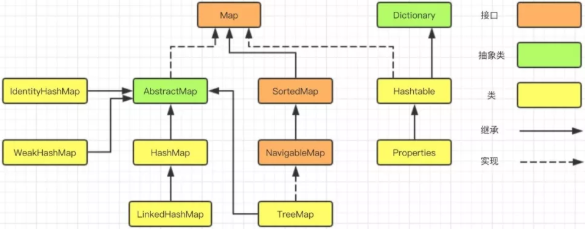
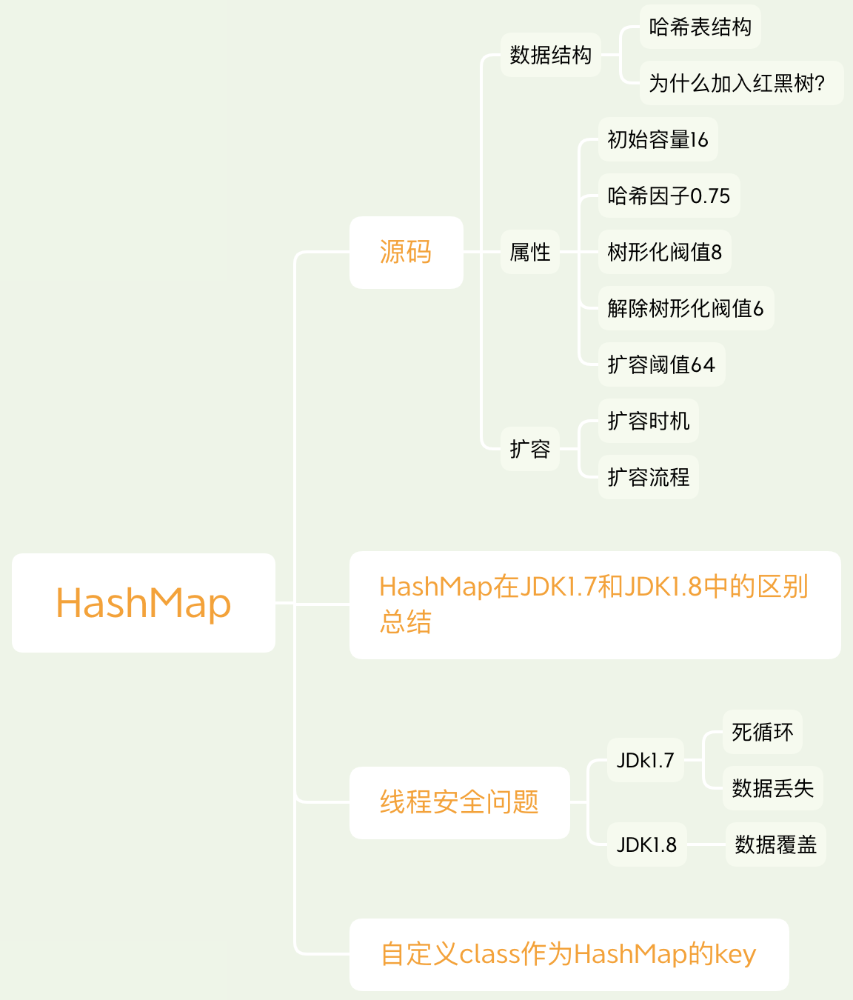
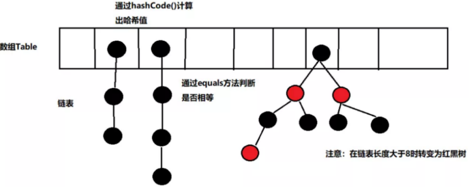
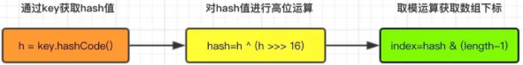

## Map  
  

### HashMap  

&emsp; ***HashMap的底层：Hash表数据结构！！！***

1. 基于JDK1.8的HashMap是由数组+链表+红黑树组成，当链表长度超过8 时链表会自动转换成红黑树，当红黑树节点个数小于6时，又会转化成链表。相对于早期版本的JDK HashMap实现，新增了红黑树作为底层数据结构，在数据量较大且哈希碰撞较多时，能够极大的增加检索的效率。
2. 允许key和value都为null。key重复会被覆盖，value允许重复。HashMap最多只允许一条记录的键为null，允许多条记录的值为null。  
&emsp; HashTable有Null会产生NullPointerException异常  
&emsp; ConcurrentHashMap不允许有Null  
3. 非线程安全。  
4. 自定义HashMap重写hashCode()和equals()方法。如果往HashMap集合中存放自定义的对象，那么保证其唯一，就必须复写hashCode和equals方法建立属于当前对象的比较方式。  
    1. 进行键值对存储时，先通过hashCode()计算出键（K）的哈希值，然后在数组中查询，如果没有则保存。  
    2. 但是如果找到相同的哈希值，那么接着调用equals方法判断它们的值是否相同。只有满足以上两种条件才能认定为相同的数据，因此对于Java中的包装类里面都重写了hashCode()和equals()方法。  

  

#### HashMap源码：  
##### HashMap类定义：  

```java
public class HashMap<K,V> extends AbstractMap<K,V> implements Map<K,V>, Cloneable, Serializable
```
&emsp; Cloneable空接口，表示可以克隆； Serializable序列化； AbstractMap，提供Map实现接口。  
##### HashMap数据结构：  
  
&emsp; 在JDK1.8中，HashMap是由数组+链表+红黑树构成，新增了红黑树作为底层数据结构。链表长度大于8的时候，链表会转成红黑树；当红黑树的节点数小于6时，会转化成链表。  
&emsp; ***为什么使用红黑树？***  
&emsp; JDK 1.7 中，如果哈希碰撞过多，拉链过长，极端情况下，所有值都落入了同一个桶内，这就退化成了一个链表。通过 key 值查找要遍历链表，效率较低。JDK1.8在解决哈希冲突时，当链表长度大于阈值（默认为8）时，将链表转化为红黑树，以减少搜索时间。  

&emsp; ***HashMap中hash函数设计？***  

```java
static final int hash(Object key) {
    int h;
    //1. 允许key为null，hash = 0
    //2. ^，异或运算
    return (key == null) ? 0 : (h = key.hashCode()) ^ (h >>> 16);
}
```
&emsp; hash函数是先得到key 的hashcode（32位的int值），然后让hashcode的高16位和低16位进行异或操作。  
&emsp; hash函数称为“扰动函数”。尽可能降低了hash碰撞；采用位运算，比较高效。  

&emsp; HashMap在发生hash冲突的时候用的是链地址法。
##### 属性：  

```java
//默认的初始化容量为16，必须是2的n次幂
static final int DEFAULT_INITIAL_CAPACITY = 1 << 4; // aka 16

//最大容量为 2^30
static final int MAXIMUM_CAPACITY = 1 << 30;

//默认的加载因子0.75，乘以数组容量得到的值，用来表示元素个数达到多少时，需要扩容。
//为什么设置 0.75 这个值呢，简单来说就是时间和空间的权衡。
//若小于0.75如0.5，则数组长度达到一半大小就需要扩容，空间使用率大大降低，
//若大于0.75如0.8，则会增大hash冲突的概率，影响查询效率。
static final float DEFAULT_LOAD_FACTOR = 0.75f;

//刚才提到了当链表长度过长时，会有一个阈值，超过这个阈值8就会转化为红黑树
static final int TREEIFY_THRESHOLD = 8;

//当红黑树上的元素个数，减少到6个时，就退化为链表
static final int UNTREEIFY_THRESHOLD = 6;

//链表转化为红黑树，除了有阈值的限制，还有另外一个限制，需要数组容量至少达到64，才会树化。
//这是为了避免，数组扩容和树化阈值之间的冲突。
static final int MIN_TREEIFY_CAPACITY = 64;

//存放所有Node节点的数组
transient Node<K,V>[] table;

//存放所有的键值对
transient Set<Map.Entry<K,V>> entrySet;

//map中的实际键值对个数，即数组中元素个数
transient int size;

//每次结构改变时，都会自增，fail-fast机制，这是一种错误检测机制。
//当迭代集合的时候，如果结构发生改变，则会发生 fail-fast，抛出异常。
transient int modCount;

//数组扩容阈值
int threshold;

//加载因子
final float loadFactor;

//普通单向链表节点类
static class Node<K,V> implements Map.Entry<K,V> {
    //key的hash值，put和get的时候都需要用到它来确定元素在数组中的位置
    final int hash;
    final K key;
    V value;
    //指向单链表的下一个节点
    Node<K,V> next;

    Node(int hash, K key, V value, Node<K,V> next) {
        this.hash = hash;
        this.key = key;
        this.value = value;
        this.next = next;
    }
}

//转化为红黑树的节点类
static final class TreeNode<K,V> extends LinkedHashMap.Entry<K,V> {
    //当前节点的父节点
    TreeNode<K,V> parent;
    //左孩子节点
    TreeNode<K,V> left;
    //右孩子节点
    TreeNode<K,V> right;
    //指向前一个节点
    TreeNode<K,V> prev;    // needed to unlink next upon deletion
    //当前节点是红色或者黑色的标识
    boolean red;
    TreeNode(int hash, K key, V val, Node<K,V> next) {
        super(hash, key, val, next);
    }
}
```  
&emsp; 在HashMap的数据结构中，有两个参数可以影响HashMap的性能：初始容量（inital capacity）和负载因子（load factor）。初始容量和负载因子也可以修改，具体实现方式，可以在对象初始化的时候，指定参数。  

* initialCapacity数组的初始容量为16。可以在构造方法中指定。必须是2的幂次方。(16 → 32 → 64 ...)。需要注意的是，传入的initialCapacity并不是实际的初始容量，HashMap通过tableSize函数将initialCapacity调整为大于等于该值的最小2次幂。  

        HashMap的数组长度为什么一定是2的幂次方？
        HashMap 是通过一个名为 tableSizeFor 的方法来确保 HashMap 数组长度永远为2的幂次方的。源码查看构造函数部分。
        为什么要把数组长度设计为 2 的幂次方呢？
        当数组长度为 2 的幂次方时，可以使用位运算来计算元素在数组中的下标。
* loadFactor加载因子0.75f。所谓的加载因子就是HashMap的容量达到0.75时的时候会自动扩容并重新哈希resize(), 扩容后的HashMap容量是之前容量的两倍，所以数组的长度总是2的n次方。(例：假设有一个HashMap的初始容量为16，那么扩容的阀值就是0.75 * 16 = 12。也就是说，在打算存入第13个值的时候，HashMap 会先执行扩容)。  
        
        哈希因子为什么默认为0.75？  
        加载因子也能通过构造方法中指定，默认的负载因子是0.75f，这是一个在时间和空间上的一个折中；较高的值减少了空间开销，但增加了查找成本(主要表现在HaspMap的get和put操作)。如果指定大于1，则数组不会扩容，牺牲了性能不过提升了内存。  
* TREEIFY_THRESHOLD树形化阈值。当链表的节点个数大于等于这个值时，会将链表转化为红黑树。
* UNTREEIFY_THRESHOLD解除树形化阈值。当链表的节点个数小于等于这个值时，会将红黑树转换成普通的链表。

        为什么要将链表中转红黑树的阈值设为8？

* MIN_TREEIFY_CAPACITY树形化阈值的第二条件。当数组的长度小于这个值时，就算树形化阈达标，链表也不会转化为红黑树，而是优先扩容数组resize()。  

* threshold数组扩容阈值。即：HashMap数组总容量 * 加载因子。当前容量大于或等于该值时会执行扩容 resize()。扩容的容量为当前HashMap总容量的两倍。比如，当前HashMap的总容量为16 ，那么扩容之后为32。  


##### 构造函数：  

```java
//默认构造函数，初始化加载因子loadFactor = 0.75
public HashMap() {
    this.loadFactor = DEFAULT_LOAD_FACTOR;
}
/**
 *传入初始容量大小，使用默认负载因子值 来初始化HashMap对象
 */
public HashMap(int initialCapacity) {
    this(initialCapacity, DEFAULT_LOAD_FACTOR);
}
/**
 * @param initialCapacity 指定初始化容量
 * @param loadFactor 加载因子 0.75
 */
public HashMap(int initialCapacity, float loadFactor) {
    //初始化容量不能小于 0 ，否则抛出异常
    if (initialCapacity < 0)
        throw new IllegalArgumentException("Illegal initial capacity: " +
                initialCapacity);
    //如果初始化容量大于2的30次方，则初始化容量都为2的30次方
    if (initialCapacity > MAXIMUM_CAPACITY)
        initialCapacity = MAXIMUM_CAPACITY;
    //如果加载因子小于0，或者加载因子是一个非数值，抛出异常
    if (loadFactor <= 0 || Float.isNaN(loadFactor))
        throw new IllegalArgumentException("Illegal load factor: " +
                loadFactor);
    this.loadFactor = loadFactor;
    this.threshold = tableSizeFor(initialCapacity);
}
// 返回大于等于initialCapacity的最小的二次幂数值。
// >>> 操作符表示无符号右移，高位取0。
// | 按位或运算
static final int tableSizeFor(int cap) {
    int n = cap - 1;//确保第一次出现1的位及其后一位都是1
    n |= n >>> 1;//确保前两次出现的1及其后两位都是1
    n |= n >>> 2;
    n |= n >>> 4;
    n |= n >>> 8;
    n |= n >>> 16;
    return (n < 0) ? 1 : (n >= MAXIMUM_CAPACITY) ? MAXIMUM_CAPACITY : n + 1;
}
```  

##### 成员方法：  
###### 通过K获取数组下标  
&emsp; 不管增加、删除还是查找键值对，定位到数组的位置都是很关键的第一步，打开hashMap的任意一个增加、删除、查找方法，从源码可以看出，通过key获取数组下标，主要做了3步操作，其中length指的是容器数组的大小。  
  

```java
/**获取hash值方法*/
static final int hash(Object key) {
    int h;
    // h = key.hashCode() 为第一步 取hashCode值（jdk1.7）
    // h ^ (h >>> 16)  为第二步 高位参与运算（jdk1.7）
    return (key == null) ? 0 : (h = key.hashCode()) ^ (h >>> 16);//jdk1.8
}
/**获取数组下标方法*/
static int indexFor(int h, int length) {
    //jdk1.7的源码，jdk1.8没有这个方法，但是实现原理一样的
    return h & (length-1);  //第三步 取模运算
}
```

###### put()，插入  
&emsp; put 方法源码部分  

```java
/**
 * put方法
 */
public V put(K key, V value) {
    return putVal(hash(key), key, value, false, true);
}
```  
&emsp; 插入元素方法：  
1. 判断键值对数组table[i]是否为空或为null，否则执行resize()进行扩容；  
2. 根据键值key计算hash值得到插入的数组索引i，如果table[i]==null，直接新建节点添加；  
3. 当table[i]不为空，判断table[i]的首个元素是否和传入的key一样，如果相同直接覆盖value；  
4. 判断table[i]是否为treeNode，即table[i]是否是红黑树，如果是红黑树，则直接在树中插入键值对；  
5. 遍历table[i]，判断链表长度是否大于8，大于8的话把链表转换为红黑树，在红黑树中执行插入操作，否则进行链表的插入操作；遍历过程中若发现 key 已经存在直接覆盖 value 即可；  
6. 插入成功后，判断实际存在的键值对数量size是否超多了最大容量 threshold，如果超过，进行扩容操作；    

```java
/**
 * 插入元素方法
 */
final V putVal(int hash, K key, V value, boolean onlyIfAbsent,
               boolean evict) {
    Node<K,V>[] tab; Node<K,V> p; int n, i;
    //1、判断数组table是否为空或为null
    if ((tab = table) == null || (n = tab.length) == 0)
        n = (tab = resize()).length;
    //2、判断数组下标table[i]==null
    if ((p = tab[i = (n - 1) & hash]) == null)
        tab[i] = newNode(hash, key, value, null);
    else {
        Node<K,V> e; K k;
        //3、判断table[i]的首个元素是否和传入的key一样
        if (p.hash == hash &&
                ((k = p.key) == key || (key != null && key.equals(k))))
            e = p;
            //4、判断table[i] 是否为treeNode
        else if (p instanceof TreeNode)
            e = ((TreeNode<K,V>)p).putTreeVal(this, tab, hash, key, value);
        else {
            //5、遍历table[i]，判断链表长度是否大于8
            for (int binCount = 0; ; ++binCount) {
                if ((e = p.next) == null) {
                    p.next = newNode(hash, key, value, null);
                    //长度大于8，转红黑树结构
                    if (binCount >= TREEIFY_THRESHOLD - 1) // -1 for 1st
                        treeifyBin(tab, hash);
                    break;
                }
                if (e.hash == hash &&
                        ((k = e.key) == key || (key != null && key.equals(k))))
                    break;
                p = e;
            }
        }
        //传入的K元素已经存在，直接覆盖value
        if (e != null) { // existing mapping for key
            V oldValue = e.value;
            if (!onlyIfAbsent || oldValue == null)
                e.value = value;
            afterNodeAccess(e);
            return oldValue;
        }
    }
    ++modCount;
    //6、判断size是否超出最大容量
    if (++size > threshold)
        resize();
    afterNodeInsertion(evict);
    return null;
}
```  
&emsp; 其中，与jdk1.7有区别的地方，第4步新增了红黑树插入方法，源码部分：  

```java
/**
 * 红黑树的插入操作
 */
final TreeNode<K,V> putTreeVal(HashMap<K,V> map, Node<K,V>[] tab,
                               int h, K k, V v) {
    Class<?> kc = null;
    boolean searched = false;
    TreeNode<K,V> root = (parent != null) ? root() : this;
    for (TreeNode<K,V> p = root;;) {
        //dir:遍历的方向， ph:p节点的hash值
        int dir, ph; K pk;
        //红黑树是根据hash值来判断大小
        // -1:左孩子方向 1:右孩子方向
        if ((ph = p.hash) > h)
            dir = -1;
        else if (ph < h)
            dir = 1;
            //如果key存在的话就直接返回当前节点
        else if ((pk = p.key) == k || (k != null && k.equals(pk)))
            return p;
            //如果当前插入的类型和正在比较的节点的Key是Comparable的话，就直接通过此接口比较
        else if ((kc == null &&
                (kc = comparableClassFor(k)) == null) ||
                (dir = compareComparables(kc, k, pk)) == 0) {
            if (!searched) {
                TreeNode<K,V> q, ch;
                searched = true;
                //尝试在p的左子树或者右子树中找到了目标元素
                if (((ch = p.left) != null &&
                        (q = ch.find(h, k, kc)) != null) ||
                        ((ch = p.right) != null &&
                                (q = ch.find(h, k, kc)) != null))
                    return q;
            }
            //获取遍历的方向
            dir = tieBreakOrder(k, pk);
        }
        //上面的所有if-else判断都是在判断下一次进行遍历的方向，即dir
        TreeNode<K,V> xp = p;
        //当下面的if判断进去之后就代表找到了目标操作元素,即xp
        if ((p = (dir <= 0) ? p.left : p.right) == null) {
            Node<K,V> xpn = xp.next;
            //插入新的元素
            TreeNode<K,V> x = map.newTreeNode(h, k, v, xpn);
            if (dir <= 0)
                xp.left = x;
            else
                xp.right = x;
            //因为TreeNode今后可能退化成链表，在这里需要维护链表的next属性
            xp.next = x;
            //完成节点插入操作
            x.parent = x.prev = xp;
            if (xpn != null)
                ((TreeNode<K,V>)xpn).prev = x;
            //插入操作完成之后就要进行一定的调整操作了
            moveRootToFront(tab, balanceInsertion(root, x));
            return null;
        }
    }
}
```  

        1. JDK1.7使用头插法，JDK1.8使用尾插法。  
        2. HashMap在发生hash冲突的时候用的是链地址法。  

###### remove()，删除  
&emsp; HashMap的删除操作仅需三个步骤即可完成。  
1. 定位桶位置  
2. 遍历链表找到相等的节点  
3. 第三步删除节点  

```java
public V remove(Object key) {
    Node<K,V> e;
    return (e = removeNode(hash(key), key, null, false, true)) == null ? null : e.value;
}

final Node<K,V> removeNode(int hash, Object key, Object value,boolean matchValue, boolean movable) {
    Node<K,V>[] tab;
    Node<K,V> p;
    int n, index;
    //1、定位元素桶位置  
    if ((tab = table) != null && (n = tab.length) > 0 && (p = tab[index = (n - 1) & hash]) != null) {
        Node<K,V> node = null, e;
        K k;
        V v;
        // 如果键的值与链表第一个节点相等，则将 node 指向该节点  
        if (p.hash == hash && ((k = p.key) == key || (key != null && key.equals(k))))
            node = p;
        else if ((e = p.next) != null) {
            // 如果是 TreeNode 类型，调用红黑树的查找逻辑定位待删除节点  
            if (p instanceof TreeNode)
                node = ((TreeNode<K,V>)p).getTreeNode(hash, key);
            else {
                // 2、遍历链表，找到待删除节点  
                do {
                    if (e.hash == hash && ((k = e.key) == key || (key != null && key.equals(k)))) {
                        node = e;
                        break;
                    }
                    p = e;
                } while ((e = e.next) != null);
            }
        }
        // 3、删除节点，并修复链表或红黑树  
        if (node != null && (!matchValue || (v = node.value) == value || (value != null && value.equals(v)))) {
            if (node instanceof TreeNode)
                ((TreeNode<K,V>)node).removeTreeNode(this, tab, movable);
            else if (node == p)
                tab[index] = node.next;
            else
                p.next = node.next;
            ++modCount;
            --size;
            afterNodeRemoval(node);
            return node;
        }
    }
    return null;
}
```  

#### HashMap在JDK1.7和JDK1.8中的区别总结  
* 数组+链表改成了数组+链表或红黑树；  
* 链表的插入方式从头插法改成了尾插法，简单说就是插入时，如果数组位置上已经有元素，1.7将新元素放到数组中，原始节点作为新节点的后继节点，1.8遍历链表，将元素放置到链表的最后；  
* 扩容的时候1.7需要对原数组中的元素进行重新hash定位在新数组的位置，1.8采用更简单的判断逻辑，位置不变或索引+旧容量大小；  
* 在插入时，1.7先判断是否需要扩容，再插入，1.8先进行插入，插入完成再判断是否需要扩容；  

#### HashMap的线程安全问题？  
##### JDK1.7  
&emsp; HashMap在数组的元素过多时会进行扩容操作，扩容之后会把原数组中的元素拿到新的数组中，这时候在多线程情况下就有可能出现多个线程搬运一个元素。或者说一个线程正在进行扩容，但是另一个线程还想进来存或者读元素，这也可会出现线程安全问题。   
1. 在jdk1.7中，在多线程环境下，扩容时会造成环形链或数据丢失。  
2. 在jdk1.8中，在多线程环境下，会发生数据覆盖的情况。  
&emsp; 在jdk1.8中对HashMap进行了优化，在发生hash碰撞，不再采用头插法方式，而是直接插入链表尾部，因此不会出现环形链表的情况。  

&emsp; 在多线程下安全的操作map，主要有以下解决方法：  
* 使用Hashtable线程安全类；  
* 使用Collections.synchronizedMap方法，对方法进行加同步锁；  
* 使用并发包中的ConcurrentHashMap类；  

#### 如何实现一个自定义的class作为HashMap的key？  
......

----
## LikedHashMap  
&emsp; LinkedHashMap怎么实现有序的？  
&emsp; LinkedHashMap内部维护了一个单链表，有头尾节点，同时LinkedHashMap节点Entry内部除了继承HashMap的Node属性，还有before 和 after用于标识前置节点和后置节点。可以实现按插入的顺序或访问顺序排序。  

```java
/**
 * The head (eldest) of the doubly linked list.
 */
transient LinkedHashMap.Entry<K,V> head;

/**
 * The tail (youngest) of the doubly linked list.
 */
transient LinkedHashMap.Entry<K,V> tail;
//链接新加入的p节点到链表后端
private void linkNodeLast(LinkedHashMap.Entry<K,V> p) {
    LinkedHashMap.Entry<K,V> last = tail;
    tail = p;
    if (last == null)
        head = p;
    else {
        p.before = last;
        last.after = p;
    }
}
//LinkedHashMap的节点类
static class Entry<K,V> extends HashMap.Node<K,V> {
    Entry<K,V> before, after;
    Entry(int hash, K key, V value, Node<K,V> next) {
        super(hash, key, value, next);
    }
}
```