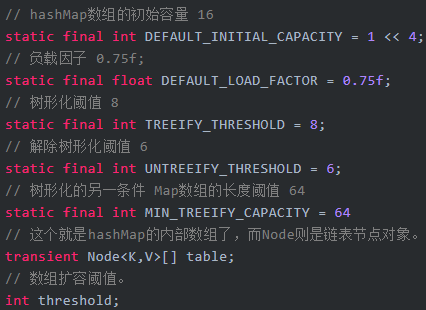

## Map  
  

### HashMap  

1. 基于JDK1.8的HashMap是由数组+链表+红黑树组成，当链表长度超过8 时链表会自动转换成红黑树，当红黑树节点个数小于6时，又会转化成链表。相对于早期版本的JDK HashMap实现，新增了红黑树作为底层数据结构，在数据量较大且哈希碰撞较多时，能够极大的增加检索的效率。
2. 允许key和value都为null。key重复会被覆盖，value允许重复。HashMap最多只允许一条记录的键为null，允许多条记录的值为null。  
&emsp; HashTable有Null会产生NullPointerException异常  
&emsp; ConcurrentHashMap不允许有Null  
3. 非线程安全。  
4. 自定义HashMap重写hashCode()和equals()方法。如果往HashMap集合中存放自定义的对象，那么保证其唯一，就必须复写hashCode和equals方法建立属于当前对象的比较方式。  
    1. 进行键值对存储时，先通过hashCode()计算出键（K）的哈希值，然后在数组中查询，如果没有则保存。  
    2. 但是如果找到相同的哈希值，那么接着调用equals方法判断它们的值是否相同。只有满足以上两种条件才能认定为相同的数据，因此对于Java中的包装类里面都重写了hashCode()和equals()方法。  

  

#### HashMap源码：  
#### HashMap类定义：  

```java
public class HashMap<K,V> extends AbstractMap<K,V> implements Map<K,V>, Cloneable, Serializable
```
&emsp; Cloneable空接口，表示可以克隆； Serializable序列化； AbstractMap，提供Map实现接口。  
#### HashMap数据结构：  
  
&emsp; 在JDK1.8中，HashMap是由数组+链表+红黑树构成，新增了红黑树作为底层数据结构。链表长度大于8的时候，链表会转成红黑树；当红黑树的节点数小于6时，会转化成链表。  
&emsp; ***为什么使用红黑树？***  
&emsp; 因为Map中桶的元素初始化是链表保存的，其查找性能是O(n)，而树结构能将查找性能提升到O(log(n))。当链表长度很小的时候，即使遍历，速度也非常快，但是当链表长度不断变长，肯定会对查询性能有一定的影响，所以才需要转成树。  

&emsp; HashMap数据结构源码：  
&emsp; 在HashMap中的底层数组中，每个元素在jdk1.7及之前叫做Entry，而在jdk1.8之后又改名叫做Node。Node是HhaspMap中的一个静态内部类，是hash基础的节点，是单向链表，实现了Map.Entry接口。  
```java
static class Node<K,V> implements Map.Entry<K,V> {
    final int hash;//hash值
    final K key;//k键
    V value;//value值
    Node<K,V> next;//链表中下一个元素
}
```

&emsp; TreeNode是红黑树的数据结构。  
```java
static final class TreeNode<K,V> extends LinkedHashMap.Entry<K,V> {
    TreeNode<K, V> parent;  // 定义红黑树父节点
    TreeNode<K, V> left;    // 左子树
    TreeNode<K, V> right;   // 右子树
    TreeNode<K, V> prev;    // 上一个节点，后期会根据上一个节点作相应判断
    boolean red;           // 判断颜色的属性

    TreeNode(int hash, K key, V val, Node<K, V> next) {
        super(hash, key, val, next);
    }

    /**
     * 返回根节点
     */
    final TreeNode<K, V> root() {
        for (TreeNode<K, V> r = this, p; ; ) {
            if ((p = r.parent) == null)
                return r;
            r = p;
        }
    }
}
```

#### 属性：  
  
* 在HashMap的数据结构中，有两个参数可以影响HashMap的性能：初始容量（inital capacity）和负载因子（load factor）。初始容量和负载因子也可以修改，具体实现方式，可以在对象初始化的时候，指定参数。  
* initialCapacity数组的初始容量为16。可以在构造方法中指定。必须是2的幂次方。(16 → 32 → 64 ...)。需要注意的是，传入的initialCapacity并不是实际的初始容量，HashMap通过tableSize函数将initialCapacity调整为大于等于该值的最小2次幂。  
* loadFactor加载因子0.75f。所谓的加载因子就是HashMap的容量达到0.75时的时候会自动扩容并重新哈希resize(), 扩容后的HashMap容量是之前容量的两倍，所以数组的长度总是2的n次方。(例：假设有一个HashMap的初始容量为16，那么扩容的阀值就是0.75 * 16 = 12。也就是说，在打算存入第13个值的时候，HashMap 会先执行扩容)。加载因子也能通过构造方法中指定，默认的负载因子是0.75f，这是一个在时间和空间上的一个折中；较高的值减少了空间开销，但增加了查找成本(主要表现在HaspMap的get和put操作)。如果指定大于1，则数组不会扩容，牺牲了性能不过提升了内存。如果初始容量大于最大条目数除以负载因子，则不会发生任何重哈希操作。  
&emsp; 默认的负载因子0.75是对空间和时间效率的一个平衡选择，建议不要修改，除非在时间和空间比较特殊的情况下，如果内存空间很多而又对时间效率要求很高，可以降低负载因子Load factor的值；相反，如果内存空间紧张而对时间效率要求不高，可以增加负载因子loadFactor的值，这个值可以大于1。同时，对于插入元素较多的场景，可以将初始容量设大，减少重新哈希的次数。  
* TREEIFY_THRESHOLD树形化阈值。当链表的节点个数大于等于这个值时，会将链表转化为红黑树。  
* UNTREEIFY_THRESHOLD解除树形化阈值。当链表的节点个数小于等于这个值时，会将红黑树转换成普通的链表。  
* MIN_TREEIFY_CAPACITY树形化阈值的第二条件。当数组的长度小于这个值时，就算树形化阈达标，链表也不会转化为红黑树，而是优先扩容数组resize()。  
* threshold数组扩容阈值。即：HashMap数组总容量 * 加载因子。当前容量大于或等于该值时会执行扩容 resize()。扩容的容量为当前HashMap总容量的两倍。比如，当前HashMap的总容量为16 ，那么扩容之后为32。  

#### 属性：  

```java
//默认构造函数，初始化加载因子loadFactor = 0.75
public HashMap() {
    this.loadFactor = DEFAULT_LOAD_FACTOR;
}
/**
 *传入初始容量大小，使用默认负载因子值 来初始化HashMap对象
 */
public HashMap(int initialCapacity) {
    this(initialCapacity, DEFAULT_LOAD_FACTOR);
}
/**
 * @param initialCapacity 指定初始化容量
 * @param loadFactor 加载因子 0.75
 */
public HashMap(int initialCapacity, float loadFactor) {
    //初始化容量不能小于 0 ，否则抛出异常
    if (initialCapacity < 0)
        throw new IllegalArgumentException("Illegal initial capacity: " +
                initialCapacity);
    //如果初始化容量大于2的30次方，则初始化容量都为2的30次方
    if (initialCapacity > MAXIMUM_CAPACITY)
        initialCapacity = MAXIMUM_CAPACITY;
    //如果加载因子小于0，或者加载因子是一个非数值，抛出异常
    if (loadFactor <= 0 || Float.isNaN(loadFactor))
        throw new IllegalArgumentException("Illegal load factor: " +
                loadFactor);
    this.loadFactor = loadFactor;
    this.threshold = tableSizeFor(initialCapacity);
}
// 返回大于等于initialCapacity的最小的二次幂数值。
// >>> 操作符表示无符号右移，高位取0。
// | 按位或运算
static final int tableSizeFor(int cap) {
    int n = cap - 1;//确保第一次出现1的位及其后一位都是1
    n |= n >>> 1;//确保前两次出现的1及其后两位都是1
    n |= n >>> 2;
    n |= n >>> 4;
    n |= n >>> 8;
    n |= n >>> 16;
    return (n < 0) ? 1 : (n >= MAXIMUM_CAPACITY) ? MAXIMUM_CAPACITY : n + 1;
}
```


