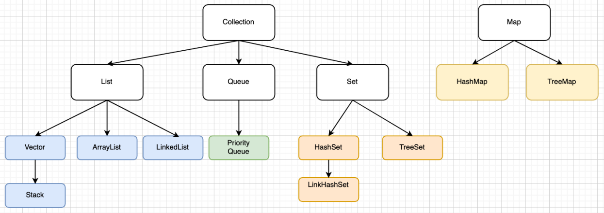

## 集合类  
### Collection和Map
  

     Collection(单列集合)
         List(有序,可重复)
             ArrayList
                 底层数据结构是数组,查询快,增删慢
                 线程不安全,效率高
             Vector
                 底层数据结构是数组,查询快,增删慢
                 线程安全,效率低
             LinkedList
                 底层数据结构是双向循环链表,查询慢,增删快
                 线程不安全,效率高
         Set(无序,唯一)
             HashSet
                 底层数据结构是哈希表。
                 哈希表依赖两个方法：hashCode()和equals()
                 执行顺序：
                     首先判断hashCode()值是否相同
                         是：继续执行equals(),看其返回值
                             是true:说明元素重复，不添加
                             是false:就直接添加到集合
                         否：就直接添加到集合
                 最终：
                     自动生成hashCode()和equals()即可

                 LinkedHashSet
                     底层数据结构由链表和哈希表组成。
                     由链表保证元素有序。
                     由哈希表保证元素唯一。
             TreeSet
                 底层数据结构是红黑树。(是一种自平衡的二叉树)
                 如何保证元素唯一性呢?
                     根据比较的返回值是否是0来决定
                 如何保证元素的排序呢?
                     两种方式
                         自然排序(元素具备比较性)
                             让元素所属的类实现Comparable接口
                         比较器排序(集合具备比较性)
                             让集合接收一个Comparator的实现类对象
     Map(双列集合)
         A:Map集合的数据结构仅仅针对键有效，与值无关。
         B:存储的是键值对形式的元素，键唯一，值可重复。
         
         HashMap
             底层数据结构是哈希表。线程不安全，效率高
                 哈希表依赖两个方法：hashCode()和equals()
                 执行顺序：
                     首先判断hashCode()值是否相同
                         是：继续执行equals(),看其返回值
                             是true:说明元素重复，不添加
                             是false:就直接添加到集合
                         否：就直接添加到集合
                 最终：
                     自动生成hashCode()和equals()即可
             LinkedHashMap
                 底层数据结构由链表和哈希表组成。
                     由链表保证元素有序。
                     由哈希表保证元素唯一。
        Hashtable
             底层数据结构是哈希表。线程安全，效率低
                 哈希表依赖两个方法：hashCode()和equals()
                 执行顺序：
                     首先判断hashCode()值是否相同
                         是：继续执行equals(),看其返回值
                             是true:说明元素重复，不添加
                             是false:就直接添加到集合
                         否：就直接添加到集合
                 最终：
                     自动生成hashCode()和equals()即可
         TreeMap
             底层数据结构是红黑树。(是一种自平衡的二叉树)
                 如何保证元素唯一性呢?
                     根据比较的返回值是否是0来决定
                 如何保证元素的排序呢?
                     两种方式
                        自然排序(元素具备比较性)
                             让元素所属的类实现Comparable接口
                         比较器排序(集合具备比较性)
                             让集合接收一个Comparator的实现类对象  

&emsp; ***关于集合选取原则：***  

    是否是键值对象形式:
        是：Map
            键是否需要排序:
                是：TreeMap
                否：HashMap
            不知道，就使用HashMap。  
        否：Collection
            元素是否唯一:
                是：Set
                    元素是否需要排序:
                        是：TreeSet
                        否：HashSet
                    不知道，就使用HashSet
                否：List
                    要安全吗:
                       是：Vector
                       否：ArrayList或者LinkedList
                           增删多：LinkedList
                           查询多：ArrayList
                       不知道，就使用ArrayList
           不知道，就使用ArrayList  

### 集合常见问题：  


### 集合使用注意事项：  
#### Arrays.asList()不能使用其修改集合相关的方法  
&emsp; 《阿里巴巴java开发规范》使用工具类Arrays.asList()方法把数组转换成集合时，不能使用其修改集合相关的方法，它的add/remove/clear方法会抛出UnsupportedOperationException()。  

#### ArrayList修改元素的炕  
&emsp; ArrayList集合不能使用foreach增加、删除、修改元素。  

&emsp; ***解决办法***  
* 采用倒序移除  

```java
public static void main(String[] args) {
    List<String> list = new ArrayList<String>();
    list.add("11");
    list.add("11");
    list.add("12");
    list.add("13");
    list.add("14");
    list.add("15");
    list.add("16");
    System.out.println("原始list元素："+ list.toString());
    CopyOnWriteArrayList<String> copyList = new CopyOnWriteArrayList<>(list);

    //通过下表移除等于11的元素
    for (int i = list.size() - 1; i >= 0; i--) {
        String item = list.get(i);
        if("11".equals(item)) {
            list.remove(i);
        }
    }
    System.out.println("通过下表移除后的list元素："+ list.toString());

    //通过对象移除等于11的元素
    for (int i = copyList.size() - 1; i >= 0; i--) {
        String item = copyList.get(i);
        if("11".equals(item)) {
            copyList.remove(item);
        }
    }
    System.out.println("通过对象移除后的list元素："+ list.toString());

}
```
&emsp; 输出结果：  

    原始list元素：[11, 11, 12, 13, 14, 15, 16]
    通过下表移除后的list元素：[12, 13, 14, 15, 16]
    通过对象移除后的list元素：[12, 13, 14, 15, 16]

* fore的解决办法  

```java
public static void main(String[] args) {
    List<String> list = new ArrayList<String>();
    list.add("11");
    list.add("11");
    list.add("12");
    list.add("13");
    list.add("14");
    list.add("15");
    list.add("16");
    System.out.println("原始list元素："+ list.toString());
    CopyOnWriteArrayList<String> copyList = new CopyOnWriteArrayList<>(list);

    //通过对象移除等于11的元素
    for (String item : copyList) {
        if("11".equals(item)) {
            copyList.remove(item);
        }
    }
    System.out.println("通过对象移除后的list元素："+ copyList.toString());

}
```
&emsp; 输出结果：  

    原始list元素：[11, 11, 12, 13, 14, 15, 16]
    通过对象移除后的list元素：[12, 13, 14, 15, 16]  

* 使用迭代器移除  

```java
public static void main(String[] args) {
    List<String> list = new ArrayList<String>();
    list.add("11");
    list.add("11");
    list.add("12");
    list.add("13");
    list.add("14");
    list.add("15");
    list.add("16");
    System.out.println("原始list元素："+ list.toString());

    //通过迭代器移除等于11的元素
    Iterator<String> iterator = list.iterator();
    while(iterator.hasNext()) {
        String item = iterator.next();
        if("11".equals(item)) {
            iterator.remove();
        }
    }
    System.out.println("通过迭代器移除后的list元素："+ list.toString());
}
```
&emsp; 输出结果：  
    
    原始list元素：[11, 11, 12, 13, 14, 15, 16]
    通过迭代器移除后的list元素：[12, 13, 14, 15, 16]  

* jdk1.8的写法  

```java
public static void main(String[] args) {
    List<String> list = new ArrayList<String>();
    list.add("11");
    list.add("11");
    list.add("12");
    list.add("13");
    list.add("14");
    list.add("15");
    list.add("16");
    System.out.println("原始list元素："+ list.toString());

    //jdk1.8移除等于11的元素
    list.removeIf(item -> "11".equals(item));
    System.out.println("移除后的list元素："+ list.toString());
}
```
&emsp; 输出结果：  

    原始list元素：[11, 11, 12, 13, 14, 15, 16]
    通过迭代器移除后的list元素：[12, 13, 14, 15, 16]  

&emsp; ***总结：*** 如果开发中需要在集合中移除某个元素，如果jdk是1.8的，建议直接使用2.4方法，如果是低版本，那么建议采用迭代器方法，效率高，性能好！  

#### Java集合不能存放基本数据类型，只存放对象的引用  
&emsp; Java集合如Map、Set、List等所有集合只能存放引用类型数据（数组、类，集合类型属于类范畴、接口），它们都是存放引用类型数据的容器。不能存放如int、long、float、double等基础类型的数据。  
&emsp; 基本类型数据如何解决？  
&emsp; 可以通过包装类把基本类型转为对象类型，存放引用就可以解决这个问题。由于有了自动拆箱和装箱功能，基本数据类型和其对应对象（包装类）之间的转换变得很方便，直接把基本数据类型存入集合中，系统会自动将其装箱成封装类，然后加入到集合当中。示例代码：  

```java
int i = 10; 
Integer in = new Integer(i);//手动将i包装为Integer类型对象 
HashSet set = new HashSet();//定义一个Set集合 
set.add(in);//将包装类对象加入该集合 
System.out.println(set);//打印结果
```
&emsp; 同样的效果（自动包装）：  

```java
int i = 10; 
HashSet set = new HashSet(); 
set.add(i);//系统会自动将i装箱为Integer类型的对象然后再存入set集合中 
System.out.println(set);
```

-----
## 迭代器类Iterator  
&emsp; 什么是迭代器 (Iterator)？   
&emsp; Iterator接口提供了很多对集合元素进行迭代的方法。每一个集合类都包含了可以返回迭代器实例的迭代方法。迭代器可以在迭代的过程中删除底层集合的元素, 但是不可以直接调用集合的remove(Object Obj) 删除，可以通过迭代器的remove()方法删除。   

### Iterator接口  
&emsp; Iterator是一个属于集合框架的接口。它允许遍历集合，访问数据元素并删除集合的数据元素。  
&emsp; java.util包具有公共接口Iterator并包含三个方法：  

|方法	|说明|
|---|---|
|boolean hasNext()	|如果Iterator有更多要迭代的元素，则返回true。|
|Object next()	|返回集合中下一个元素，直到hasNext()方法返回true。如果没有下一个元素，则此方法抛出“NoSuchElementException”。第一次调用next，则返回第一个元素。|
|void remove()	|它删除集合中的当前元素。如果在调用next()之前调用此函数，则此方法抛出”IllegalStateException”。|  

### ListIterator接口  
&emsp; ListIterator是个迭代器，它是Iterator的子接口，它比Iterator更加的强大，提供了更多在迭代过程中使用的方法。  

&emsp; Iterator和ListIterator的区别是什么？  
* Iterator可用来遍历Set和List集合，但是ListIterator只能用来遍历List。   
* ListIterator实现了Iterator接口，并包含其他的功能，比如：增加元素，替换元 素，获取前一个和后一个元素的索引，等等。  
* Iterator只能正向遍历集合，适用于获取移除元素。ListIterator继承自Iterator，专门针对List，可以从两个方向来遍历List，同时支持元素的修改。  

&emsp; ListIterator接口常用方法：  
  
&emsp; 方法演示：  

```java
//案例：在list集合迭代元素中，对元素进行判断，一旦条件满足就添加一个新元素
public class ListIteratorDemo {
	public static void main(String[] args) {
		//创建List容器
		List<String> list = new ArrayList<String>();
		//给容器中添加元素
		list.add("abc1");
		list.add("abc2");
		list.add("abc3");
		list.add("abc4");
		//遍历容器，当有元素为"abc2"时，使用迭代器，加入新元素"itcast"
		ListIterator<String> it = list.listIterator();
		while(it.hasNext()){
			String str = it.next();
			if("abc2".equals(str)){
				it.add("itcast");
			}
		}
		//打印容器中的元素
		System.out.println(list);
	}
}
```

### Iterator和forEach的区别  
......

### ConcurrentModificationException异常  
1. 在单线程中，集合循环遍历时所使用的迭代器Iterator有一个要求：在迭代的过程中，除了使用迭代器（如:Iterator.remove()方法）对集合增删元素外，是不允许直接对集合进行增删操作。否则将会抛出ConcurrentModificationException异常。所以，由于集合的for-Each循环本质上使用的还是Iterator来迭代，因此也要注意这个陷阱。for-Each循环很隐蔽地使用了Iterator，导致程序员很容易忽略掉这个细节，所以一定要注意。看下面的例子，for-Each循环中修改了集合。  

```java
List<String> list = new LinkedList<String>();
list.add("aa");
list.add("bb");
for (String item : list) {//for-Each
    if ("bb".equals(item)) {
        list.add("cc"); //直接操作list
    }
}
```  
&emsp; 运行抛出异常:ConcurrentModificationException。  
&emsp; 抛出上述异常的主要原因是当调用容器的iterator()方法返回Iterator对象时，把容器中包含对象的个数赋值给了一个变量expectedModCount，在调用next()方法时会比较变量expectedModCount与容器中实际对象的个数modCount的值是否相等，若二者不相等，则会抛出ConcurrentModificationException异常，因此在使用Iterator遍历容器的过程中，如果对容器进行增加或删除操作，就会改变容器中对象的数量，从而导致抛出异常。解决办法如下：在遍历的过程中把需要删除的对象保存到一个集合中，等遍历结束后再调用removeAll()方法来删除，或者使用iterator.remove()方法。  
2. 在多线程的环境中，线程是交替运行的（时间片轮转调度）。这就意味着，如果有两个线程A、B，线程A对集合使用Iterator迭代遍历，线程B则对集合进行增删操作。线程A、B一旦交替运行，就会出现在迭代的同时对集合增删的效果，也会抛出异常。解决办法就是加锁变成原子操作。  
以上主要介绍了单线程的解决方案，那么多线程访问容器的过程中抛出ConcurrentModificationException异常了又该怎么解决呢？  
* 在JDK1.5版本引入了线程安全的容器，比如ConcurrentHashMap和CopyOnWriteArrayList等。可以使用这些线程安全的容器来代替非线程安全的容器。  
* 在使用迭代器遍历容器时对容器的操作放到synchronized代码块中，但是当引用程序并发程度比较高时，这会严重影响程序的性能。  

### 快速失败（fail-fast）VS安全失败（fail-safe）  
......

----
## 集合工具类  
### 集合工具类Collections  
&emsp; API描述：http://tool.oschina.net/uploads/apidocs/jdk-zh/java/util/Collections.html  
&emsp; Collections提供了一些常用的集合框架操作。掌握API中部分常用的方法。  

### 数组工具类Arrays  
&emsp; java.util.Arrays类能方便地操作数组,它提供的所有方法都是静态的。  

### Comparable、Comparator接口  
&emsp; 一般是用于对象的比较来实现排序，两者略有区别：  
&emsp; Comparable用作默认的比较方式，实现了该接口的类之间可以相互进行比较，这个对象组成的集合就可以直接通过sort()进行排序了。  
&emsp; Comparator是设计模式中策略模式的一种应用。将算法的实现和数据进行了分离。  

