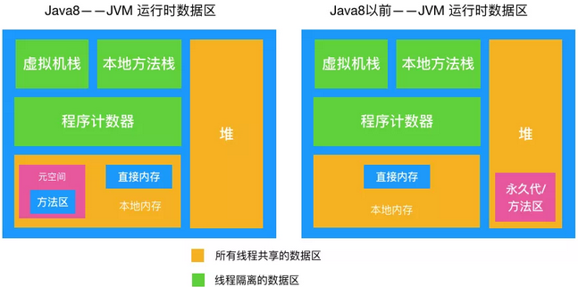
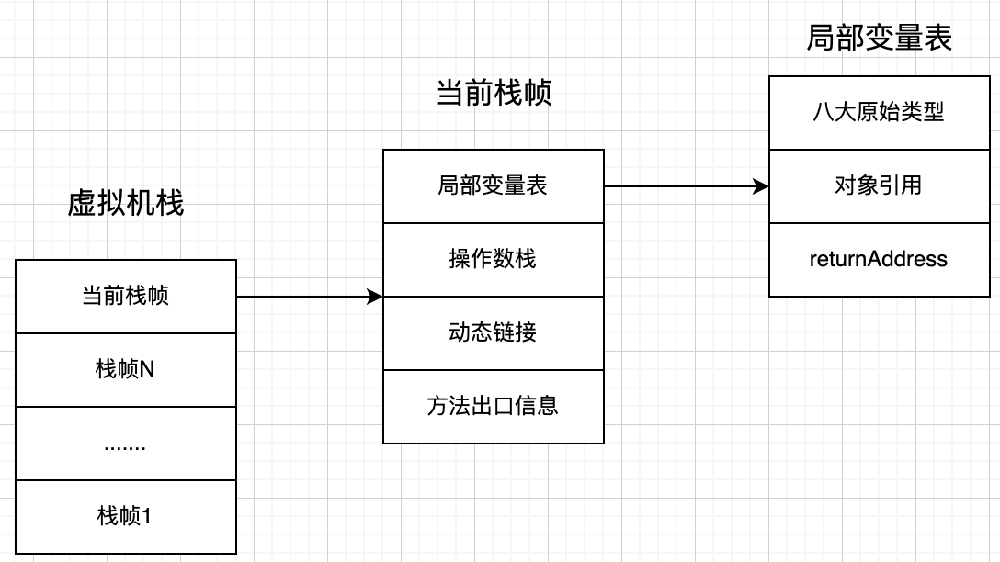

## JVM运行时数据区  
&emsp; Java虚拟机在执行Java程序的过程中会把它管理的内存划分成若干个不同的数据区域。JDK1.8和之前的版本略有不同。  
  
&emsp; JVM 内存区域主要分为线程私有区域【程序计数器、虚拟机栈、本地方法区】、线程共享区域【Java 堆、方法区】、直接内存。  
&emsp; 线程私有数据区域生命周期与线程相同，依赖用户线程的启动/结束而创建/销毁（在 Hotspot VM 内，每个线程都与操作系统的本地线程直接映射，因此这部分内存区域的存/否跟随系统本地线程的生/死对应）。  
&emsp; 线程共享区随虚拟机的启动/关闭而创建/销毁。  
### 1. 程序计数器  
&emsp; Program Counter Register程序计数器是一块较小的内存空间，可以看作是当前线程所执行的字节码的行号指示器。  
&emsp; 1).存储内容：  
如果线程执行的是java方法，这个计数器记录的是正在执行的虚拟字节码指令的地址。  
如果线程执行的是native方法，那么这个计数器的值为undefined。  

&emsp; 2).主要有两个作用：  
字节码解释器通过改变程序计数器来依次读取指令，从而实现代码的流程控制，如：顺序执行、选择、循环、异常处理。  
在多线程的情况下，程序计数器用于记录当前线程执行的位置，从而当线程被切换回来的时候能够知道该线程上次运行到哪儿了。  

&emsp; 3).为了线程切换后能恢复到正确的执行位置，每条线程都需要有一个独立的程序计数器，各线程之间计数器互不影响，独立存储，因此这类内存区域为“线程私有”的内存。  

&emsp; 4).程序计数器是唯一一个不会出现OutOfMemoryError的内存区域，它的生命周期随着线程的创建而创建，随着线程的结束而死亡。  
### 2. JVM栈  
&emsp; JVM栈描述Java方法执行的内存模型。Java虚拟机栈中出栈入栈的元素称为「栈帧」，栈对应线程，栈帧对应方法。每个方法被执行的时候都会同时创建一个栈帧。每一个方法被调用直至执行完成的过程，就对应着一个栈帧在虚拟机栈中从入栈到出栈的过程。执行流程如下：  
&emsp; 示例代码：  

```java
int main() {
    int a = 1;
    int ret = 0;
    int res = 0;
    ret = add(3, 5);
    res = a + ret;
    printf("%d", res);
    reuturn 0;
}

int add(int x, int y) {
    int sum = 0;
    sum = x + y;
    return sum;
}
```  
&emsp; main()函数调用了add()函数，获取计算结果，并且与临时变量a相加，最后打印res的值。下图展示了在执行到add()函数时，函数调用栈的情况。  
  
&emsp; 存储内容：Java虚拟机栈是由一个个栈帧组成，而每个栈帧中都拥有：局部变量表、操作数栈、动态链接、方法出口信息。  
  
&emsp; Java虚拟机栈是线程私有的。  
&emsp; Java虚拟机栈会出现两种异常：StackOverFlowError和 OutOfMemoryError。  


