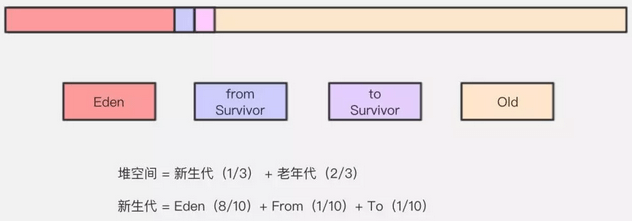
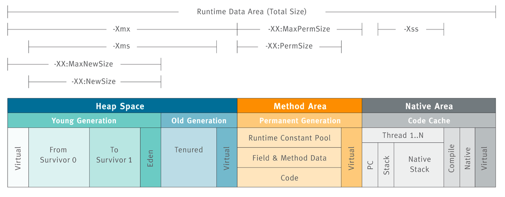

## JVM运行时数据区  
&emsp; Java虚拟机在执行Java程序的过程中会把它管理的内存划分成若干个不同的数据区域。JDK1.8和之前的版本略有不同。  
  
&emsp; JVM 内存区域主要分为线程私有区域【程序计数器、虚拟机栈、本地方法区】、线程共享区域【Java 堆、方法区】、直接内存。  
&emsp; 线程私有数据区域生命周期与线程相同，依赖用户线程的启动/结束而创建/销毁（在 Hotspot VM 内，每个线程都与操作系统的本地线程直接映射，因此这部分内存区域的存/否跟随系统本地线程的生/死对应）。  
&emsp; 线程共享区随虚拟机的启动/关闭而创建/销毁。  
### 1. 程序计数器  
&emsp; Program Counter Register程序计数器是一块较小的内存空间，可以看作是当前线程所执行的字节码的行号指示器。  
&emsp; 1).存储内容：  
如果线程执行的是java方法，这个计数器记录的是正在执行的虚拟字节码指令的地址。  
如果线程执行的是native方法，那么这个计数器的值为undefined。  

&emsp; 2).主要有两个作用：  
字节码解释器通过改变程序计数器来依次读取指令，从而实现代码的流程控制，如：顺序执行、选择、循环、异常处理。  
在多线程的情况下，程序计数器用于记录当前线程执行的位置，从而当线程被切换回来的时候能够知道该线程上次运行到哪儿了。  

&emsp; 3).为了线程切换后能恢复到正确的执行位置，每条线程都需要有一个独立的程序计数器，各线程之间计数器互不影响，独立存储，因此这类内存区域为“线程私有”的内存。  

&emsp; 4).程序计数器是唯一一个不会出现OutOfMemoryError的内存区域，它的生命周期随着线程的创建而创建，随着线程的结束而死亡。  
### 2. JVM栈  
&emsp; JVM栈描述Java方法执行的内存模型。Java虚拟机栈中出栈入栈的元素称为「栈帧」，栈对应线程，栈帧对应方法。每个方法被执行的时候都会同时创建一个栈帧。每一个方法被调用直至执行完成的过程，就对应着一个栈帧在虚拟机栈中从入栈到出栈的过程。执行流程如下：  
&emsp; 示例代码：  

```java
int main() {
    int a = 1;
    int ret = 0;
    int res = 0;
    ret = add(3, 5);
    res = a + ret;
    printf("%d", res);
    reuturn 0;
}

int add(int x, int y) {
    int sum = 0;
    sum = x + y;
    return sum;
}
```
&emsp; main()函数调用了add()函数，获取计算结果，并且与临时变量a相加，最后打印res的值。下图展示了在执行到add()函数时，函数调用栈的情况。  
  
&emsp; 存储内容：Java虚拟机栈是由一个个栈帧组成，而每个栈帧中都拥有：局部变量表、操作数栈、动态链接、方法出口信息。  
  
&emsp; Java虚拟机栈是线程私有的。  
&emsp; Java虚拟机栈会出现两种异常：StackOverFlowError和 OutOfMemoryError。  
### 本地方法堆栈  
&emsp; 本地方法栈与虚拟机栈作用相似。注：hotspot虚拟机中，虚拟机栈与本地方法栈是一体的。  
&emsp; 区别：虚拟机栈为虚拟机执行Java方法服务；本地方法栈为虚拟机执行native方法服务。  
&emsp; 本地方法堆栈也会出现StackOverFlowError和OutOfMemoryError两种异常。  

### 4. 堆  
&emsp; 存储内容：Java堆存储所有由new创建的对象（包括该对象其中的所有成员变量）和数组。  
&emsp; 堆中对象的内存需要等待GC进行回收。Java堆是垃圾收集器管理的主要区域，因此也被称作GC堆（Garbage Collected Heap）。  
&emsp; 堆分类：从垃圾回收的角度，由于现在收集器基本都采用分代垃圾收集算法，所以Java堆还可以细分为：新生代和老年代。新生代内存又被分成三部分，Eden、From Survivor、To Survivor，默认情况下年轻代按照8:1:1的比例来分配。  
  


#### Java堆内存配置项  
  
&emsp; ***堆内存扩展：通过 -Xmx -Xms 控制。***  
&emsp; 没有直接设置老年代的参数，但是可以设置堆空间大小和新生代空间大小两个参数来间接控制。老年代空间大小=堆空间大小-年轻代大空间大小。  

|VM Switch|描述|
|---|---|
|-Xms	|用于在JVM启动时设置初始堆大小|
|-Xmx	|用于设置最大堆大小|
|-Xmn	|设置新生区的大小，剩下的空间用于老年区|
|-XX：PermGen	|用于设置永久区存初始大小|
|-XX：MaxPermGen	|用于设置Perm Gen的最大尺寸|
|XX：SurvivorRatio	|提供Eden区域的比例|
|XX：NewRatio	|用于提供老年代/新生代大小的比例，默认值为2|

&emsp; 32位JVM和64位JVM的最大堆内存分别是多少？  
&emsp; 答：理论上说上32位的JVM堆内存可以到达2^32，即4GB，但实际上会比这个小很多。不同操作系统之间不同，如Windows系统大约1.5GB，Solaris大约 3GB。64位JVM允许指定最大的堆内存，理论上可以达到2^64，这是一个非常大的数字，实际上可以指定堆内存大小到100GB。  
&emsp; ***一般建议堆的最大值设置为可用内存的最大值的80%。***  

#### 堆和栈的区别是什么？  
&emsp; 堆和栈（虚拟机栈）是完全不同的两块内存区域，一个是线程独享的，一个是线程共享的。二者之间最大的区别就是存储的内容不同：堆中主要存放对象实例；栈（局部变量表）中主要存放各种基本数据类型、对象的引用。一个对象的大小是不可估计的，或者说是可以动态变化的，但是在栈中，一个对象只对应了一个4btye的引用（堆栈分离的好处）。  
&emsp; 从作用来说，栈是运行时的单位，而堆是存储的单位。栈解决程序的运行问题，即程序如何执行，或者说如何处理数据。堆解决的是数据存储的问题，即数据怎么放、放在哪儿。在Java中一个线程就会相应有一个线程栈与之对应，因为不同的线程执行逻辑有所不同，因此需要一个独立的线程栈。而堆则是所有线程共享的。栈因为是运行单位，因此里面存储的信息都是跟当前线程（或程序）相关信息的。包括局部变量、程序运行状态、方法返回值等等；而堆只负责存储对象信息。  
&emsp; 堆的优势是可以动态地分配内存空间，需要多少内存空间不必事先告诉编译器，因为它是在运行时动态分配的。但缺点是，由于需要在运行时动态分配内存，所以存取速度较慢。  
&emsp; 栈的优势是，存取速度比堆快。但缺点是，存放在栈中的数据占用多少内存空间需要在编译时确定下来，缺乏灵活性。  
#### 堆和非堆内存  
&emsp; JVM主要管理两种类型的内存：堆和非堆。简单来说堆就是Java代码可及的内存，是留给开发人员使用的；非堆就是JVM留给自己用的。所以方法区、JVM内部处理或优化所需的内存(如JIT编译后的代码缓存)、每个类结构(如运行时常数池、字段和方法数据)以及方法和构造方法的代码都在非堆内存中。  

### ~~方法区（永久代）~~  
JDK1.8以前的HotSpot JVM有方法区，也叫永久代(permanent generation)。
&emsp; 存储内容：方法区用于存放已被虚拟机加载的类信息、常量、静态变量、即时编译器（JIT）编译后的代码等数据。  
&emsp; 永久代的GC是和老年代(old generation)捆绑在一起的，无论谁满了，都会触发永久代和老年代的垃圾收集。  
&emsp; 方法区是一片连续的堆空间，通过-XX:MaxPermSize来设定永久代最大可分配空间，当JVM加载的类信息容量超过了这个值，会报OOM:PermGen错误。  
&emsp; ***JDK1.7开始了方法区的部分移除：符号引用(Symbols)移至native heap，字面量(interned strings)和静态变量(class statics)移至java heap。从JDK 1.8开始，移除永久代，并把方法区移至元空间，它位于本地内存中，而不是虚拟机内存中。***  

#### ~~运行常量池~~  
&emsp; 运行时常量是方法区一个特殊的部分，相对于常量来说的，它具备一个重要特征是：动态性。也就是说，除了类加载时将常量池写入其中，Java 程序运行期间也可以向其中写入常量。  
&emsp; 运行时常量池用于存储编译器生成的字面量和符号引用。  

&emsp; JDK1.7及之后版本的JVM已经将运行时常量池从方法区中移了出来，在 Java堆（Heap）中开辟了一块区域存放运行时常量池。  

### 5. 元空间（直接内存）  
&emsp; JDK1.8 版本中移除了方法区并使用 MetaSpace（元数据空间）作为替代实现，MetaSpace 存储类的元数据信息。  
&emsp; 元空间与永久代之间最大的区别在于：元数据空间并不在虚拟机中，而是使用本地内存。  
&emsp; 元空间也可能导致OutOfMemoryError异常出现。  
&emsp; 元空间的内存大小：默认情况下，元空间的大小仅受本地内存限制。  

&emsp; ***为什么要用元空间替代方法区？***  
&emsp; 原因一：因为直接内存，JVM将会在 IO 操作上具有更高的性能，因为它直接作用于本地系统的 IO 操作。而非直接内存，也就是堆内存中的数据，如果要作 IO 操作，会先复制到直接内存，再利用本地 IO 处理。  
&emsp; &emsp; 从数据流的角度，非直接内存是下面这样的作用链：本地 IO --> 直接内存 --> 非直接内存 --> 直接内存 --> 本地 IO。  
&emsp; &emsp; 而直接内存是：本地 IO --> 直接内存 --> 本地 IO。  
&emsp; 原因二：整个永久代有一个 JVM 本身设置固定大小上线，无法进行调整，而元空间使用的是直接内存，受本机可用内存的限制，并且永远不会得到 java.lang.OutOfMemoryError。也可以通过JVM参数来指定元空间的大小。  

## JVM堆内存分配  
### 1. 内存分配策略：  
&emsp; JVM分配内存机制有三大原则和担保机制。具体如下所示：  
* 1). 优先分配到eden区
* 2). 大对象，直接进入到老年代
* 3). 长期存活的对象分配到老年代
* 4). 空间分配担保  
#### 对象优先在Eden分配：  
&emsp; 在JVM内存模型中，JVM年轻代堆内存可以划分为一块Eden区和两块Survivor区。在大多数情况下, 对象在新生代Eden区中分配, 当Eden区没有足够空间分配时，JVM发起一次Minor GC，将Eden区和其中一块Survivor区内尚存活的对象放入另一块Survivor区域，如果在Minor GC期间发现新生代存活对象无法放入空闲的Survivor区，则会通过空间分配担保机制使对象提前进入老年代。  
#### 大对象直接进入老年代：  
&emsp; Serial和ParNew两款收集器提供了-XX:PretenureSizeThreshold的参数，令大于该值的大对象直接在老年代分配, 这样做的目的是避免在Eden区和Survivor区之间产生大量的内存复制(大对象一般指需要大量连续内存的Java对象，如很长的字符串和数组), 因此大对象容易导致还有不少空闲内存就提前触发GC以获取足够的连续空间。  
#### 长期存活的对象将进入老年代：  
&emsp; 虚拟机采用了分代收集的思想来管理内存，那么内存回收时就必须能识别哪些对象应放在新生代，哪些对象应放在老年代中。为此，虚拟机为每个对象定义了一个对象年龄(Age)计数器，对象在Eden出生如果经第一次Minor GC后仍然存活，且能被Survivor容纳的话，将被移动到Survivor空间中，并将年龄设为1。以后对象在Survivor区中每经历一次Minor GC，年龄就+1。当增加到一定程度(-XX:MaxTenuringThreshold，默认15)，将会被晋升到老年代。对象晋升老年代的年龄阈值，可以通过参数-XX:MaxTenuringThreshold设置。  
#### 动态对象年龄判定：  
&emsp; 为了更好地适应不同程序的内存情况，JVM并不总是要求对象的年龄必须达到MaxTenuringThreshold才能晋升老年代: 如果在Survivor空间中相同年龄所有对象大小的总和大于Survivor空间的一半，年龄大于或等于该年龄的对象就可以直接进入老年代，而无须等到晋升年龄。  
#### 空间分配担保：  
&emsp; JVM在发生Minor GC之前，虚拟机会检查老年代最大可用的连续空间是否大于新生代所有对象的总空间，如果大于，则此次Minor GC是安全的如果小于，则虚拟机会查看HandlePromotionFailure设置项的值是否允许担保失败。如果HandlePromotionFailure=true，那么会继续检查老年代最大可用连续空间是否大于历次晋升到老年代的对象的平均大小，如果大于则尝试进行一次Minor GC，但这次Minor GC依然是有风险的；如果小于或者HandlePromotionFailure=false，则改为进行一次Full GC。  
### 2. 内存分配方式：  
&emsp; 分配方式有“指针碰撞”和“空闲列表”两种，选择哪种分配方式由Java堆是否规整决定，而Java堆是否规整又由所采用的垃圾收集器是否带有压缩整理功能决定，即取决于GC收集器的算法是"标记-清除"，还是"标记-整理"（也称作"标记-压缩"），值得注意的是，复制算法内存也是规整的。  
#### 指针碰撞：  
&emsp; 假设Java堆中内存是绝对规整的，所有用过的内存都放一边，空闲的内存放另一边，中间放着一个指针作为分界点的指示器，所分配内存就仅仅是把哪个指针向空闲空间那边挪动一段与对象大小相等的举例，这种分配方案就叫指针碰撞。  
#### 空闲列表：  
&emsp; 有一个列表，其中记录中哪些内存块可用，在分配的时候从列表中找到一块足够大的空间划分给对象实例，然后更新列表中的记录。这就叫做空闲列表。  
### 3. 内存分配并发问题：  
&emsp; 问题产生：空闲列表中一块内存被分配后，还未更新空闲列表时，另一对象请求分配该地址。线程不安全。虚拟机采用两种方式来保证线程安全：  
&emsp; CAS（乐观锁）+失败重试：虚拟机采用CAS配上失败重试的方式保证更新操作的原子性。  
&emsp; TLAB：为每一个线程预先在Eden区分配一块儿内存，JVM在给线程中的对象分配内存时，首先在TLAB分配，当对象大于TLAB中的剩余内存或TLAB的内存已用尽时，再采用上述的CAS进行内存分配。  

##3. 内存泄漏、内存溢出  
&emsp; 内存泄漏和内存溢出的区别与关联：
&emsp; 1).内存溢出out of memory，是指程序在申请内存时，没有足够的内存空间供其使用，出现out of memory；  
&emsp; 2).内存泄露 memory leak，是指程序在申请内存后，无法释放已申请的内存空间，一次内存泄露危害可以忽略，但内存泄露堆积后果很严重，无论多少内存,迟早会被占光。内存泄露，会导致频繁的Full GC。  
&emsp; 所以内存泄漏可能会导致内存溢出，但内存溢出并不完全都是因为内存泄漏，也有可能使用了太多的大对象导致。  

