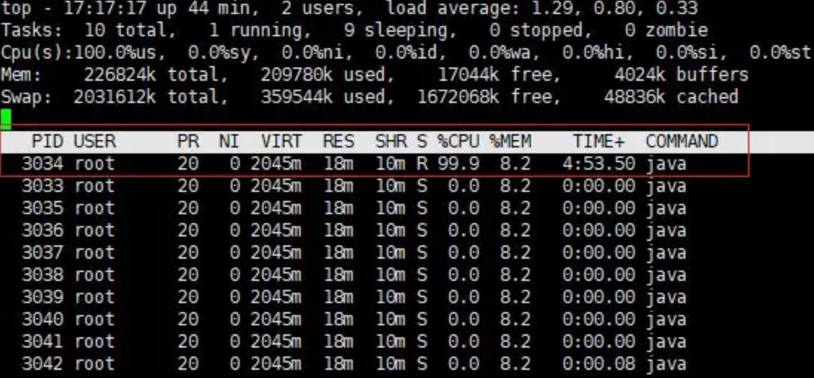
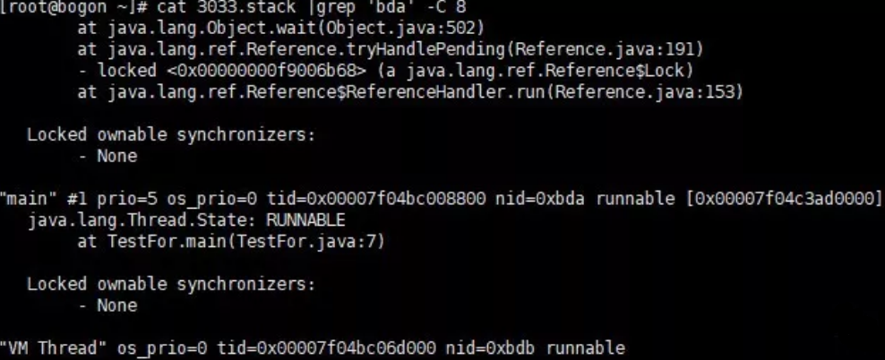
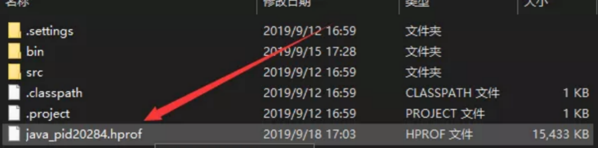

### JVM调优流程  
&emsp; JVM的调优主要有两个方面：内存调优、垃圾回收策略调优。  
* 获取堆内存日志，调整内存比例或者gc回收堆策略； 

#### 1. 内存调优
&emsp; Jvm调优Oracle官网有一份指导说明：https://docs.oracle.com/middleware/11119/wls/PERFM/jvm_tuning.htm#i1146060  

&emsp; 各分区的大小对GC的性能影响很大。如何将各分区调整到合适的大小，分析活跃数据的大小是很好的切入点。  
&emsp; 活跃数据的大小是指，应用程序稳定运行时长期存活对象在堆中占用的空间大小，也就是Full GC后堆中老年代占用空间的大小。可以通过GC日志中Full GC之后老年代数据大小得出，比较准确的方法是在程序稳定后，多次获取GC数据，通过取平均值的方式计算活跃数据的大小。活跃数据和各分区之间的比例关系如下：  

|空间	|倍数|
|---|---|
|总大小	|3--4倍活跃数据的大小|
|新生代	|1--1.5倍活跃数据的大小|
|老年代	|2--3倍活跃数据的大小|
|永久代	|1.2--1.5倍Full GC后的永久代空间占用|

&emsp; 例如，根据GC日志获得老年代的活跃数据大小为300MB，那么各分区大小可以设为：  

```
总堆：1200MB = 300MB × 4
新生代：450MB = 300MB × 1.5
老年代：750MB = 1200MB - 450MB*
```
&emsp; 这部分设置仅仅是堆大小的初始值，后面的优化中，可能会调整这些值，具体情况取决于应用程序的特性和需求。

#### 2. GC调优  
......

### JVM问题排查  
* 获取线程stack快照，排查CPU飚高；  
* 获取堆heap快照，排查内存溢出的问题；  

#### 1. CPU飚高  
##### 现象：  
&emsp; 对于Full GC较多的情况，其主要有如下两个特征：  
* 线上多个线程的CPU都超过了100%，通过jstack命令可以看到这些线程主要是垃圾回收线程。  
* 通过jstat命令监控GC情况，可以看到Full GC次数非常多，并且次数在不断增加。  

##### 排查步骤：  
* 1). 查找消耗cpu最高的进程PID  
&emsp; 执行top -c ，显示进程运行信息列表。按下P，进程按照cpu使用率排序  
&emsp; 如下图所示，PID为3033的进程耗费cpu最高  
  
* 2). 查找该进程下消耗cpu最高的线程号  
&emsp; 执行命令top -Hp 3033 ，显示一个进程的线程运行信息列表。按下P,进程按照cpu使用率排序。  
&emsp; 如下图所示，PID为3034的线程耗费cpu最高  
  
&emsp; 这是十进制的数据，需转成十六进制为0xbda  

* 3). 通过JDK提供的jstack工具dump线程堆栈信息到指定文件中。  
&emsp; jstack -l [进程 ID] >jstack.stack。 

```
jstack -l 3033 > ./3033.stack
```
* 4). 转换进制  
&emsp; 由于刚刚的线程ID是十进制的，而堆栈信息中的线程ID是十六进制的，因此需要将10进制的转换成16进制的，并用这个线程ID在堆栈中查找。  
&emsp; 执行命令：printf "%x\n" [十进制数字] 。  

* 5). 过滤指定线程，查找对应的线程堆栈信息  
&emsp; 执行grep命令：  

```
cat 3033.stack |grep 'bda' -C 8
```
&emsp; 输出如下  
  
&emsp; 至此定位到问题。  
#### 2. 内存溢出排查实战  


##### 内存溢出的解决方案：  
1. 修改JVM启动参数，直接增加内存。  
2. 检查错误日志，查看“OutOfMemory”错误前是否有其它异常或错误。  
3. 对代码进行走查和分析，找出可能发生内存溢出的位置。重点排查以下几点：  
1). 检查对数据库查询中，是否有一次获得全部数据的查询。一般来说，如果一次取十万条记录到内存，就可能引起内存溢出。这个问题比较隐蔽，在上线前，数据库中数据较少，不容易出问题，上线后，数据库中数据多了，一次查询就有可能引起内存溢出。对数据库查询尽量采用分页查询。  
2). 检查代码是否有死循环或递归调用。  
3). 检查是否有大循环重复产生新对象实体。  
4). 检查List、Map等集合对象是否有使用后，未清除的问题。List、Map等集合对象会始终存有对对象的引用，使得这些对象不能被GC回收。  
4. 使用内存查看工具动态查看内存快照。 

###### 使用内存查看工具分析堆dump文件  

1. 保存内存快照（两种方法）：  
1). 添加JVM参数，该参数作用是：在程序内存溢出时输出dump文件。参数如下：  

```
-XX:+HeapDumpOnOutOfMemoryError -Xms20m -Xmx20m  
```
随后找到项目地址，会发现在Project本目录中出现了个hprof文件，至此就把堆内存快照保存下来了。  
  

2). jmap命令：先运行对应的jar进程，jps找到该进程ID，然后jmap设置导出格式。

```
jps
jmap -dump:format=b,file=heap.hprof <pid>
```
2. 使用内存工具分析  
&emsp; 有了dump文件，就可以通过dump分析工具进行分析，比如常用的MAT，Jprofile，jvisualvm 等工具都可以分析，这些工具都能够看出到底是哪里溢出，哪里创建了大量的对象等等信息。  

#### 3. 线程死锁  
&emsp; 死循环、死锁、阻塞、页面打开慢等问题，打印线程dump是最好的解决问题的途径。  

