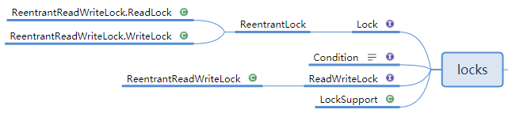
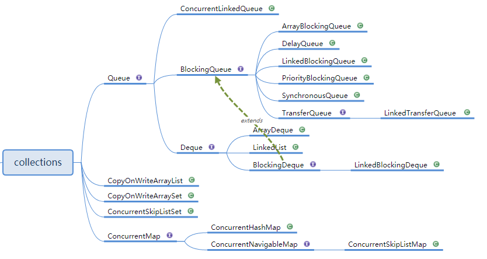
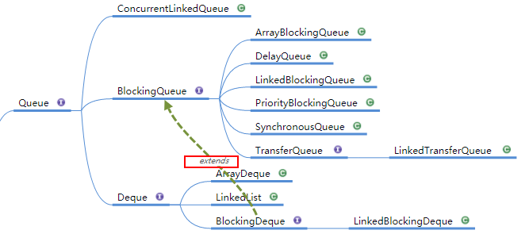
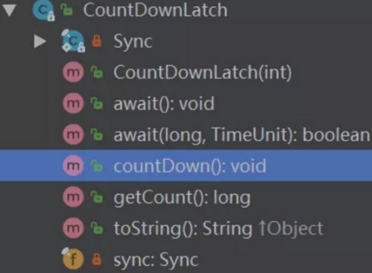
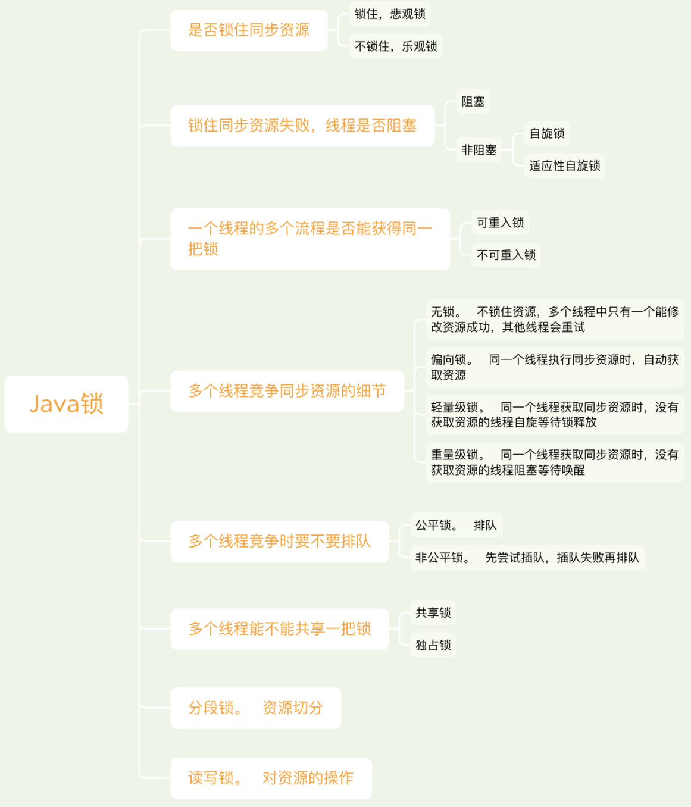

#并发API
&emsp; 本文描述java.util.concurrent的API接口文档，相关方法使用的详情参考：http://www.matools.com/api/java8  
&emsp; java.util.concurrent包是Java并发编程包。包括5部分：  
* locks：显式锁相关；  
* atomic：原子变量类相关，是构建非阻塞算法的基础；  
* collections：并发容器相关；  
* executor：线程池相关；  
* tools：同步工具相关，如信号量、闭锁、栅栏等功能；  
  
##0. 基础算法、组件  
###0.1. CAS算法：  
&emsp; CAS，Compare And Swap，即比较并交换。一种无锁原子算法，CAS是一种乐观锁。
####CAS算法思想：  
&emsp; 在函数CAS(V,E,N)中有3个参数，V表示要更新的变量，E预期值，N新值。CAS操作需要提供一个期望值，当期望值与当前线程的变量值相同时，说明还没线程修改该值，当前线程可以进行修改，也就是执行CAS操作；但如果期望值与当前线程不符，则说明该值已被其他线程修改，此时不执行更新操作，但可以选择重新读取该变量再尝试再次修改该变量，也可以放弃操作。  
&emsp; 当多个线程同时使用CAS操作一个变量时，只有一个会胜出，并成功更新，其余均会失败。**失败的线程不会挂起，仅是被告知失败，并且允许再次尝试，当然也允许实现的线程放弃操作（一般情况下，这是一个自旋操作，即不断的重试）**。基于这样的原理，CAS操作即使没有锁，也可以发现其他线程对当前线程的干扰。
####CAS缺点：  
&emsp; CAS虽然很高效的解决原子操作，但是CAS仍然存在三大问题：ABA问题，循环时间长开销大、只能保证一个共享变量的原子操作。  
&emsp; 1). 循环时间长开销大。自旋CAS如果长时间不成功，会给CPU带来非常大的执行开销。如果JVM能支持处理器提供的pause指令那么效率会有一定的提升，pause指令有两个作用，第一它可以延迟流水线执行指令（de-pipeline）,使CPU不会消耗过多的执行资源，延迟的时间取决于具体实现的版本，在一些处理器上延迟时间是零。第二它可以避免在退出循环的时候因内存顺序冲突（memory order violation）而引起CPU流水线被清空（CPU pipeline flush），从而提高CPU的执行效率。  
&emsp; 2). 只能保证一个共享变量的原子操作。当对一个共享变量执行操作时，可以使用循环CAS的方式来保证原子操作，但是对多个共享变量操作时，循环CAS就无法保证操作的原子性，这个时候就可以用锁，或者有一个取巧的办法，就是把多个共享变量合并成一个共享变量来操作。比如有两个共享变量i＝2,j=a，合并一下ij=2a，然后用CAS来操作ij。从Java1.5开始JDK提供了AtomicReference类来保证引用对象之间的原子性，可以把多个变量放在一个对象里来进行CAS操作。    
&emsp; 3). ABA问题（A修改为B，再修改为A）：  
&emsp; 因为CAS需要在操作值的时候检查下值有没有发生变化，如果没有发生变化则更新，但是如果一个值原来是A，变成了B，又变成了A，那么使用CAS进行检查时会发现它的值没有发生变化，但是实际上却变化了。  
&emsp; ABA问题的解决思路就是使用版本号。在变量前面追加上版本号，每次变量更新的时候把版本号加一，那么A－B－A 就会变成1A-2B－3A。   
&emsp; 从Java1.5开始JDK的atomic包里提供了一个类AtomicStampedReference来解决ABA问题。
###0.2. AQS，抽象队列同步器，基础组件  
&emsp;AQS，AbstractQueuedSynchronizer.java类，抽象队列同步器。它是JUC并发包中的核心基础组件。它是构建锁或者其他同步组件（如ReentrantLock、ReentrantReadWriteLock、Semaphore等）的基础框架。  
&emsp;1). 内部实现的关键是：先进先出的队列、state状态  
&emsp;2). 拥有两种线程模式：独占模式、共享模式。  
&emsp;  独占式：有且只有一个线程能获取到锁，如：ReentrantLock。  
&emsp;  共享式：可以多个线程同时获取到锁，如：Semaphore/CountDownLatch。  
####属性：  
&emsp; AQS维护了一个同步状态（volatile int state）和一个先进先出FIFO等待队列（多线程争用资源被阻塞时会进入此队列）。
  
#####同步状态state  

```java
   //AQS使用一个int类型的成员变量state来表示同步状态，是由volatile修饰的。当state>0时表示已经获取了锁，当state = 0时表示释放了锁。
   private volatile int state;
   //获取state值
   protected final int getState() {
       return state;
   }
   //设置state值
   protected final void setState(int newState) {
       state = newState;
   }
   /**使用CAS设置当前状态，该方法能够保证状态设置的原子性；*/
   protected final boolean compareAndSetState(int expect, int update) {
       // See below for intrinsics setup to support this
       return unsafe.compareAndSwapInt(this, stateOffset, expect, update);
   }
```
&emsp; 内部通过一个int类型的成员变量state来控制同步状态，是由volatile修饰的。并且提供了几个访问这个字段的方法：getState()、setState、compareAndSetState。这几个方法都是final修饰的，说明子类中无法重写它们。另外它们都是protected修饰的，说明只能在子类中使用这些方法。  

&emsp; 怎么通过state控制同步状态？  
&emsp; 通过修改state字段代表的同步状态来实现多线程的独占模式或者共享模式。例如：当state=0时，则说明没有任何线程占有共享资源的锁，当state=1时，则说明有线程目前正在使用共享变量，其他线程必须加入同步队列进行等待。  
&emsp; 在独占模式下，可以把state的初始值设置成0，每当某个线程要进行某项独占操作前，都需要判断state的值是不是0，如果不是0的话意味着别的线程已经进入该操作，则本线程需要阻塞等待；如果是0的话就把state的值设置成1，自己进入该操作。这个先判断再设置的过程我们可以通过CAS操作保证原子性，把这个过程称为尝试获取同步状态。如果一个线程获取同步状态成功了，那么在另一个线程尝试获取同步状态的时候发现state的值已经是1了就一直阻塞等待，直到获取同步状态成功的线程执行完了需要同步的操作后释放同步状态，也就是把state的值设置为0，并通知后续等待的线程。  
&emsp; 在共享模式下的道理也差不多，比如说某项操作允许10个线程同时进行，超过这个数量的线程就需要阻塞等待。那么就可以把state的初始值设置为10，一个线程尝试获取同步状态的意思就是先判断state的值是否大于0，如果不大于0的话意味着当前已经有10个线程在同时执行该操作，本线程需要阻塞等待；如果state的值大于0，那么可以把state的值减1后进入该操作，每当一个线程完成操作的时候需要释放同步状态，也就是把state的值加1，并通知后续等待的线程。  
#####先进先出FIFO等待队列  

```java
static final class Node {
    //共享模式
    static final Node SHARED = new Node();
    //独占模式
    static final Node EXCLUSIVE = null;
    //因为超时或者中断，节点会被设置为取消状态，被取消的节点时不会参与到竞争中的，他会一直保持取消状态不会转变为其他状态；
    static final int CANCELLED =  1;
    //后继节点的线程处于等待状态，而当前节点的线程如果释放了同步状态或者被取消，将会通知后继节点，使后继节点的线程得以运行
    static final int SIGNAL    = -1;
    //节点在等待队列中，节点线程等待在Condition上，当其他线程对Condition调用了signal()后，改节点将会从等待队列中转移到同步队列中，加入到同步状态的获取中
    static final int CONDITION = -2;
    //表示下一次共享式同步状态获取将会无条件地传播下去
    static final int PROPAGATE = -3;
    //等待状态
    volatile int waitStatus;
    //前驱节点
    volatile Node prev;
    //后继节点
    volatile Node next;
    //当前节点的线程
    volatile Thread thread;
}
/*等待队列的队首结点(懒加载，这里体现为竞争失败的情况下，加入同步队列的线程执行到enq方法的时候会创
建一个Head结点)。该结点只能被setHead方法修改。并且结点的waitStatus不能为CANCELLED*/
private transient volatile Node head;
/**等待队列的尾节点，也是懒加载的。（enq方法）。只在加入新的阻塞结点的情况下修改*/
private transient volatile Node tail;

//构建等待队列
public class ConditionObject implements Condition, java.io.Serializable {
    //...
}
```  


####成员方法：  
&emsp; AQS定义两种资源共享方式：Exclusive独占和Share。独占模式和共享模式下在什么情况下会往CLH同步队列里添加节点，什么情况下会从CLH同步队列里移除节点，以及线程阻塞和恢复的实现细节？  
#####独占模式


#####共享模式

#####AQS的模板方法设计模式

#####自定义同步器
不同的自定义同步器争用共享资源的方式也不同。自定义同步器在实现时只需要实现共享资源state的获取与释放方式即可，至于具体线程等待队列的维护（如获取资源失败入队/唤醒出队等），AQS已经在顶层实现好了。自定义同步器实现时主要实现以下几种方法：


----  
##java.util.concurrent.locks包  

###ReentrantLock，重入锁  
&emsp; ReentrantLock，一个可重入互斥锁具有与使用synchronized方法和语句访问的隐式监视锁相同的基本行为和语义，但具有扩展功能。  
&emsp; 可重入：指的是同一线程外层函数获得对象锁或类锁之后，内层函数仍然需要获取该锁，不会受影响。  
####ReentrantLock的API：  
#####构造函数：  

```java
//创建 ReentrantLock实例
public ReentrantLock() {
    sync = new NonfairSync();
}
//创建具有给定的公平政策ReentrantLock实例。true，公平锁；false，非公平锁。
public ReentrantLock(boolean fair) {
    sync = fair ? new FairSync() : new NonfairSync();
}
```
#####成员方法：  
```java
*获取锁，有以下三种情况：
    锁空闲：直接获取锁并返回，同时设置锁持有者数量为1；
    当前线程持有锁：直接获取锁并返回，同时锁持有者数量递增1；
    其他线程持有锁：当前线程会休眠等待，直至获取锁为止；*/
public void lock() {
    sync.lock();
}
/*一个获取可中断锁的尝试。
        获取锁，逻辑和lock()方法一样，但这个方法在获取锁过程中能响应中断。*/
public void lockInterruptibly() throws InterruptedException {
    sync.acquireInterruptibly(1);
}
/*一个非块结构的获取锁尝试，获取成功返回：true，获取失败返回：false, 这个方法不会等待，有以下三种情况：
        锁空闲：直接获取锁并返回：true，同时设置锁持有者数量为：1；
        当前线程持有锁：直接获取锁并返回：true，同时锁持有者数量递增1；
        其他线程持有锁：获取锁失败，返回：false；*/
public boolean tryLock() {
    return sync.nonfairTryAcquire(1);
}
/*一个获取超时失效锁的尝试。
        逻辑和tryLock()差不多，只是这个方法是带时间的。*/
public boolean tryLock(long timeout, TimeUnit unit)
        throws InterruptedException {
    return sync.tryAcquireNanos(1, unit.toNanos(timeout));
}
/*释放锁，每次锁持有者数量递减1，直到0为止。*/
public void unlock() {
    sync.release(1);
}
/*返回一个这个锁的Condition实例，可以实现 synchronized关键字类似wait/ notify实现多线程通信的功能。*/
public Condition newCondition() {
    return sync.newCondition();
}
```
####ReentrantLock与synchronized比较： 
&emsp; Java提供了两种锁机制来控制多个线程对共享资源的互斥访问，第一个是 JVM实现的synchronized，而另一个是JDK实现的ReentrantLock。  
&emsp; ReentrantLock与synchronized的联系：Lock接口提供了与synchronized关键字类似的同步功能，但需要在使用时手动获取锁和释放锁。ReentrantLock和synchronized都是可重入的互斥锁。  
&emsp; Lock接口与synchronized关键字的区别（Lock的优势全部体现在构造函数、方法中）：  
1)（构造函数）.ReenTrantLock可以指定是公平锁还是非公平锁。而synchronized只能是非公平锁。所谓的公平锁就是先等待的线程先获得锁。  
2).Lock接口可以尝试非阻塞地获取锁，当前线程尝试获取锁。如果这一时刻锁没有被其他线程获取到，则成功获取并持有锁。  
3)（地点）.Lock接口能被中断地获取锁，与synchronized不同，获取到锁的线程能够响应中断，当获取到的锁的线程被中断时，中断异常将会被抛出，同时锁会被释放。 可以使线程在等待锁的时候响应中断；  
4)（时间）.Lock接口可以在指定的截止时间之前获取锁，如果截止时间到了依旧无法获取锁，则返回。可以让线程尝试获取锁，并在无法获取锁的时候立即返回或者等待一段时间；  
5).ReenTrantLock提供了一个Condition（条件）类，用来实现分组唤醒需要唤醒的一些线程，而不是像synchronized要么随机唤醒一个线程要么唤醒全部线程。  
  
&emsp; 什么时候选择用ReentrantLock代替synchronized？  
&emsp; 在确实需要一些synchronized所没有的特性的时候，比如时间锁等候、可中断锁等候、无块结构锁、多个条件变量或者锁投票。ReentrantLock还具有可伸缩性的好处，应当在高度争用的情况下使用它，但是请记住，大多数synchronized块几乎从来没有出现过争用，所以可以把高度争用放在一边。建议用synchronized开发，直到确实证明synchronized不合适，而不要仅仅是假设如果使用ReentrantLock“性能会更好”。  

####使用示例：  
&emsp; 在使用重入锁时，一定要在程序最后释放锁。一般释放锁的代码要写在finally里。否则，如果程序出现异常，Loack就永远无法释放了。(synchronized的锁是JVM最后自动释放的。)  

```java
private final ReentrantLock lock = new ReentrantLock();

try {
if (lock.tryLock(5, TimeUnit.SECONDS)) { //如果已经被lock，尝试等待5s，看是否可以获得锁，如果5s后仍然无法获得锁则返回false继续执行
    // lock.lockInterruptibly();可以响应中断事件
    try {
        //操作
    } finally {
        lock.unlock();
    }
}
} catch (InterruptedException e) {
    e.printStackTrace(); //当前线程被中断时(interrupt)，会抛InterruptedException
}
```  
####2. Condition，等待/通知机制  
&emsp; 关键字synchronized与wait()和notify()/notifyAll()方法相结合可以实现等待/通知机制。ReentrantLock结合Condition也可以实现等待/通知机制。  
&emsp; Condition又称等待条件，它实现了对锁更精确的控制。interface Condition中抽象方法：  

|Modifier and Type| Method and Description|
|---|---|
|void |await()    导致当前线程等到发信号或 interrupted|
|boolean|await(long time, TimeUnit unit)    使当前线程等待直到发出信号或中断，或指定的等待时间过去。|
|long| awaitNanos(long nanosTimeout)    使当前线程等待直到发出信号或中断，或指定的等待时间过去。|
|void |awaitUninterruptibly()    使当前线程等待直到发出信号。|
|boolean 	|awaitUntil(Date deadline)    使当前线程等待直到发出信号或中断，或者指定的最后期限过去。|
|void 	|signal()    唤醒一个等待线程。|
|void 	|signalAll()    唤醒所有等待线程。|  
 
&emsp; Condition与Object监视器（wait()和notify()/notifyAll() 的联系与区别： 
&emsp; Condition中的await()方法相当于Object的wait()方法，Condition中的signal()方法相当于Object的notify()方法，Condition中的signalAll()相当于Object的notifyAll()方法。  
&emsp; 在使用notify()/notifyAll()方法进行通知时，被通知的线程是由JVM随机选择的。但使用ReentrantLock结合Condition类是可以实现“选择性通知”。  

| 对比项 | Condition | Object监视器 |  
| ---- | ---- | ---- |  
使用条件|获取锁|获取锁，创建Condition对象
等待队列的个数|一个|多个
是否支持通知指定等待队列|支持|不支持
是否支持当前线程释放锁进入等待状态|支持|支持
是否支持当前线程释放锁并进入超时等待状态|支持|支持
是否支持当前线程释放锁并进入等待状态直到指定最后期限|支持|不支持
是否支持唤醒等待队列中的一个任务|支持|支持
是否支持唤醒等待队列中的全部任务|支持|支持  

####3. ReentrantReadWriteLock，读写锁
&emsp; ReentrantReadWriteLock是一种共享锁。ReentrantReadWriteLock维护了两个锁，读锁和写锁，所以一般称其为读写锁。写锁是独占的（写操作只能由一个线程来操作）。读锁是共享的，如果没有写锁，读锁可以由多个线程共享。  
&emsp; 优点：与互斥锁相比，虽然一次只能有一个写线程可以修改共享数据，但大量读线程可以同时读取共享数据，所以，读写锁适用于共享数据很大，且读操作远多于写操作的情况。  
&emsp; 缺点：只有当前没有线程持有读锁或者写锁时才能获取到写锁，这可能会导致写线程发生饥饿现象，即读线程太多导致写线程迟迟竞争不到锁而一直处于等待状态。StampedLock()可以解决这个问题。  
#####示例：  

```java
private ReentrantReadWriteLock readWriteLock = new ReentrantReadWriteLock();
private Lock readLock = readWriteLock.readLock();
private Lock writeLock = readWriteLock.writeLock();
public Object handleRead() throws InterruptedException {
    try {
        readLock.lock();
        Thread.sleep(1000);
        return value;
    }finally{
        readLock.unlock();
    }
}
public Object handleRead() throws InterruptedException {
    try {
        writeLock.lock();
        Thread.sleep(1000);
        return value;
    }finally{
        writeLock.unlock();
    }
}
```

####4. StampedLock，读写锁的升级
&emsp; StampedLock是JDK1.8新增的一个锁，是对读写锁ReentrantReadWriteLock的改进。使用ReentrantReadWriteLock可能会导致写线程发生饥饿现象，即读线程太多导致写线程迟迟竞争不到锁而一直处于等待状态。StampedLock可以解决这个问题，解决方法是如果在读的过程中发生了写操作，应该重新读而不是直接阻塞写线程。  


 
---
##2. Atomic，原子类  
###atomic类简介：  
&emsp; 原子操作定义：原子操作是指不会被线程调度机制打断的操作，这种操作一旦开始，就一直运行到结束，中间不会有任何线程上下文切换。原子操作是在多线程环境下避免数据不一致必须的手段。  
&emsp; 原子操作可以是一个步骤，也可以是多个操作步骤，但是其顺序不可以被打乱，也不可以被切割而只执行其中的一部分，将整个操作视作一个整体是原子性的核心特征。  
&emsp; int++并不是一个原子操作，所以当一个线程读取它的值并加1时，另外一个线程有可能会读到之前的值，这就会引发错误。为了解决这个问题，必须保证增加操作是原子的，在JDK1.5之前可以使用同步技术来做到这一点。到JDK1.5，java.util.concurrent.atomic包提供了int和long类型的包装类，它们可以自动的保证对于它们的操作是原子的并且不需要使用同步。  

&emsp; 原子类原理：原子类是基于CAS实现的。  
&emsp; 原子类与锁：原子类不是锁的常规替换方法。仅当对象的重要更新限定于单个变量时才应用它。  
&emsp; 原子类和java.lang.Integer等类的区别：原子类不提供诸如hashCode和compareTo之类的方法。因为原子变量是可变的。  
###atomic使用：  
####1.原子更新基本类型或引用类型：
原子更新基本类型：AtomicBoolean、AtomicInteger、AtomicLong。  
原子更新引用类型：AtomicReference、AtomicStampedRerence、AtomicMarkableReference。
这几个类的操作基本类似，底层都是调用Unsafe的compareAndSwapXxx()来实现，基本用法如下：  

```java
private static void testAtomicReference() {

    AtomicInteger atomicInteger = new AtomicInteger(1);
    atomicInteger.incrementAndGet();
    atomicInteger.getAndIncrement();
    atomicInteger.compareAndSet(3, 666);
    System.out.println(atomicInteger.get());

    AtomicStampedReference<Integer> atomicStampedReference = new AtomicStampedReference<>(1, 1);
    atomicStampedReference.compareAndSet(1, 2, 1, 3);
    atomicStampedReference.compareAndSet(2, 666, 3, 5);
    System.out.println(atomicStampedReference.getReference());
    System.out.println(atomicStampedReference.getStamp());
}
```  
####2.原子更新数组中的元素：  
原子更新数组：AtomicIntegerArray、AtomicLongArray、AtomicReferenceArray。
这几个类的操作基本类似，更新元素时都要指定在数组中的索引位置，基本用法如下：  

```java
private static void testAtomicReferenceArray() {

    AtomicIntegerArray atomicIntegerArray = new AtomicIntegerArray(10);
    atomicIntegerArray.getAndIncrement(0);
    atomicIntegerArray.getAndAdd(1, 666);
    atomicIntegerArray.incrementAndGet(2);
    atomicIntegerArray.addAndGet(3, 666);
    atomicIntegerArray.compareAndSet(4, 0, 666);

    System.out.println(atomicIntegerArray.get(0));
    System.out.println(atomicIntegerArray.get(1));
    System.out.println(atomicIntegerArray.get(2));
}
```  
####3.原子更新对象中的字段：  
原子更新对象的属性：AtomicIntegerFieldUpdater、AtomicLongFieldUpdater、AtomicReferenceFieldUpdater。这几个类的操作基本类似，都需要传入要更新的字段名称，基本用法如下：  

```java
private static void testAtomicReferenceField() {

    AtomicReferenceFieldUpdater<User, String> updateName = AtomicReferenceFieldUpdater.newUpdater(User.class, String.class,"name");
    AtomicIntegerFieldUpdater<User> updateAge = AtomicIntegerFieldUpdater.newUpdater(User.class, "age");
    User user = new User("tong ge", 21);
    updateName.compareAndSet(user, "tong ge", "read source code");
    updateAge.compareAndSet(user, 21, 25);
    updateAge.incrementAndGet(user);
    System.out.println(user);
}
```  
####4.高性能原子类：  
高性能原子类，是java8中增加的原子类，它们使用分段的思想，把不同的线程hash到不同的段上去更新，最后再把这些段的值相加得到最终的值，这些类主要有：  
（1）Striped64下面四个类的父类。  
（2）LongAccumulator，long类型的聚合器，需要传入一个long类型的二元操作，可以用来计算各种聚合操作，包括加乘等。  
（3）LongAdder，long类型的累加器，LongAccumulator的特例，只能用来计算加法，且从0开始计算。  
（4）DoubleAccumulator，double类型的聚合器，需要传入一个double类型的二元操作，可以用来计算各种聚合操作，包括加乘等。  
（5）DoubleAdder，double类型的累加器，DoubleAccumulator的特例，只能用来计算加法，且从0开始计算。  
这几个类的操作基本类似，其中DoubleAccumulator和DoubleAdder底层其实也是用long来实现的，基本用法如下：  

```java
private static void testNewAtomic() {

    LongAdder longAdder = new LongAdder();
    longAdder.increment();
    longAdder.add(666);
    System.out.println(longAdder.sum());

    LongAccumulator longAccumulator = new LongAccumulator((left, right)->left + right * 2, 666);
    longAccumulator.accumulate(1);
    longAccumulator.accumulate(3);
    longAccumulator.accumulate(-4);
    System.out.println(longAccumulator.get());
}
```  
###AtomicStampedReference类详解  
&emsp; Java1.5中提供了AtomicStampedReference这个类，解决ABA问题。这个类的compareAndSet方法作用是首先检查当前引用是否等于预期引用，并且当前标志是否等于预期标志，如果全部相等，则以原子方式将该引用和该标志的值设置为给定的更新值。  
####源码分析：  
内部类  

```java
private static class Pair<T> {
    final T reference;
    final int stamp;
    private Pair(T reference, int stamp) {
        this.reference = reference;
        this.stamp = stamp;
    }
    static <T> Pair<T> of(T reference, int stamp) {
        return new Pair<T>(reference, stamp);
    }
}
```  
&emsp; 将元素值和版本号绑定在一起，存储在Pair的reference和stamp（邮票、戳的意思）中。  
属性  

```java
private volatile Pair<V> pair;
private static final sun.misc.Unsafe UNSAFE = sun.misc.Unsafe.getUnsafe();
private static final long pairOffset = objectFieldOffset(UNSAFE, "pair", AtomicStampedReference.class);
```  
&emsp; 声明一个Pair类型的变量并使用Unsfae获取其偏移量，存储到pairOffset中。  
&emsp; CAS算法核心类，sun.misc.Unsafe提供了访问底层的机制（native()方法也有访问底层的功能），这种机制仅供java核心类库使用。  
&emsp; ***构造方法*** &emsp;  

```java
/**
 * @param initialRef 初始值
 * @param initialStamp 初始版本号
 */
public AtomicStampedReference(V initialRef, int initialStamp) {
    pair = Pair.of(initialRef, initialStamp);
}
```  
&emsp; ***compareAndSet()方法***  

```java
public boolean compareAndSet(V expectedReference, V newReference, int expectedStamp, int newStamp) {
    // 获取当前的（元素值，版本号）对
    Pair<V> current = pair;
    return
        // 引用没变
        expectedReference == current.reference &&
                // 版本号没变
                expectedStamp == current.stamp &&
                // 新引用等于旧引用
                ((newReference == current.reference &&
                        // 新版本号等于旧版本号
                        newStamp == current.stamp) ||
                        // 构造新的Pair对象并CAS更新
                        casPair(current, Pair.of(newReference, newStamp)));
}

private boolean casPair(Pair<V> cmp, Pair<V> val) {
    // 调用Unsafe的compareAndSwapObject()方法CAS更新pair的引用为新引用
    return UNSAFE.compareAndSwapObject(this, pairOffset, cmp, val);
}
```  
（1）如果元素值和版本号都没有变化，并且和新的也相同，返回true；  
（2）如果元素值和版本号都没有变化，并且和新的不完全相同，就构造一个新的Pair对象并执行CAS更新pair。  
####示例：  
&emsp; 示例代码分别用AtomicInteger和AtomicStampedReference来对初始值为100的原子整型变量进行更新，AtomicInteger会成功执行CAS操作，而加上版本戳的AtomicStampedReference对于ABA问题会执行CAS失败：  

```java
import java.util.concurrent.TimeUnit;
import java.util.concurrent.atomic.AtomicInteger;
import java.util.concurrent.atomic.AtomicStampedReference;

public class ABA {
    private static AtomicInteger atomicInt = new AtomicInteger(100);
    private static AtomicStampedReference atomicStampedRef = new AtomicStampedReference(100, 0);

    public static void main(String[] args) throws InterruptedException {
        Thread intT1 = new Thread(new Runnable() {
            @Override
            public void run() {
                atomicInt.compareAndSet(100, 101);
                atomicInt.compareAndSet(101, 100);
            }
        });

        Thread intT2 = new Thread(new Runnable() {
            @Override
            public void run() {
                try {
                    TimeUnit.SECONDS.sleep(1);
                } catch (InterruptedException e) {
                }
                boolean c3 = atomicInt.compareAndSet(100, 101);
                System.out.println(c3); // true
            }
        });

        intT1.start();
        intT2.start();
        intT1.join();
        intT2.join();

        Thread refT1 = new Thread(new Runnable() {
            @Override
            public void run() {
                try {
                    TimeUnit.SECONDS.sleep(1);
                } catch (InterruptedException e) {
                }
                atomicStampedRef.compareAndSet(100, 101, atomicStampedRef.getStamp(), atomicStampedRef.getStamp() + 1);
                atomicStampedRef.compareAndSet(101, 100, atomicStampedRef.getStamp(), atomicStampedRef.getStamp() + 1);
            }
        });

        Thread refT2 = new Thread(new Runnable() {
            @Override
            public void run() {
                int stamp = atomicStampedRef.getStamp();
                try {
                    TimeUnit.SECONDS.sleep(2);
                } catch (InterruptedException e) {
                }
                boolean c3 = atomicStampedRef.compareAndSet(100, 101, stamp, stamp + 1);
                System.out.println(c3); // false
            }
        });

        refT1.start();
        refT2.start();
    }
}
```  
----  
##3. Collections，14个并发容器  
  
&emsp; 按照线程安全模型分类：copy-on-write、CAS（JDK1.8 ConcurrentHashMap）、读写分离（LinkedBlockingQueue）。    
###0. CopyOnWrite简介：  
&emsp; CopyOnWrite，简称COW。所谓写时复制，即读操作时不加锁以保证性能不受影响；写操作时加锁，复制资源的一份副本，在副本上执行写操作，写操作完成后将资源的引用指向副本。  
&emsp; 使用场景：CopyOnWrite并发容器用于读多写少的并发场景。比如白名单，黑名单，商品类目的访问和更新场景，假如有一个搜索网站，用户在这个网站的搜索框中，输入关键字搜索内容，但是某些关键字不允许被搜索。这些不能被搜索的关键字会被放在一个黑名单当中，黑名单每天晚上更新一次。当用户搜索时，会检查当前关键字在不在黑名单当中，如果在，则提示不能搜索。  
 
&emsp; 优点：可以对CopyOnWrite容器进行并发的读，而不需要加锁，因为当前容器不会添加任何元素。所以CopyOnWrite容器也是一种读写分离的思想，读和写不同的容器。  
&emsp; 缺点：1).占内存（写时复制new两个对象）；2).不能保证数据实时一致性。  
* 内存占用问题:  
因为CopyOnWrite的写时复制机制，所以在进行写操作的时候，内存里会同时驻扎两个对象的内存，旧的对象和新写入的对象（注意:在复制的时候只是复制容器里的引用，只是在写的时候会创建新对象添加到新容器里，而旧容器的对象还在使用，所以有两份对象内存）。如果这些对象占用的内存比较大，比如说200M左右，那么再写入100M数据进去，内存就会占用300M，那么这个时候很有可能造成频繁的Yong GC和Full GC。之前系统中使用了一个服务由于每晚使用CopyOnWrite机制更新大对象，造成了每晚15秒的Full GC，应用响应时间也随之变长。  
针对内存占用问题，可以通过压缩容器中的元素的方法来减少大对象的内存消耗，比如，如果元素全是10进制的数字，可以考虑把它压缩成36进制或64进制。或者不使用CopyOnWrite容器，而使用其他的并发容器，如ConcurrentHashMap。  
* 数据一致性问题:  
CopyOnWrite容器只能保证数据的最终一致性，不能保证数据的实时一致性。所以如果希望写入的的数据，马上能读到，不要使用CopyOnWrite容器。  
###1. List，CopyOnWriteArrayList  
&emsp; 并发版ArrayList，底层结构也是数组，和ArrayList不同之处在于：当新增和删除元素时会创建一个新的数组，在新的数组中增加或者排除指定对象，最后用新增数组替换原来的数组。  
&emsp; 适用场景：由于读操作不加锁，写（增、删、改）操作加锁，因此适用于读多写少的场景。  
&emsp; 局限：由于读的时候不会加锁（读的效率高，就和普通ArrayList一样），读取的当前副本，因此可能读取到脏数据。每次对集合结构进行修改时，都需要拷贝数据，占用内存较大；  
&emsp; 总结：CopyOnWriteArrayList基于ReentrantLock保证了增加元素和删除元素动作的互斥。在读上没有做任何锁操作，这样就保证了读的性能，带来的副作用是有些时候可能会读取到脏数据。  
&emsp; 在读多写少的高并发环境中，使用CopyOnWriteArrayList可以提高系统的性能，但是，在写多读少的场合，CopyOnWriteArrayList的性能可能不如Vector。  
####源码解析：  
```java
public class CopyOnWriteArrayList<E>
        implements List<E>, RandomAccess, Cloneable, java.io.Serializable {

    final transient ReentrantLock lock = new ReentrantLock();
    private transient volatile Object[] array;

    //创建一个大小为0的数组
    public CopyOnWriteArrayList() {
        setArray(new Object[0]);
    }

    // 添加元素，有锁
    /*    add方法并没有加上synchronized关键字，它通过使用ReentrantLock来保证线程安全。*/
    public boolean add(E e) {
        final ReentrantLock lock = this.lock;
        lock.lock(); // 修改时加锁，保证并发安全
        try {
            Object[] elements = getArray(); // 当前数组
            int len = elements.length;
            Object[] newElements = Arrays.copyOf(elements, len + 1); // 创建一个新数组，比老的大一个空间
            newElements[len] = e; // 要添加的元素放进新数组
            setArray(newElements); // 用新数组替换原来的数组
            return true;
        } finally {
            lock.unlock(); // 解锁
        }
    }

    //
    public E remove(int index) {
        final ReentrantLock lock = this.lock;
        lock.lock();
        try {
            Object[] elements = getArray();
            int len = elements.length;
            E oldValue = get(elements, index);
            int numMoved = len - index - 1;
            if (numMoved == 0)
                setArray(Arrays.copyOf(elements, len - 1));
            else {
                Object[] newElements = new Object[len - 1];
                System.arraycopy(elements, 0, newElements, 0, index);
                System.arraycopy(elements, index + 1, newElements, index,
                        numMoved);
                setArray(newElements);
            }
            return oldValue;
        } finally {
            lock.unlock();
        }
    }

    // 读元素，不加锁，因此可能读取到旧数据
    public E get(int index) {
        return get(getArray(), index);
    }

    //创建一个新的COWIterator对象实例，并保存了一个当前数组的快照，
    // 在调用 next遍历时则仅对此快照数组进行遍历，
    // 因此遍历CopyOnWriteArrayList时不会抛出Concurrent- Modi ficatiedException
    public Iterator<E> iterator() {
        return new COWIterator<E>(getArray(), 0);
    }
}
```  
####示例代码：  
```java
import java.util.Map;
import com.ifeve.book.forkjoin.CopyOnWriteMap;

/**
 * 黑名单服务
 * @author fangtengfei
 */
public class BlackListServiceImpl {

    private static CopyOnWriteMap<String, Boolean> blackListMap = new CopyOnWriteMap<String, Boolean>(1000);

    public static boolean isBlackList(String id) {
        return blackListMap.get(id) == null ? false : true;
    }

    public static void addBlackList(String id) {
        blackListMap.put(id, Boolean.TRUE);
    }

    /**
     * 批量添加黑名单
     * @param ids
     */
    public static void addBlackList(Map<String,Boolean> ids) {
        blackListMap.putAll(ids);
    }

}
```  
###2. Map，ConcurrentHashMap、ConcurrentSkipListMap  
&emsp; JDK中并没有提供CopyOnWriteMap。JUC容器Map的实现有ConcurrentHashMap，线程安全的哈希表，相当于线程安全的HashMap；ConcurrentSkipListMap，线程安全的有序的哈希表，相当于线程安全的TreeMap。  
####2.1. ConcurrentHashMap  
&emsp; HashMap是非线程安全的，在多线程环境下，put操作是有可能产生死循环的，导致CPU利用率接近100%。为了解决该问题，提供了Hashtable和Collections.synchronizedMap(hashMap)两种解决方案，但是这两种方案都是对读写加锁，独占式，一个线程在读时其他线程必须等待，吞吐量较低，性能较为低下。高性能的线程安全HashMap：ConcurrentHashMap。  
&emsp; ConcurrentHashMap在jdk1.7中是采用Segment(段) + HashEntry(哈希条目) + ReentrantLock的方式进行实现的，而jdk1.8中采用Node + CAS + Synchronized来保证并发安全进行实现。  
#####Java7 ConcurrentHashMap  

#####Java8 ConcurrentHashMap  
&emsp; JDK8的ConcurrentHashMap的数据结构和JDK1.8的HashMap基本上一样，了解Hashmap的结构，就基本了解了Concurrenthashmap了，只是增加了同步的操作来控制并发。JDK8采用CAS(读)+Synchronized(写)保证线程安全。  
    
####2.2. ConcurrentSkipListMap
&emsp; ConcurrentSkipListMap与TreeMap都是有序的哈希表。  
&emsp; ConcurrentSkipListMap线程安全，TreeMap非线程安全；  
&emsp; ConcurrentSkipListMap是通过跳表（skip list）实现的，而TreeMap是通过红黑树实现的。

####3. Set，CopyOnWriteArraySet、ConcurrentSkipListSet  
&emsp; JUC容器Set的实现有CopyOnWriteArraySet与ConcurrentSkipListSet。CopyOnWriteArraySet相当于线程安全的HashSet，CopyOnWriteArraySet的实现依赖于CopyOnWriteArrayList；ConcurrentSkipListSet相当于线程安全的TreeSet，ConcurrentSkipListSet的实现依赖于ConcurrentSkipListMap。  
&emsp; CopyOnWriteArraySet适用于读多写少的高并发场合，在需要并发写的场合，则可以使用 Set s = Collections.synchronizedSet(Set<T> s)得到一个线程安全的Set。 

####4. Queue  
  
&emsp; 在并发队列上，JDK提供了两套实现，一个是以ConcurrentLinkedQueue为代表的高性能队列，一个是以BlockingQueue接口为代表的阻塞队列。  
&emsp; ConcurrentLinkedQueue是一个适用于高并发场景下的队列。它通过无锁的方式，实现了高并发状态下的高性能。通常，ConcurrentLinkedQueue的性能要好于BlockingQueue 。  
&emsp; 与 ConcurrentLinkedQueue 的使用场景不同，BlockingQueue 的主要功能并不是在于提升高并发时的队列性能，而在于简化多线程间的数据共享。  

&emsp; JDK7提供了6个阻塞队列实现类。分别是：  
* ArrayBlockingQueue：一个由数组结构组成的有界阻塞队列。  
* LinkedBlockingQueue：一个由链表结构组成的有界阻塞队列。  
* PriorityBlockingQueue：一个支持优先级排序的无界阻塞队列。  
* DelayQueue：一个使用优先级队列实现的无界阻塞队列。  
* SynchronousQueue：一个不存储元素的阻塞队列。  
* LinkedTransferQueue：一个由链表结构组成的无界阻塞队列。  

----
##4. Tools，工具类  
&emsp; Java提供了三个同步工具类：CountDownLatch(计数器)、CyclicBarrier(栅栏)、Semaphore(信号量)。这几个工具类是为了能够更好控制线程之间的通讯问题。  
###CountDownLatch，线程计数器    
&emsp; java.util.concurrent.CountDownLatch类，允许一个或多个线程等待直到在其他线程中执行的一组操作完成的同步辅助。利用它可以实现类似计数器的功能。比如有一个任务A，它要等待其他4个任务执行完毕之后才能执行，此时就可以利用CountDownLatch来实现这种功能了。  

***注意：***  
&emsp; CountDownLatch对象不能被重复利用，也就是不能修改计数器的值。  
&emsp; CountDownLatch代表的计数器的大小可以为0，意味着在一个线程调用await方法时会立即返回。  
&emsp; 如果某些线程中有阻塞操作的话，最好使用带有超时时间的await方法，以免该线程调用await方法之后永远得不到执行。  

&emsp; CountDownLatch与Thread的join()方法方法对比：  
&emsp; Thread的join方法，这个方法表示一个线程将等待另一个线程执行完才能继续执行。  
&emsp; CountDownLatch代表的是一个计数器，不论是否在同一线程中，不论线程是否执行完成，都可以随时随地调用CountDownLatch的countDown方法，而Thread的成员方法join只能在一个线程中对另一个线程对象调用，而且方法返回的前提是线程已经执行完成。  
&emsp; 所以使用CountDownLatch会比join方法更灵活。  
####API：  
  
&emsp; ***构造函数：***  

```java
/创建对象时，指定计数器大小
public CountDownLatch(int count) {
    if (count < 0) throw new IllegalArgumentException("count < 0");
    this.sync = new Sync(count);
}
```  
&emsp; ***成员方法：***  

```java
//创建对象时，指定计数器大小
public CountDownLatch(int count) {
    if (count < 0) throw new IllegalArgumentException("count < 0");
    this.sync = new Sync(count);
}
//返回当前计数
public long getCount() {
    return sync.getCount();
}
//计数减1，如果计数达到零，则释放所有等待的线程
public void countDown() {
    sync.releaseShared(1);
}
//使当前线程在计数至0之前一直等待，计数为0时返回
public void await() throws InterruptedException {
    sync.acquireSharedInterruptibly(1);
}
//使当前线程在指定时间内等待计数器为0，超时或计数为0的时候则返回
public boolean await(long timeout, TimeUnit unit)
        throws InterruptedException {
    return sync.tryAcquireSharedNanos(1, unit.toNanos(timeout));
}
```  
&emsp; CountDownLatch内部通过共享锁实现。在创建CountDownLatch实例时，需要传递一个int型的参数：count，该参数为计数器的初始值，也可以理解为该共享锁可以获取的总次数。当某个线程调用await()方法，程序首先判断count的值是否为0，如果不会0的话则会一直等待直到为0为止。当其他线程调用countDown()方法时，则执行释放共享锁状态，使count值- 1。当在创建CountDownLatch时初始化的count参数，必须要有count线程调用countDown方法才会使计数器count等于0，锁才会释放，前面等待的线程才会继续运行。注意CountDownLatch不能回滚重置。  
####示例：  

```java
public class CountdownLatchExample {

    public static void main(String[] args) throws InterruptedException {
        final int totalThread = 10;
        CountDownLatch countDownLatch = new CountDownLatch(totalThread);
        ExecutorService executorService = Executors.newCachedThreadPool();
        for (int i = 0; i < totalThread; i++) {
            executorService.execute(() -> {
                System.out.print("run..");
                //每次执行完一个任务的时候都调用一下这个CountDownLatch对象的countDown方法，每调用一下countDown方法计数就会减1
                countDownLatch.countDown();
            });
        }
        //在CountDownLatch对象的计数减为0之前，这个方法会一只等待，直到totalThread个线程都调用了countDown方法，计数减为0，await方法返回，其他线程继续执行
        countDownLatch.await();
        System.out.println("end");
        executorService.shutdown();
    }

}
//打印结果：run..run..run..run..run..run..run..run..run..run..end
```  
###CyclicBarrier，回环栅栏  
&emsp; 字面意思是回环栅栏，它允许一组线程互相等待，直到到达某个公共屏障点 (common barrier point)之后，再全部同时执行。叫做回环是因为当所有等待线程都被释放以后， CyclicBarrier可以被重用。  
&emsp; 应用场景：CyclicBarrier适用于多线程结果合并的操作，用于多线程计算数据，最后合并计算结果的应用场景。比如需要统计多个Excel中的数据，然后等到一个总结果。可以通过多线程处理每一个Excel，执行完成后得到相应的结果，最后通过barrierAction来计算这些线程的计算结果，得到所有Excel的总和。  
####API：  
&emsp; ***构造函数：***  

```java
//创建对象的时候指定计算器大小
public CyclicBarrier(int parties) {
    this(parties, null);
}
//创建对象的时候指定计算器大小，在所有线程都运行到栅栏的时候，barrierAction会在其他线程恢复执行之前优先执行
public CyclicBarrier(int parties, Runnable barrierAction) {
    if (parties <= 0) throw new IllegalArgumentException();
    this.parties = parties;
    this.count = parties;
    this.barrierCommand = barrierAction;
}
```  

&emsp; ***成员方法：***  

```java
//返回计数器数值
public int getParties() {
    
}
//返回当前在栅栏处等待的线程数目
public int getNumberWaiting() {

}
//线程在调用处等待，直到与计数器数值相同数量的线程都到调用此方法，所有线程恢复执行
//用来挂起当前线程，直至所有线程都到达 barrier 状态再同时执行后续任务
public int await() throws InterruptedException, BrokenBarrierException {

}
//让这些线程等待至一定的时间，如果还有线程没有到达 barrier 状态就直接让到达barrier的线程执行后续任务。
public int await(long timeout, TimeUnit unit)

}
//移除栅栏。执行本操作后可以继续在其他线程中使用await操作
public void reset() {

}
//
public boolean isBroken() {

}
```  
####示例：  

```java
public class CyclicBarrierExample {


    public static void main(String[] args) {
        final int totalThread = 10;
        CyclicBarrier cyclicBarrier = new CyclicBarrier(totalThread);
        ExecutorService executorService = Executors.newCachedThreadPool();
        for (int i = 0; i < totalThread; i++) {
            executorService.execute(() -> {
                System.out.print("before..");
                try {
                    cyclicBarrier.await();
                } catch (InterruptedException | BrokenBarrierException e) {
                    e.printStackTrace();
                }
                System.out.print("after..");
            });
        }
        executorService.shutdown();
    }
}
//    before..before..before..before..before..before..before..before..before..before..after..after..after..after..after..after..after..after..after..after..
```  
####CycliBarriar和CountdownLatch有什么区别？  
* CountDownLatch的作用是允许1或N个线程等待其他线程完成执行；而CyclicBarrier则是允许N个线程相互等待。  
* CountDownLatch的计数器无法被重置；CyclicBarrier的计数器可以被重置后使用，因此它被称为是循环的barrier  

###Semaphore，信号量-控制同时访问的线程个数  
&emsp; Semaphore类，一个计数信号量。从概念上讲，信号量维护了一个许可集合。如有必要，在许可可用前会阻塞每一个acquire()，然后再获取该许可。每个 release()添加一个许可，从而可能释放一个正在阻塞的获取者。但是，不使用实际的许可对象，Semaphore只对可用许可的号码进行计数，并采取相应的行动。  
&emsp; Semaphore通常用于限制可以访问某些资源（物理或逻辑的）的线程数目。  

&emsp; Semaphore与ReentrantLock：  
&emsp; 信号量为多线程协作提供了更为强大的控制方法。信号量是对锁的扩展。无论是内部锁synchronized还是重入锁ReentrantLock，一次都允许一个线程访问一个资源，而信号量却可以指定多个线程同时访问某一个资源。  
&emsp; Semaphore 基本能完成ReentrantLock的所有工作，使用方法也与之类似，通过 acquire()与release()方法来获得和释放临界资源。经实测，Semaphone.acquire()方法默认为可响应中断锁，与ReentrantLock.lockInterruptibly()作用效果一致，也就是说在等待临界资源的过程中可以被Thread.interrupt()方法中断。  
&emsp; 此外，Semaphore 也实现了可轮询的锁请求与定时锁的功能，除了方法名 tryAcquire与tryLock不同，其使用方法与ReentrantLock几乎一致。Semaphore也提供了公平与非公平锁的机制，也可在构造函数中进行设定。  
&emsp; Semaphore的锁释放操作也由手动进行，因此与ReentrantLock一样，为避免线程因抛出异常而无法正常释放锁的情况发生，释放锁的操作也必须在finally 代码块中完成。  

&emsp; 使用场景：Semaphore可以用来构建一些对象池，资源池之类的， 比如数据库连接池。  
####API：  
&emsp; ***构造函数：***  

```java
//创建具有给定的许可数和非公平的公平设置的Semaphore。
public Semaphore(int permits) {
    sync = new NonfairSync(permits);
}
//创建具有给定的许可数和给定的公平设置的Semaphore
public Semaphore(int permits, boolean fair) {
    sync = fair ? new FairSync(permits) : new NonfairSync(permits);
}
```  
&emsp; ***成员方法：***  

```java
//用来获取一个许可，若无许可能够获得，则会一直等待，直到获得许可。
public void acquire() throws InterruptedException
//获取 permits 个许可
public void acquire(int permits)
// 类似于acquire()，但是不会响应中断。
public void acquireUninterruptibly()
// 尝试获取，如果成功则为true，否则false。这个方法不会等待，立即返回。
public boolean tryAcquire()
//尝试获取permits个许可，若在指定的时间内获取成功，则立即返回true，否则则立即返回false
public boolean tryAcquire(int permits, long timeout, TimeUnit unit)
//尝试获取一个许可，若在指定的时间内获取成功，则立即返回 true，否则则立即返回 false
public boolean tryAcquire(long timeout, TimeUnit unit) throws InterruptedException
//用于在现场访问资源结束后，释放一个许可，以使其他等待许可的线程可以进行资源访问。
public void release()
```  
####示例：  
&emsp; JDK文档中提供使用信号量的实例。这个实例很好的解释了如何通过信号量控制资源访问。  

```java
public class Pool {
    private static final int MAX_AVAILABLE = 100;
    private final Semaphore available = new Semaphore(MAX_AVAILABLE, true);
    public Object getItem() throws InterruptedException {
        available.acquire();
        // 申请一个许可
        // 同时只能有100个线程进入取得可用项，
        // 超过100个则需要等待
        return getNextAvailableItem();
    }

    public void putItem(Object x) {
        // 将给定项放回池内，标记为未被使用
        if (markAsUnused(x)) {
            available.release();
            // 新增了一个可用项，释放一个许可，请求资源的线程被激活一个
        }
    }

    // 仅作示例参考，非真实数据
    protected Object[] items = new Object[MAX_AVAILABLE]; // 用于对象池复用对象
    protected boolean[] used = new boolean[MAX_AVAILABLE]; // 标记作用

    protected synchronized Object getNextAvailableItem() {
        for (int i = 0; i < MAX_AVAILABLE; ++i) {
            if (!used[i]) {
                used[i] = true;
                return items[i];
            }
        }
        return null;
    }

    protected synchronized boolean markAsUnused(Object item) {
        for (int i = 0; i < MAX_AVAILABLE; ++i) {
            if (item == items[i]) {
                if (used[i]) {
                    used[i] = false;
                    return true;
                } else {
                    return false;
                }
            }
        }
        return false;
    }
}
```  
&emsp; 此实例简单实现了一个对象池，对象池最大容量为100。因此，当同时有100个对象请求时，对象池就会出现资源短缺，未能获得资源的线程就需要等待。当某个线程使用对象完毕后，就需要将对象返回给对象池。此时，由于可用资源增加，因此，可以激活一个等待该资源的线程。  

----
## 15种锁分类：  
  
