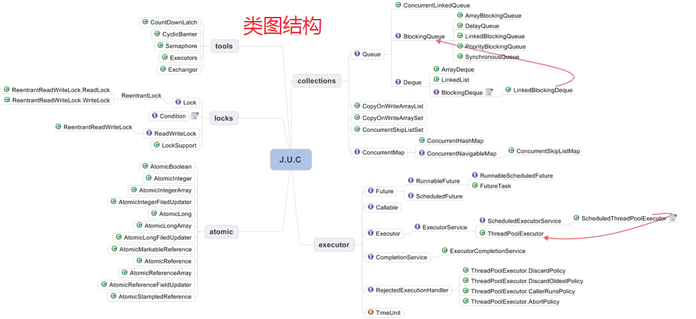
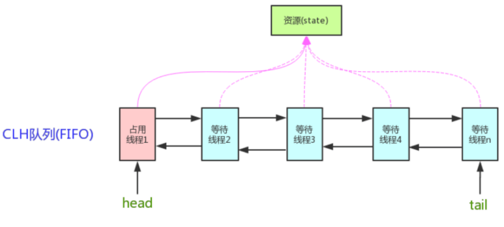

#并发API
&emsp; java.util.concurrent包是Java并发编程包。包括5部分：
* locks：显式锁相关；  
* atomic：原子变量类相关，是构建非阻塞算法的基础；  
* collections：并发容器相关；  
* executor：线程池相关；  
* tools：同步工具相关，如信号量、闭锁、栅栏等功能；  

##0. 基础算法、组件
###0.1. CAS算法：
&emsp; CAS，Compare And Swap，即比较并交换。一种无锁原子算法，CAS是一种乐观锁。
####CAS算法思想：
&emsp; 在函数CAS(V,E,N)中有3个参数，V表示要更新的变量，E预期值，N新值。CAS操作需要提供一个期望值，当期望值与当前线程的变量值相同时，说明还没线程修改该值，当前线程可以进行修改，也就是执行CAS操作，但如果期望值与当前线程不符，则说明该值已被其他线程修改，此时不执行更新操作，但可以选择重新读取该变量再尝试再次修改该变量，也可以放弃操作。
当多个线程同时使用CAS操作一个变量时，只有一个会胜出，并成功更新，其余均会失败。**失败的线程不会挂起，仅是被告知失败，并且允许再次尝试，当然也允许实现的线程放弃操作（一般情况下，这是一个自旋操作，即不断的重试）**。基于这样的原理，CAS操作即使没有锁，也可以发现其他线程对当前线程的干扰。
####CAS缺点：
&emsp; CAS虽然很高效的解决原子操作，但是CAS仍然存在三大问题：ABA问题，循环时间长开销大、只能保证一个共享变量的原子操作。  
&emsp; 1). 循环时间长开销大。自旋CAS如果长时间不成功，会给CPU带来非常大的执行开销。如果JVM能支持处理器提供的pause指令那么效率会有一定的提升，pause指令有两个作用，第一它可以延迟流水线执行指令（de-pipeline）,使CPU不会消耗过多的执行资源，延迟的时间取决于具体实现的版本，在一些处理器上延迟时间是零。第二它可以避免在退出循环的时候因内存顺序冲突（memory order violation）而引起CPU流水线被清空（CPU pipeline flush），从而提高CPU的执行效率。  
&emsp; 2). 只能保证一个共享变量的原子操作。当对一个共享变量执行操作时，可以使用循环CAS的方式来保证原子操作，但是对多个共享变量操作时，循环CAS就无法保证操作的原子性，这个时候就可以用锁，或者有一个取巧的办法，就是把多个共享变量合并成一个共享变量来操作。比如有两个共享变量i＝2,j=a，合并一下ij=2a，然后用CAS来操作ij。从Java1.5开始JDK提供了AtomicReference类来保证引用对象之间的原子性，可以把多个变量放在一个对象里来进行CAS操作。    
&emsp; 3). ABA问题（A修改为B，再修改为A）：  
&emsp; 因为CAS需要在操作值的时候检查下值有没有发生变化，如果没有发生变化则更新，但是如果一个值原来是A，变成了B，又变成了A，那么使用CAS进行检查时会发现它的值没有发生变化，但是实际上却变化了。ABA问题的解决思路就是使用版本号。在变量前面追加上版本号，每次变量更新的时候把版本号加一，那么A－B－A 就会变成1A-2B－3A。  
&emsp; Java中使用原子更新引用类型解决线程并发中导致的ABA问题，有Java类：AtomicReference、AtomicStampedRerence、AtomicMarkableReference。
###0.2. AQS，抽象队列同步器，基础组件
&emsp;AQS，AbstractQueuedSynchronizer.java类，抽象队列同步器。它是JUC并发包中的核心基础组件。它是构建锁或者其他同步组件（如ReentrantLock、ReentrantReadWriteLock、Semaphore等）的基础框架。  
&emsp;1). 内部实现的关键是：先进先出的队列、state状态  
&emsp;2). 拥有两种线程模式：独占模式、共享模式  
&emsp;  独占式：有且只有一个线程能获取到锁，如：ReentrantLock。  
&emsp;  共享式：可以多个线程同时获取到锁，如：Semaphore/CountDownLatch。  
####属性：
&emsp; AQS维护了一个volatile int state（代表共享资源）和一个FIFO线程等待队列（多线程争用资源被阻塞时会进入此队列）。

#####state，同步状态
```java
   //AQS使用一个int类型的成员变量state来表示同步状态，是由volatile修饰的。当state>0时表示已经获取了锁，当state = 0时表示释放了锁。
   private volatile int state;
   //获取state值
   protected final int getState() {
       return state;
   }
   //设置state值
   protected final void setState(int newState) {
       state = newState;
   }
   /**使用CAS设置当前状态，该方法能够保证状态设置的原子性；*/
   protected final boolean compareAndSetState(int expect, int update) {
       // See below for intrinsics setup to support this
       return unsafe.compareAndSwapInt(this, stateOffset, expect, update);
   }
```
&emsp; 内部通过一个int类型的成员变量state来控制同步状态，是由volatile修饰的。并且提供了几个访问这个字段的方法：getState()、setState、compareAndSetState。这几个方法都是final修饰的，说明子类中无法重写它们。另外它们都是protected修饰的，说明只能在子类中使用这些方法。
&emsp; 怎么通过state控制同步状态？
&emsp; 通过修改state字段代表的同步状态来实现多线程的独占模式或者共享模式。例如：当state=0时，则说明没有任何线程占有共享资源的锁，当state=1时，则说明有线程目前正在使用共享变量，其他线程必须加入同步队列进行等待。
&emsp; 在独占模式下，可以把state的初始值设置成0，每当某个线程要进行某项独占操作前，都需要判断state的值是不是0，如果不是0的话意味着别的线程已经进入该操作，则本线程需要阻塞等待；如果是0的话就把state的值设置成1，自己进入该操作。这个先判断再设置的过程我们可以通过CAS操作保证原子性，把这个过程称为尝试获取同步状态。如果一个线程获取同步状态成功了，那么在另一个线程尝试获取同步状态的时候发现state的值已经是1了就一直阻塞等待，直到获取同步状态成功的线程执行完了需要同步的操作后释放同步状态，也就是把state的值设置为0，并通知后续等待的线程。
&emsp; 在共享模式下的道理也差不多，比如说某项操作允许10个线程同时进行，超过这个数量的线程就需要阻塞等待。那么就可以把state的初始值设置为10，一个线程尝试获取同步状态的意思就是先判断state的值是否大于0，如果不大于0的话意味着当前已经有10个线程在同时执行该操作，本线程需要阻塞等待；如果state的值大于0，那么可以把state的值减1后进入该操作，每当一个线程完成操作的时候需要释放同步状态，也就是把state的值加1，并通知后续等待的线程。
#####FIFO，先进先出队列
```java
static final class Node {
    //共享模式
    static final Node SHARED = new Node();
    //独占模式
    static final Node EXCLUSIVE = null;
    //因为超时或者中断，节点会被设置为取消状态，被取消的节点时不会参与到竞争中的，他会一直保持取消状态不会转变为其他状态；
    static final int CANCELLED =  1;
    //后继节点的线程处于等待状态，而当前节点的线程如果释放了同步状态或者被取消，将会通知后继节点，使后继节点的线程得以运行
    static final int SIGNAL    = -1;
    //节点在等待队列中，节点线程等待在Condition上，当其他线程对Condition调用了signal()后，改节点将会从等待队列中转移到同步队列中，加入到同步状态的获取中
    static final int CONDITION = -2;
    //表示下一次共享式同步状态获取将会无条件地传播下去
    static final int PROPAGATE = -3;
    //等待状态
    volatile int waitStatus;
    //前驱节点
    volatile Node prev;
    //后继节点
    volatile Node next;
    //当前节点的线程
    volatile Thread thread;
}
/*等待队列的队首结点(懒加载，这里体现为竞争失败的情况下，加入同步队列的线程执行到enq方法的时候会创
建一个Head结点)。该结点只能被setHead方法修改。并且结点的waitStatus不能为CANCELLED*/
private transient volatile Node head;
/**等待队列的尾节点，也是懒加载的。（enq方法）。只在加入新的阻塞结点的情况下修改*/
private transient volatile Node tail;

//构建等待队列
public class ConditionObject implements Condition, java.io.Serializable {
    //...
}
```
