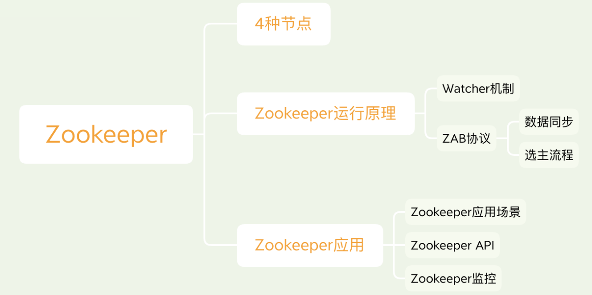
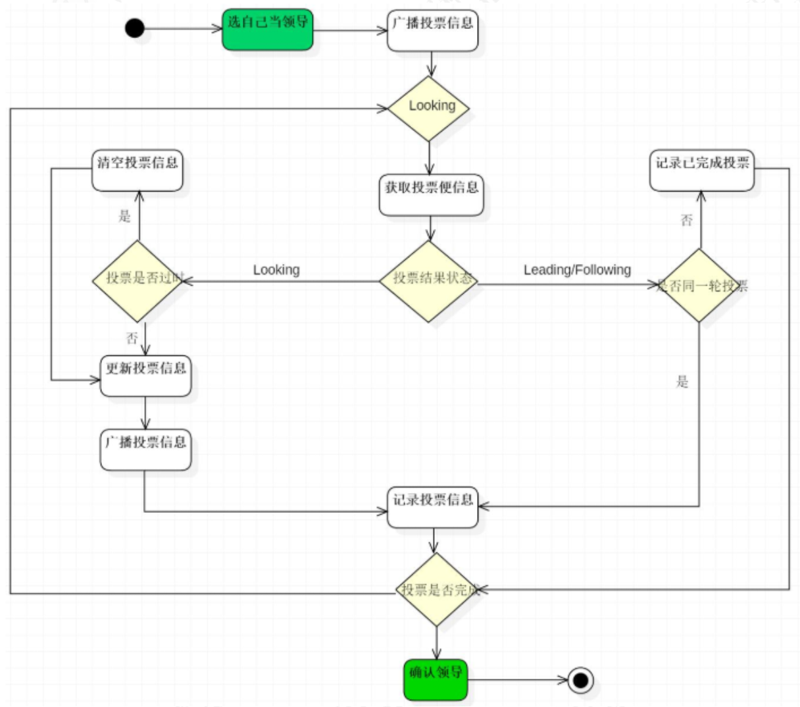

  
## Zookeeper是什么  
&emsp; Zookeeper 是一个分布式协调服务的开源框架。主要用来解决分布式集群中应用系统的一致性问题，例如怎样避免同时操作同一数据造成脏读的问题。  
&emsp; ZooKeeper提供类似于分布式文件存储系统的目录树方式的数据存储，并且可以对树中的节点进行有效管理。从而用来维护和监控存储的数据的状态变化。通过监控这些数据状态的变化，从而可以达到基于数据的集群管理。诸如：统一命名服务、分布式配置管理、分布式消息队列、分布式锁、分布式协调等功能。  
&emsp; ***Zookeeper特性：***  
* 全局数据一致：每个 server 保存一份相同的数据副本，client 无论连 接到哪个server，展示的数据都是一致的，这是最重要的特征。  
* 可靠性：如果消息被其中一台服务器接受，那么将被所有的服务器接受。  
* 顺序性：包括全局有序和偏序两种：全局有序是指如果在一台服务器上消息 a 在消息b前发布，则在所有Server上消息a都将在消息b前被发布；偏序是指如果一个消息b在消息a后被同一个发送者发布，a必将排在b前面。  
* 数据更新原子性：一次数据更新要么成功（半数以上节点成功），要么失败，不存在中间状态。  
* 实时性：Zookeeper 保证客户端将在一个时间间隔范围内获得服务器的更新信息，或者服务器失效的信息。  

## ZooKeeper分层命名空间  
&emsp; Zookeeper提供一个多层级的节点命名空间（节点称为znode）。与文件系统不同的是，这些节点都可以设置关联的数据，而文件系统中只有文件节点可以存放数据而目录节点不行。Zookeeper为了保证高吞吐和低延迟，在内存中维护了这个树状的目录结构，这种特性使得Zookeeper不能用于存放大量的数据，每个节点的存放数据上限为1M。  
  
&emsp; znode的类型在创建时确定，并且之后不能再修改。  
* 临时非顺序节点：客户端与zookeeper断开连接后，该节点被删除。  
* 临时顺序节点：客户端与zookeeper断开连接后，该节点被删除，节点名称会追加一个单调递增的数字。  
* 持久非顺序节点：客户端与zookeeper断开连接后，该节点依旧存在，直到有删除操作主动清除该节点。  
* 持久顺序节点：客户端与zookeeper断开连接后，该节点依旧存在，直到有删除操作主动清除该节点，节点名称会追加一个单调递增的数字。   

&emsp; ***Zookeeper节点的持久性：***  
* 临时节点并不会在客户端断开的瞬间就被删除，而是等到会话结束时，zookeeper会将该短暂znode删除，短暂znode不可以有子节点。  
* 持久节点不依赖于客户端会话，只有当客户端明确要删除该持久znode时才会被删除。  

&emsp; ***Zookeeper节点的顺序性：***  
* 创建带自增序列znode时设置顺序标识，znode名称后会附加一个值。  
* 顺序号是一个单调递增的计数器，由父节点维护。  
* 在分布式系统中，顺序号可以被用于为所有的事件进行全局排序，这样客户端可以通过顺序号推断事件的顺序。  

## Zookeeper的运行原理  
### Watcher机制  
&emsp; 在ZooKeeper中，引入Watcher机制来实现分布式数据的发布/订阅功能。Zookeeper客户端向服务端的某个Znode 注册一个 Watcher 监听，当服务端的一些指定事件触发了这个 Watcher，服务端会向指定客户端发送一个事件通知来实现分布式的通知功能，然后客户端根据 Watcher 通知状态和事件类型做出业务上的改变。  
&emsp; 触发watch事件种类很多，如：节点创建，节点删除，节点改变，子节点改变等。  

&emsp; ***watch的重要特性：***  
* 一次性触发：  
&emsp; Watcher通知是一次性的，即一旦触发一次通知后，该 Watcher 就失效了，因此客户端需要反复注册Watcher。但是在获取watch事件和设置新的watch事件之间有延迟。延迟为毫秒级别，理论上会出现不能观察到节点的每一次变化。  
&emsp; 不支持用持久Watcher的原因：如果Watcher的注册是持久的，那么必然导致服务端的每次数据更新都会通知到客户端。这在数据变更非常频繁且监听客户端特别多的场景下，ZooKeeper无法保证性能。  
* 有序性：  
&emsp; 客户端先得到watch通知才可查看节点变化结果。  

### ZAB协议  
&emsp; ZAB协议全称：Zookeeper Atomic Broadcast（Zookeeper原子广播协议），崩溃可恢复的的原子消息广播算法。ZAB协议包括两种基本模式：崩溃恢复（选主）和消息广播（同步）。整个Zookeeper集群就是在这两个模式之间切换。  

#### Zookeeper集群3种角色  

&emsp; 领导者Leader、学习者Learner(包括跟随者Follower和观察者Observer)。  

##### 领导者Leader  
&emsp; 领导者Leader负责客户端的Writer类型的请求（增删改的操作请求其他节点都会发给Leader节点来做，然后由Leader节点同步给其他节点）。负责进行投票的发起和决议，更新系统状态。  
&emsp; Leader主要的功能  
1. 恢复数据。
2. 维持与Learner的心跳，接收Learner请求并判断Learner的请求消息类型。Learner的消息类型主要有PING消息、REQUEST消息、ACK消息、REVALIDATE消息，根据不同的消息类型，进行不同的处理。  
* PING消息是指Learner的心跳信息；
* REQUEST消息是Follower发送的提议信息，包括写请求及同步请求；
* ACK消息是Follower的对提议的回复，超过半数的Follower通过，则commit该提议；
* REVALIDATE消息是用来延长SESSION有效时间。

##### 跟随者Follower  
&emsp; Follower负责客户端reader请求。参与leader的选举，与leader同步。  
&emsp; Follower主要功能：  
1. 接收Client的请求，如果为写请求，发送给Leader进行投票。返回Client结果。
2. 向Leader发送请求（PING消息、REQUEST消息、ACK消息、REVALIDATE消息）。接收Leader消息并进行处理。

&emsp; Follower的消息循环处理如下几种来自Leader的消息：  
* PING消息：心跳消息；  
* PROPOSAL消息：Leader发起的提案，要求Follower投票；  
* COMMIT消息：服务器端最新一次提案的信息；  
* UPTODATE消息：表明同步完成；  
* REVALIDATE消息：根据Leader的REVALIDATE结果，关闭待revalidate的session还是允许其接受消息；   
* SYNC消息：返回SYNC结果到客户端，这个消息最初由客户端发起，用来强制得到最新的更新。  

##### 观察者Observer  
&emsp; Observer可以接受客户端连接，负责客户端reader请求，将write请求转发给leader。不参与投票和选举，与leader同步。observer的目的是为了扩展系统，提高读取速度。  

&emsp; 对于Observer的流程不再叙述，Observer流程和Follower的唯一不同的地方就是Observer不会参加Leader发起的投票。  

### 原子广播协议  
#### 选举流程，恢复模式  
&emsp; 当整个集群在启动时，或者当 leader 节点出现网络中断、崩溃等情况时， ZAB 协议就会进入恢复模式并选举产生新的 Leader，当 leader 服务器选举出来后，并且集群中有过半的机器和该 leader 节点完成数据同步后（同步指的是数据同步，用来保证集群中过半的机器能够和 leader 服务器的数据状态保持一致）， ZAB 协议就会退出恢复模式。  

&emsp; ***选举流程中几个重要参数：***  
&emsp; 服务器ID：即配置的myId。id越大，选举时权重越高。
&emsp; 数据id：服务器在运行时产生的数据id，即zkid, 这里指本地最新snapshot的id。id越大说明数据越新，选举时权重越高。
&emsp; 选举轮数：Epoch，即逻辑时钟。随着选举的轮数++。
&emsp; 选举状态：4种状态。LOOKING，竞选状态；FOLLOWING，随从状态，同步leader状态，参与投票；OBSERVING，观察状态，同步leader状态，不参与投票；LEADING，领导者状态。

&emsp; ***服务器启动时的leader选举：***  
&emsp; 每个节点启动的时候状态都是LOOKING，处于观望状态，接下来就开始进行选主流程。  
&emsp; 若进行 Leader 选举，则至少需要两台机器，这里选取 3 台机器组成的服务器集群为例。在集群初始化阶段，当有一台服务器 Server1 启动时，其单独无法进行和完成 Leader 选举，当第二台服务器 Server2 启动时，此时两台机器可以相互通信，每台机器都试图找到 Leader，于是进入 Leader选举过程。选举过程如下：  
1. 每个 Server 发出一个投票。由于是初始情况， Server1 和 Server2 都会将自己作为 Leader 服务器来进行投票，每次投票会包含所推举的服务器的 myid 和 ZXID、 epoch，使用(myid, ZXID,epoch)来表示，此时 Server1 的投票为(1, 0)， Server2 的投票为(2, 0)，然后各自将这个投票发给集群中其他机器。  
2. 接受来自各个服务器的投票。集群的每个服务器收到投票后，首先判断该投票的有效性，如检查是否是本轮投票（ epoch）、是否来自LOOKING 状态的服务器。  
3. 处理投票。针对每一个投票，服务器都需要将别人的投票和自己的投票进行 PK， PK 规则如下  
i. 优先比较 epoch  
ii. 其次检查 ZXID。 ZXID 比较大的服务器优先作为 Leader  
iii. 如果 ZXID 相同，那么就比较 myid。 myid 较大的服务器作为Leader 服务器。  
&emsp; 对于 Server1 而言，它的投票是(1, 0)，接收 Server2 的投票为(2, 0)，首先会比较两者的 ZXID，均为 0，再比较 myid，此时 Server2 的myid 最大，于是更新自己的投票为(2, 0)，然后重新投票，对于Server2 而言，其无须更新自己的投票，只是再次向集群中所有机器发出上一次投票信息即可。  
4. 统计投票。每次投票后，服务器都会统计投票信息，判断是否已经有过半机器接受到相同的投票信息，对于 Server1、 Server2 而言，都统计出集群中已经有两台机器接受了(2, 0)的投票信息，此时便认为已经选出了 Leader。  
5. 改变服务器状态。一旦确定了 Leader，每个服务器就会更新自己的状态，如果是 Follower，那么就变更为 FOLLOWING，如果是 Leader，就变更为 LEADING。  

&emsp; ***运行过程中的leader选举：***  
&emsp; 当集群中的 leader 服务器出现宕机或者不可用的情况时，那么整个集群  
&emsp; 将无法对外提供服务，而是进入新一轮的 Leader 选举，服务器运行期间的 Leader 选举和启动时期的 Leader 选举基本过程是一致的。  
1. 变更状态。 Leader 挂后，余下的非 Observer 服务器都会将自己的服务器状态变更为 LOOKING，然后开始进入 Leader 选举过程。  
2. 每个 Server 会发出一个投票。在运行期间，每个服务器上的 ZXID 可能不同，此时假定 Server1 的 ZXID 为 123，Server3 的 ZXID 为 122；在第一轮投票中，Server1 和 Server3 都会投自己，产生投票(1, 123)，(3, 122)，然后各自将投票发送给集群中所有机器。接收来自各个服务器的投票。与启动时过程相同。  
3. 处理投票。与启动时过程相同，此时， Server1 将会成为 Leader。  
4. 统计投票。与启动时过程相同。  
5. 改变服务器的状态。与启动时过程相同。  
  

### 数据同步，广播模式  
&emsp; 当集群中已经有过半的 Follower 节点完成了和 Leader 状态同步以后，那么整个集群就进入了消息广播模式。这个时候，在 Leader 节点正常工作时，启动一台新的服务器加入到集群，那这个服务器会直接进入数据恢复模式，和leader 节点进行数据同步。同步完成后即可正常对外提供非事务请求的处理。  
&emsp; 注：leader节点可以处理事务请求和非事务请求， follower 节点只能处理非事务请求，如果 follower 节点接收到非事务请求，会把这个请求转发给 Leader 服务器。  

&emsp; 在 zookeeper 中，客户端会随机连接到 zookeeper 集群中的一个节点，如果是读请求，就直接从当前节点中读取数据，如果是写请求，那么请求会被转发给 leader 提交事务，然后 leader 会广播事务，只要有超过半数节点写入成功，那么写请求就会被提交（类2PC事务）。  

&emsp; ***消息广播流程：***  
1. leader 接收到消息请求后，将消息赋予一个全局唯一的64 位自增 id，叫： zxid，通过 zxid 的大小比较既可以实现因果有序这个特征。  
2. leader 为每个 follower 准备了一个 FIFO 队列（通过 TCP协议来实现，以实现了全局有序这一个特点）将带有 zxid的消息作为一个提案（ proposal）分发给所有的 follower。  
3. 当 follower 接收到 proposal，先把 proposal 写到磁盘，写入成功以后再向 leader 回复一个 ack。  
4. 当 leader 接收到合法数量（超过半数节点）的 ACK 后，leader 就会向这些 follower 发送 commit 命令，同时会在本地执行该消息。  
5. 当 follower 收到消息的 commit 命令以后，会提交该消息。  
  
&emsp; ps: 和完整的 2pc 事务不一样的地方在于，zab 协议不能终止事务， follower 节点要么 ACK 给 leader，要么抛弃leader，只需要保证过半数的节点响应这个消息并提交了即可，虽然在某一个时刻 follower 节点和 leader 节点的状态会不一致，但是也是这个特性提升了集群的整体性能。 当然这种数据不一致的问题， zab 协议提供了一种恢复模式来进行数据恢复。  
&emsp; 这里需要注意的是leader 的投票过程，不需要 Observer 的 ack，也就是Observer 不需要参与投票过程，但是 Observer 必须要同步 Leader 的数据从而在处理请求的时候保证数据的一致性。  

## Zookeeper应用  
### 应用场景：  
#### 分布式协调  
&emsp; 这个其实是zookeeper很经典的一个用法，简单来说，就好比，A系统发送个请求到mq，然后B系统消息消费之后处理了。那A系统如何知道B系统的处理结果？用zookeeper就可以实现分布式系统之间的协调工作。A系统发送请求之后可以在zookeeper上对某个节点的值注册个监听器，一旦B系统处理完了就修改zookeeper那个节点的值，A系统立马就可以收到通知，完美解决。  

#### 统一命名服务  
&emsp; 分布式应用中，通常需要一套完整的命名规则，即能保证唯一又便于人识别和记住，通常采用树形的名称结构。  
&emsp; 在zookeeper的文件系统里创建一个目录，即有唯一的path，调用create接口即可建一个目录节点。  

#### 元数据/配置信息管理
&emsp; 配置的分布式管理，相同的配置需要应用到多台机器上。这种配置完全可以由zookeeper来管理，将配置信息保存在某个目录节点中，然后将所有的应用机器监控配置信息的状态，一旦发生变化，就可以从zookeeper中获取最新的配置信息，并应用到系统中。  
&emsp; 发布与订阅模型，即所谓的配置中心，顾名思义就是发布者将数据发布到ZK节点上，供订阅者动态获取数据，实现配置信息的集中式管理和动态更新。例如全局的配置信息，服务式服务框架的服务地址列表等就非常合适用。  

#### 集群管理，HA高可用性
&emsp; 所谓集群管理无在乎两点：是否有机器退出和加入、选举master。  
&emsp; 对于第一点，所有机器约定在父目录GroupMembers下创建临时目录节点，然后监听父目录节点的子节点变化消息。一旦有机器挂掉，该机器与zookeeper的连接断开，其所创建的临时目录节点被删除，所有其他机器都收到通知。新机器加入 也是类似，所有机器收到通知。  
&emsp; 对于第二点，稍微改变一下，所有机器创建临时顺序编号目录节点，每次选取编号最小的机器作为master就好。  
&emsp; 集群启动、集群同步、集群FastPaxos  

&emsp; hadoop、hdfs、yarn等很多大数据系统，都选择基于zookeeper来开发HA高可用机制，就是一个重要进程一般会做主备两个，主进程挂了立马通过 zookeeper 感知到切换到备用进程。

#### 分布式锁  
&emsp; 有了zookeeper的一致性文件系统，锁的问题变得容易。锁服务可以分为两类，一个是保持独占，另一个是控制时序。  
&emsp; 对于第一类，将zookeeper上的一个znode看作是一把锁，通过createznode的方式来实现。所有客户端都去创建/distribute_lock节点，最终成功创建的那个客户端也即拥有了这把锁。用完删除掉自己创建的distribute_lock节点就释放出锁。  
&emsp; 对于第二类，/distribute_lock已经预先存在，所有客户端在它下面创建临时顺序编号目录节点，和选master一样，编号最小的获得锁，用完删除，依次方便。  

#### 队列管理
&emsp; 两种类型的队列：
&emsp; 1）同步队列，当一个队列的成员都聚齐时，这个队列才可用，否则一直等待所有成员到达。  
&emsp; 2）队列按照FIFO方式进行入队和出队操作。  
&emsp; 第一类，在约定目录下创建临时目录节点，监听节点数目是否是要求的数目。  
&emsp; 第二类，和分布式锁服务中的控制时序场景基本原理一致，入列有编号，出列按编号。  

### Zookeeper的API  
#### 原生API  
......  

#### ZkClient  
&emsp; Zkclient是由Datameer的工程师开发的开源客户端，对Zookeeper的原生API进行了包装，实现了超时重连，Watcher反复注册等功能。  

#### Curator  
&emsp; Curator是Netflix公司开源的一个Zookeeper客户端，与Zookeeper提供的原生客户端相比，Curator的抽象层次更高，简化了Zookeeper客户端的开发量。  

### Zookeeper监控  
#### Zookeeper的四字命令  
.......  

#### IDEA zookeeper插件的使用  
......  

#### JMX  
......

