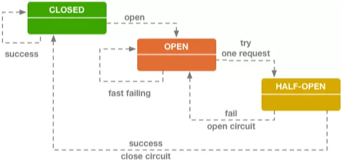
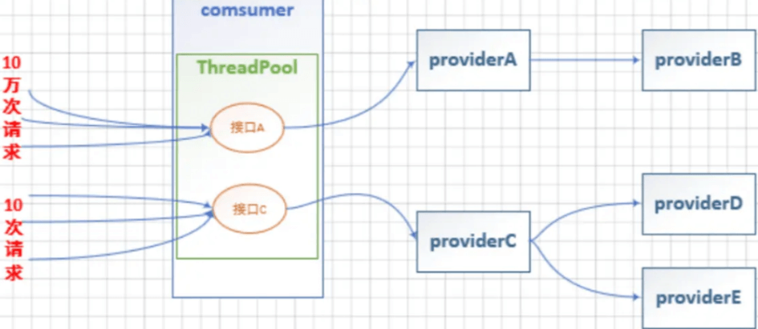
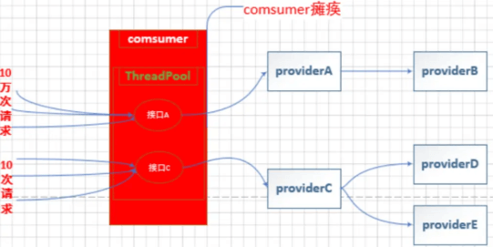
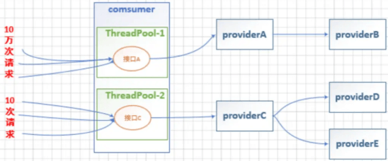
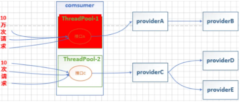
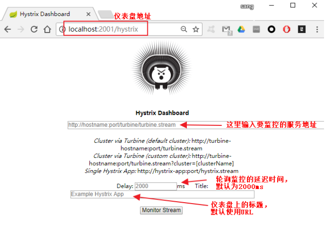
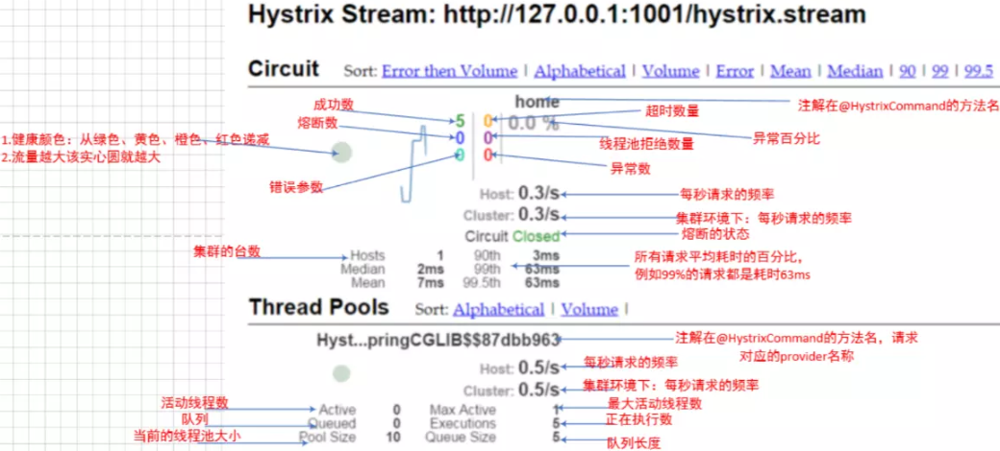
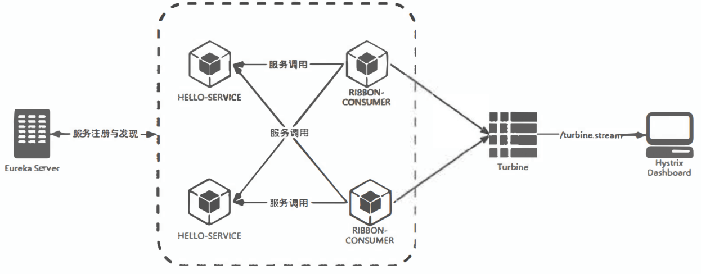

## 服务雪崩：  
&emsp; 在微服务架构中，将系统拆分成了很多服务单元，各单元的应用间通过服务注册与订阅的方式互相依赖。由于每个单元都在不同的进程中运行，依赖通过远程调用的方式执行，这样就有可能因为网络原因或是依赖服务自身间题出现调用故障或延迟，而这些问题会直接导致调用方的对外服务也出现延迟，若此时调用方的请求不断增加，最后就会因等待出现故障的依赖方响应形成任务积压，最终导致自身服务的瘫痪。  
&emsp; 在微服务架构中，存在着那么多的服务单元，若一个单元出现故障，就很容易因依赖关系而引发故障的蔓延，最终导致整个系统的瘫痪，这样的架构相较传统架构更加不稳定。为了解决这样的问题，产生了断路器等一系列的服务保护机制。  

## Hytrix简介：  
&emsp; 针对服务雪崩，Spring Cloud Hystrix实现了断路器、线程隔离等一系列服务保护功能。它也是基于Netflix的开源框架Hystrix实现的，该框架的目标在于通过控制那些访问远程系统、服务和第三方库的节点，从而对延迟和故障提供更强大的容错能力。Hystrix具备服务降级、服务熔断、线程和信号隔离、请求缓存、请求合并以及服务监控等强大功能。  
&emsp; Hystrix设计目标：  
* 对来自依赖的延迟和故障进行防护和控制——这些依赖通常都是通过网络访问的  
* 阻止故障的连锁反应  
* 快速失败并迅速恢复  
* 回退并优雅降级  
* 提供近实时的监控与告警  
## Hystrix原理：  
### Hystrix工作流程：  
.....

### 断路器原理：  
  
&emsp; 服务的健康状况 = 请求失败数 / 请求总数。  
&emsp; 熔断器开关由关闭到打开的状态转换是通过当前服务健康状况和设定阈值比较决定的。熔断器模式定义了熔断器开关相互转换的逻辑：  
1). 当熔断器开关关闭时, 请求被允许通过熔断器. 如果当前健康状况高于设定阈值, 开关继续保持关闭. 如果当前健康状况低于设定阈值, 开关则切换为打开状态。  
2). 当熔断器开关打开时, 请求被禁止通过。  
3). 当熔断器开关处于打开状态, 经过一段时间后, 熔断器会自动进入半开状态, 这时熔断器只允许一个请求通过. 当该请求调用成功时, 熔断器恢复到关闭状态。若该请求失败, 熔断器继续保持打开状态, 接下来的请求被禁止通过。  
&emsp; 熔断器的开关能***保证服务调用者在调用异常服务时, 快速返回结果, 避免大量的同步等待***. 并且熔断器能在一段时间后继续侦测请求执行结果, 提供恢复服务调用的可能。  

### 依赖隔离：  
&emsp; Hystrix提供了两种线程隔离方式：线程池隔离和信号量隔离。  
* 线程池隔离：  
    * 未使用线程池隔离：  
  
  
    * 使用线程池隔离：  
  
  

* 信号量隔离：  
  
&emsp; 线程池隔离和信号量隔离的区别：  

|隔离方式	|隔离原理	|是否支持超时	|是否支持熔断	|是否是异步调用	|资源消耗|
|---|---|---|---|---|---|
|线程池隔离	|每个服务单独用线程池	|支持，可直接返回	|支持，当线程池到达maxSize后，再请求会触发fallback接口进行熔断	|可以是异步，也可以是同步。看调用的方法	|大，大量线程的上下文切换，容易造成机器负载高|
|信号量隔离	|通过信号量的计数器	|不支持，如果阻塞，只能通过调用协议（如：socket）超时才能返回	|支持，当信号量达到maxConcurrentRequests后。再请求会触发fallback	|同步调用，不支持异步|小，只是个计数器|
&emsp; 信号量隔离策略适用于耗时短的接口；  
&emsp; 线程池隔离策略适用于耗时长的接口；  

## Hystrix配置信息  
......

## Hystrix仪表盘：  
&emsp; Hystrix Dashboard主要用来实时监控Hystrix的各项指标信息。  
&emsp; 访问Hystrix仪表盘地址：http://ip:port/hystrix  
  
&emsp; Hystrix Dashboard共支持三种不同的监控方式， 如下所示。
* 默认的集群监控：通过URL http://turbine-hostname:port/turbine.stream开启， 实现对默认集群的监控。  
* 指定的集群监控：通过URL http://turbine-hostname:port/turbine.strearn?cluster= [clusterName]开启，实现对clusterName集群的监控。  
* 单体应用的监控：通过URL http://hystrix-app:port/hystrix.stream开启， 实现对具体某个服务实例的监控。  
&emsp; 前两者都是对集群的监控，需要整合Turbine才能实现。  

&emsp; 仪表盘其余两个参数：  
&emsp; Delay: 该参数用来控制服务器上轮询监控信息的延迟时间，默认为2000毫秒， 可以通过配置该属性来降低客户端的网络和CPU消耗。  
&emsp; Title: 该参数对应了上图头部标题 Hystrix Stream之后的内容，默认会使用具体监控实例的URL, 可以通过配置该信息来展示更合适的标题。  

&emsp; 输入URL，单击单击Monitor Stream按钮。  
  

## Turbine集群监控：  
### 构建监控聚合服务：  
&emsp; 微服务集群中，Hystrix的度量信息通过Turbine来汇集监控信息，并将聚合后的信息提供给Hystrix Dashboard来集中展示和监控。  
  

### 与消息代理结合：  
......

