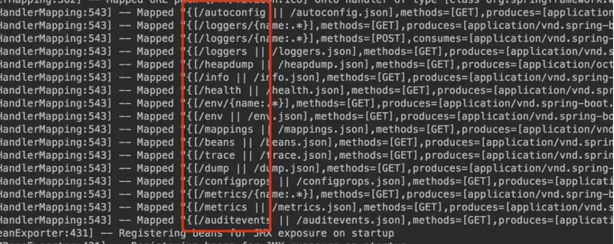

&emsp; Spring Boot Admin依赖了spring-boot-starter-actuator，引入该依赖能够自动为 Spring Boot 构建的应用提供 一系列用于监控的端点。  
&emsp; 在Spring Boot工程中新增spring-boot-starter-actuator依赖。具体如下：  

```xml
<dependency>
    <groupId>org.springframework.boot</groupId>
    <artifactId>spring-boot-starter-actuator</artifactId>
</dependency>
``` 
为了保证actuator接口的敏感性，在配置文件中，开放安全属性配置：  

```properties
management.security.enabled=false
```
&emsp; 重新启动应用。此时，可以在控制台中看到如下图所示的输出：  
  


## 原生断点：  
&emsp; spring-boot-starter-actuator依赖中已经实现的一些原生端点。 根据端点的作用， 可以将原生端点分为以下三大类。  
* 应用配置类：获取应用程序中加载的应用配置、 环境变量、 自动化配置报告等与 Spring Boot应用密切相关的配置类信息。  
* 度最指标类：获取应用程序运行过程中用于监控的度量指标， 比如内存信息、 线程池信息、 HTTP请求统计等。  
* 操作控制类：提供了对应用的关闭等操作类功能。  

注意：  
1. 每一个端点都可以通过配置来单独禁用或者启动  
2. 不同于Actuator 1.x，Actuator 2.x 的大多数端点默认被禁掉。Actuator 2.x 中的默认端点增加了 /actuator前缀。默认暴露的两个端点为 /actuator/health和 /actuator/info  


## 在Spring Cloud中基于Eureka的Spring Boot Admin的搭建  


## 监控通知  


## 集成spring security  


