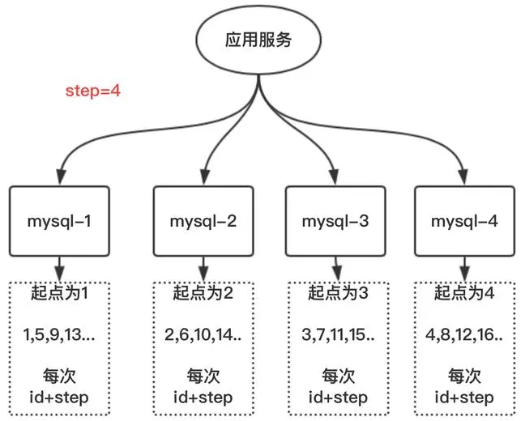

## 分布式ID  
&emsp; 在业务开发中需要使用一些id。分布式系统的全局唯一ID称为分布式ID。  

&emsp; 分布式ID需要满足那些条件？  
* 全局唯一：必须保证ID是全局性唯一的，基本要求。  
* 高性能：高可用低延时，ID生成响应要块，否则反倒会成为业务瓶颈。  
* 高可用：100%的可用性是骗人的，但是也要无限接近于100%的可用性。  
* 好接入：要秉着拿来即用的设计原则，在系统设计和实现上要尽可能的简单。  
* 趋势递增：最好趋势递增，这个要求就得看具体业务场景了，一般不严格要求。  
* 可反解：一个ID生成之后，就会伴随着信息终身，排错分析的时候，需要查验。这时候一个可反解的ID可以帮上很多忙，从哪里来的，什么时候出生的。  

## 分布式ID常见生成方案  

&emsp; 分布式ID常见生成方案有以下几种：  
* UUID
* 数据库自增ID
* 数据库多主模式
* 号段模式
* Redis
* 雪花算法(SnowFlake)
* 滴滴出品(TinyID)
* 百度(Uidgenerator)
* 美团(Leaf)  

### UUID  
&emsp; ***生产随机数的方式：***  
1). Math.random()0到1之间随机数；  
2). java.util.Random伪随机数（线性同余法生成）；  
3). java.security.SecureRandom真随机数；  
4). java.util.concurrent.ThreadLocalRandom每一个线程有一个独立的随机数生成器。  

&emsp; ***优点：***  
* 不需要第三方组件（也就没有单点的风险），代码实现简单；  
* 本机生成，没有网络消耗；  
* 因为是全球唯一的ID，所以迁移数据容易。  

&emsp; ***缺点：***  
* 每次生成的ID是无序的，相对来说还会影响性能（比如 MySQL 的 InnoDB 引擎，如果UUID作为数据库主键，其无序性会导致数据位置频繁变动）；  
* UUID的字符串存储，查询效率慢；  
* 长度长，存储空间大；  
* ID本事无业务含义，不可读。  

&emsp; ***应用场景：***  
* 适用于类似生成token令牌的场景；  
* 不适用一些要求有趋势递增的ID场景。  

### 2. 利用数据库生成  
#### MySql主键自增：  
&emsp; 这个方案利用了MySQL的主键自增auto_increment，默认每次ID加1。  
&emsp; ***优点：***  
* 数字化，id递增；  
* 查询效率高；  
* 具有一定的业务可读。  
&emsp; ***缺点：***  
* 存在单点问题，如果mysql挂了，就没法生成ID；  
* 数据库压力大，高并发抗不住。  

#### MySQL多实例主键自增  
&emsp; 这个方案就是解决mysql的单点问题，在auto_increment基本上面，设置step步长。  
  
&emsp; 每台的初始值分别为1,2,3...N，步长为N（这个案例步长为4）。  
&emsp; ***优点：*** 解决了单点问题。  
&emsp; ***缺点：*** 一旦把步长定好后，就无法扩容；而且单个数据库的压力大，数据库自身性能无法满足高并发。  
&emsp; ***应用场景：*** 数据不需要扩容的场景。  

#### 基于数据库的号段模式  
&emsp; 号段模式是当下分布式ID生成器的主流实现方式之一，号段模式可以理解为从数据库批量的获取自增ID，每次从数据库取出一个号段范围，例如 (1,1000] 代表1000个ID，具体的业务服务将本号段，生成1~1000的自增ID并加载到内存。表结构如下：  

```sql
CREATE TABLE id_generator (
  id int(10) NOT NULL,
  max_id bigint(20) NOT NULL COMMENT '当前最大id',
  step int(20) NOT NULL COMMENT '号段的布长',
  biz_type    int(20) NOT NULL COMMENT '业务类型',
  version int(20) NOT NULL COMMENT '版本号',
  PRIMARY KEY (`id`)
) 
```
&emsp; biz_type ：代表不同业务类型  
&emsp; max_id ：当前最大的可用id  
&emsp; step ：代表号段的长度  
&emsp; version ：是一个乐观锁，每次都更新version，保证并发时数据的正确性  

|id	|biz_type	|max_id	|step	|version|
|---|---|---|---|
|1	|101	|1000	|2000	|0|    
&emsp; 等这批号段ID用完，再次向数据库申请新号段，对max_id字段做一次update操作，update max_id= max_id + step，update成功则说明新号段获取成功，新的号段范围是(max_id ,max_id +step]。

```sql
update id_generator set max_id = #{max_id+step}, version = version + 1 where version = # {version} and biz_type = XXX
```
&emsp; 由于多业务端可能同时操作，所以采用版本号version乐观锁方式更新，这种分布式ID生成方式不强依赖于数据库，不会频繁的访问数据库，对数据库的压力小很多  

### 3. 利用中间件生成  
&emsp; 可以使用Redis / MongoDB / zookeeper 生成分布式ID。  
#### 基于Redis实现  
&emsp; redis单机使用incr函数生成自增ID；redis集群使用lua脚本生成，或使用org.springframework.data.redis.support.atomic.RedisAtomicLong生成。  
&emsp; ***优点：*** 有序递增，可读性强。
&emsp; ***缺点：*** 占用带宽，每次要向redis进行请求。

### 4. 雪花SnowFlake算法  


