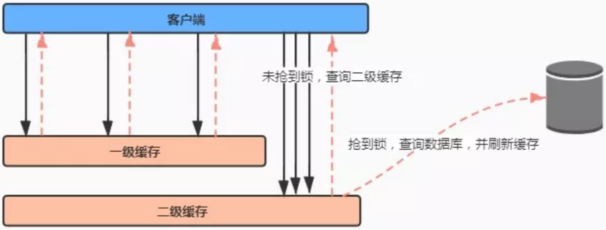
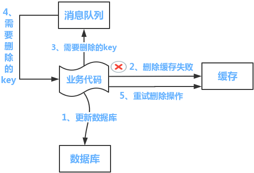
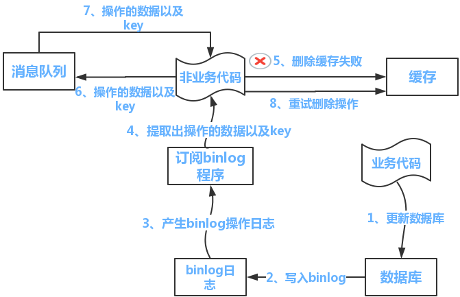

&emsp; 使用缓存需要考虑的问题：缓存雪崩、缓存穿透、缓存更新和缓存与数据的一致性问题、热点数据集中失效、缓存并发、缓存无底洞、缓存淘汰......  
&emsp; ***缓存穿透、缓存击穿和缓存雪崩：***  
&emsp; 缓存穿透、缓存击穿和缓存雪崩都是缓存失效导致大量请求直接访问数据库而出现的情况。不同的是缓存穿透是数据库和缓存都不存在相关数据；而缓存击穿和缓存雪崩是缓存和数据库都存在相应数据，只是缓存失效了而已。  

## 缓存穿透  
### 问题：  
&emsp; 缓存穿透是指查询一个一定不存在的数据，因为缓存中也无该数据的信息，则会直接去数据库层进行查询，从系统层面来看像是穿透了缓存层直接达到数据库，从而称为缓存穿透。  

### 解决方案：  
1. 空值缓存：  
&emsp; 一种比较简单的解决办法，在第一次查询完不存在的数据后，将该key与对应的空值也放入缓存中，只不过设定为较短的失效时间，例如几分钟，这样则可以应对短时间的大量的该key攻击，设置为较短的失效时间是因为该值可能业务无关，存在意义不大，且该次的查询也未必是攻击者发起，无过久存储的必要，故可以早点失效。    
2. 设置布隆过滤器：  
[布隆过滤器]()  
&emsp; 设置布隆过滤器，预先将所有值哈希到一个足够大的BitMap中，每次请求都会经过BitMap的拦截，如果Key不存在，直接返回异常。这样就避免了对缓存以及底层数据库的查询压力。  

## 缓存雪崩  
### 问题：  
&emsp; 缓存雪崩 是指在某一个时间段，缓存集中过期失效。此刻无数的请求直接绕开缓存，直接请求数据库。  
&emsp; 造成缓存雪崩的原因，有以下两种：  
* 多个key同时失效  
* reids宕机  
### 解决方案：  
1. 多个key同时失效：  
* 不设置缓存过期时间  
* 设置随机过期时间，这样就会大幅度的减少缓存在同一时间过期。  
* 使用互斥锁：在缓存失效后，通过互斥锁或者队列，控制读数据库和写缓存的线程数量；不过这样会导致系统的吞吐量下降。  
* 双缓存：设置一级缓存和二级缓存，一级缓存过期时间短，二级缓存过期时间长或者不过期，一级缓存失效后访问二级缓存，同时刷新一级缓存。  

2. 缓存服务器宕机：对于“Redis挂掉了，请求全部走数据库”这种情况，可以有以下的思路：  
事发前：实现Redis的高可用(主从架构+Sentinel 或者Redis Cluster)，尽量避免Redis挂掉这种情况发生。  
事发中：万一Redis真的挂了，可以设置本地缓存(ehcache)+限流(hystrix)，尽量避免数据库被干掉(起码能保证服务还是能正常工作的)。  
事发后：redis持久化，重启后自动从磁盘上加载数据，快速恢复缓存数据。  

## 缓存击穿  
### 问题：  
&emsp; 缓存击穿指的是，一个key的访问量非常大，比如某秒杀活动，有1w/s的并发量。这个key在某一时刻过期，那这些大量的请求就会一瞬间到数据库，数据库可能会直接崩溃。  
&emsp; 缓存击穿实际上是缓存雪崩的一个特例，缓存被“击穿”和缓存雪崩的区别在于这里针对某一key缓存，前者则是很多key。  
### 解决方案： 
* 对于热点数据，慎重考虑过期时间，确保热点期间key不会过期，甚至有些可以设置永不过期。  
* 读取数据库数据进行缓存时，增加互斥锁。 
&emsp; 分布式环境中要使用分布式锁，单机的话用普通的锁（synchronized、Lock）   
* 双缓存：对于热点数据进行二级缓存，并对于不同级别的缓存设定不同的失效时间，则请求不会直接击穿缓存层到达数据库。  

#### 使用互斥锁：  
&emsp; 第一种方法：整个方法是synchronized 的，这样做虽然可以防止大量请求落到数据库上，但是就算是缓存没有失效，需要从数据库中查询数据也需要排队，无疑是降低了系统的吞吐量。  

```java
public synchronized String getCacheData() {
      String cacheData = "";
      //读 Redis
      cacheData = getDataFromRedis();
      if (cacheData.isEmpty()) {
          //读数据库
          cacheData = getDataFromDB();
          //写 Redis
          setDataToCache(cacheData);
      }
      return cacheData;
}
```
&emsp; 第二种方法：当缓存失效时，只对查询数据库的操作进行加锁，这样对于缓存没有失效的情况也非常友好，但是查询操作这里加锁，也只是会阻塞掉住其他调用，第一其他线程要等待，对调用方不友好，第二这些请求被阻塞的请求最终还是会落到数据库上的。  

```java
static Object lock = new Object();
  
public String getCacheData() {
      String cacheData = "";
      // 读 Redis
      cacheData = getDataFromRedis();
      if (cacheData.isEmpty()) {
          synchronized (lock) {
              //读数据库
           cacheData = getDataFromDB();
              //写 Redis
              setDataToCache(cacheData);
          }
      }
      return cacheData;
 }
```
&emsp; 第三种方法：使用互斥锁，抢到锁的话读数据库并写入缓存，抢不到锁的话也不阻塞，而是直接去读缓存，如果缓存中依然读不到数据（抢到锁的可能还没有将缓存写入成功），就等一会再试试读缓存。  

```java
public String getCacheData(){
    String result = "";
    //读 Redis
    result = getDataFromRedis();
    if (result.isEmpty()) {
        if (reenLock.tryLock()) {
            try {
                //读数据库
                result = getDataFromDB();
                //写 Redis
                setDataToCache(result);
            }catch(Exception e){
                //...
            }finally {
                reenLock.unlock();//释放锁
            }
        } else {
            //注意：这里可以结合下文中的双缓存机制：
            //抢不到锁的去查询二级缓存
            //读 Redis
            result = getDataFromRedis();
            if (result.isEmpty()) {
                try {
                    Thread.sleep(100);
                } catch (InterruptedException e) {
                    //...
                }
                return getCacheData();
            }
        }
    }
    return result;
}
```

#### 双缓存  
&emsp; 设置一级缓存和二级缓存，一级缓存过期时间短，二级缓存过期时间长或者不过期，一级缓存失效后访问二级缓存，同时刷新一级缓存和二级缓存。  
&emsp; 双缓存的方式，说白了就是不能将一级缓存和二级缓存中数据同时变成失效，当一级缓存失效后，有多个请求访问，彼此之间依然是竞争锁，抢到锁的线程查询数据库并刷新缓存，而其他没有抢到锁的线程，直接访问二级缓存（代码可以参考上文中的互斥锁），如图：  
  

## 保证缓存与数据库的双写一致性  
### 问题：  
&emsp; ***是否需要保证双写一致性？***  
&emsp; 一般来说，如果允许缓存可以稍微的跟数据库偶尔有不一致的情况，也就是说如果系统不是严格要求“缓存+数据库”必须保持一致性，最好不要做这个方案。即：读请求和写请求串行化，串到一个内存队列里去，从而达到防止并发请求导致数据错乱的问题。  
&emsp; ***四种更新策略：***  
* 先更新数据库，再更新缓存  
* 先更新缓存，再更新数据库  
* 先删除缓存，再更新数据库  
* 先更新数据库，再删除缓存（推荐）  

### 解决方案：  
&emsp; 1).一个比较简单的解决办法是设置过期时间，把过期时间设置得比较低，这样就只有在缓存没过期之前存在数据不一致问题，在一些业务场景下也还能接受。  

&emsp; 2).采用延时双删策略。  

```java
    public void write(String key,Object data){
        //1.删除缓存
        redis.delKey(key);
        //2.更新数据
        db.updateData(data);
        //3.休眠1S
        Thread.sleep(1000);
        //2.再次删除缓存
        redis.delKey(key);
    }
```
&emsp; 这么做，可以将1秒内所造成的缓存脏数据，再次删除。那么，这个1秒怎么确定的，具体该休眠多久呢？  
&emsp; 针对上面的情形，读者应该自行评估自己的项目的读数据业务逻辑的耗时。然后写数据的休眠时间则在读数据业务逻辑的耗时基础上，加几百ms即可。这么做的目的，就是确保读请求结束，写请求可以删除读请求造成的缓存脏数据。  

#### 使用辅助队列：  
&emsp; 3).使用队列辅助，提供一个保障的重试机制。如果缓存删除失败，就放进队列，然后另一个任务从队列中取出消息，不断去重试删除相应的key。给出两套方案：  
&emsp; 方案一：  
  
&emsp; 流程如下所示：  
（1）更新数据库数据；  
（2）缓存因为种种问题删除失败  
（3）将需要删除的key发送至消息队列  
（4）自己消费消息，获得需要删除的key  
（5）继续重试删除操作，直到成功  
&emsp; 然而，该方案有一个缺点，对业务线代码造成大量的侵入。于是有了方案二，在方案二中，启动一个订阅程序去订阅数据库的binlog，获得需要操作的数据。在应用程序中，另起一段程序，获得这个订阅程序传来的信息，进行删除缓存操作。  

&emsp; 方案二：  
  
&emsp; 流程如下图所示：  
（1）更新数据库数据  
（2）数据库会将操作信息写入binlog日志当中  
（3）订阅程序提取出所需要的数据以及key  
（4）另起一段非业务代码，获得该信息  
（5）尝试删除缓存操作，发现删除失败  
（6）将这些信息发送至消息队列  
（7）重新从消息队列中获得该数据，重试操作。  
&emsp; 备注说明：上述的订阅binlog程序在mysql中有现成的中间件叫canal，可以完成订阅binlog日志的功能。另外，重试机制，可以采用消息队列的方式。如果对一致性要求不是很高，直接在程序中另起一个线程，每隔一段时间去重试即可。  


