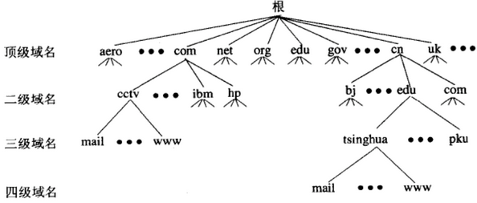

# DNS  
&emsp; 访问网站的时候会输入域名，而在真实网络中主机通信是通过IP地址进行通信的。  
&emsp; DNS，英文全写为Domain Name System，中文意思为域名系统，是互联网中提供域名与IP地址互相映射的分布式数据库。DNS 运行在 UDP 上，使用 53 端口。  
## DNS域名的层次结构  
&emsp; 由于因特网的用户数量较多，所以因特网在命名时采用的是层次树状结构的命名方法。任何一个连接在因特网上的主机或路由器，都有一个唯一的层次结构的名字，即域名(domain name)。这里，“域”(domain)是名字空间中一个可被管理的划分。  
&emsp; DNS的域名树由根域，顶级域，二级域及其子域构成，其结构图与示例如下：  
  
&emsp; 根域，由互联网网络信息中心(InterNIC)负责管理，用点“.”表示，无名称，是域名系统中的最高级别域，标准域名结尾应包含根域“.”，但实际使用中该根域都是省略的，所以大家常见的网址末尾并没有“.”。  
&emsp; 顶级域(Top-Level Domains = TLD)，隶属于根域，是仅次于根域的下一级域，顶级域名TLD分为三大类：  
&emsp; &emsp; (1)国家顶级域名nTLD：采用ISO3166的规定。如：cn代表中国，us代表美国，uk代表英国，等等。国家域名又常记为ccTLD(cc表示国家代码contry-code)。  
&emsp; &emsp; (2)通用顶级域名gTLD：最常见的通用顶级域名有7个，即：com(公司企业)，net(网络服务机构)，org(非营利组织)，int(国际组织)，gov(美国的政府部门)，mil(美国的军事部门)。  
&emsp; &emsp; (3)基础结构域名(infrastructure domain)：这种顶级域名只有一个，即arpa，用于反向域名解析，因此称为反向域名。  
&emsp; 二级域，正式给组织和个人注册使用的唯一名称，如亚马逊、IBM，微软的官方网址(头条不能带网址)中的字眼“amazon”“ibm”“microsoft”就是这些企业注册的二级域名。  
&emsp; 二级域以下子域，在二级域中的组织机构可以根据需要来进一步划分子域，如销售部门用sale子域名，业务部门用business子域名等。  
## 域名服务器

## DNS解析流程  