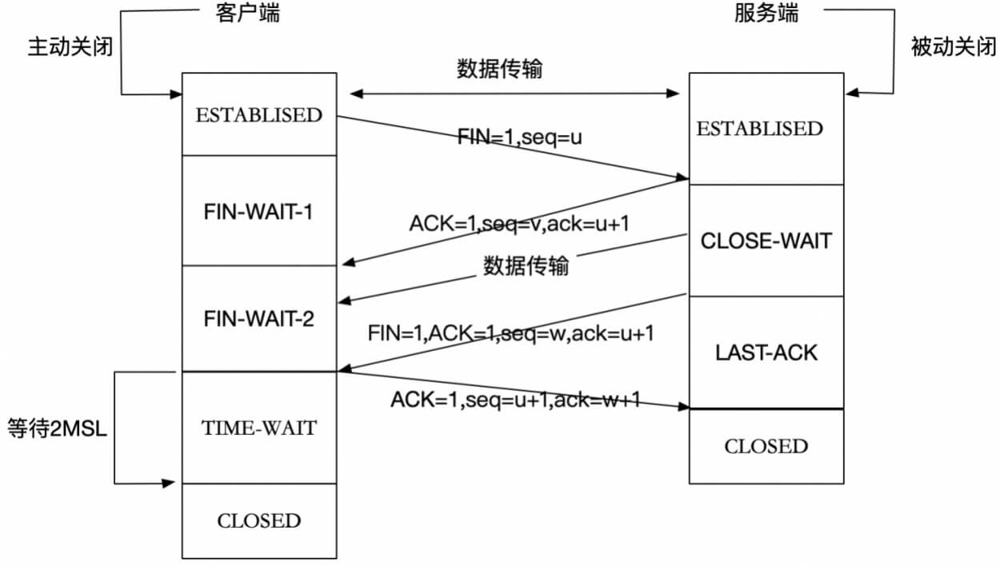

#TCP  
##1. TCP简介：  
&emsp; 传输控制协议（TCP，Transmission Control Protocol）是一种面向连接的、可靠的、基于字节流的传输层通信协议。  

##2. 工作方式：  
###2.1. 三次握手，建立连接  
&emsp; 在TCP/IP协议中，TCP协议提供可靠的连接服务，采用三次握手建立一个连接。三次握手主要目的是：信息对等和防止超时。  
&emsp; TCP三次握手的过程掌握最重要的两点就是客户端和服务端状态的变化和三次握手过程标志信息的变化。  
####1. 流程：  
  
&emsp; 初始状态：客户端处于closed(关闭) 状态，服务端处于listen(监听) 状态。  
&emsp; 第一次握手：建立连接时，客户端发送SYN包（SYN=1，sql=x）到服务器。并进入SYN_SEND发送等待状态，等待服务器确认；  
&emsp; 第二次握手：服务器收到SYN包，必须确认客户的SYN（ACK=1，ack+1）,同时自己也发送一个SYN包（SYN=1，sql=Y)，即SYN+ACK包，此时服务器进入SYN_RECV确认接收状态；  
&emsp; 第三次握手：客户端收到服务器的SYN+ACK包，向服务器发送确认包ACK(ACK=1，ack=y+l)，此包发送完毕,客户端和服务器进入ESTABLISHED确认连接状态，完成三次握手。  

####2. 常见问题：  
&emsp; ***1. 为什么只有三次握手才能确认双方的接受与发送能力是否正常，而两次却不可以？***  
&emsp; 防止了服务器端的一直等待而浪费资源。例如：已失效的连接请求报文突然又传送到了服务器，从而会产生错误。  
&emsp; client发送了第一个连接的请求报文，但是由于网络不好，这个请求没有立即到达服务端，而是在某个网络节点中滞留了，直到某个时间才到达server，本来这已经是一个失效的报文，但是server端接收到这个请求报文后，还是会向client发出确认的报文，表示同意连接。  
&emsp; 假如不采用三次握手，那么只要server发出确认，新的建立就连接了，但其实这个请求是失效的请求，client是不会理睬server的确认信息，也不会向服务端发送确认的请求，但是server认为新的连接已经建立起来了，并一直等待client发来数据，这样，serve的很多资源就没白白浪费掉了，采用三次握手就是为了防止这种情况的发生，server会因为收不到确认的报文，就知道client并没有建立连接。这就是三次握手的作用。  

&emsp; ***2. 三次握手过程中可以携带数据吗？***  
&emsp; 其实第三次握手的时候，是可以携带数据的。但是，第一次、第二次握手不可以携带数据。  
&emsp; 解析：假如第一次握手可以携带数据的话，如果有人要恶意攻击服务器，那攻击者每次都在第一次握手中的 SYN 报文中放入大量的数据。因为攻击者根本就不理服务器的接收、发送能力是否正常，然后疯狂着重复发 SYN 报文的话，这会让服务器花费很多时间、内存空间来接收这些报文。  
&emsp; 也就是说，第一次握手不可以放数据，其中一个简单的原因就是会让服务器更加容易受到攻击了。而对于第三次的话，此时客户端已经处于 ESTABLISHED 状态。客户端已经建立起连接了，并且也已经知道服务器的接收、发送能力是正常的了，所以能携带数据也没啥毛病。  

###2.2. ***四次挥手，连接终止  
####1. 流程：  
  
&emsp; TCP采用四次挥手来释放连接：刚开始双方都处于establised状态。  
&emsp; 第一次挥手：第一次挥手无论是客户端还是服务端都可以发起，因为TCP是全双工的。假如是客户端先发起关闭请求，Client发送一个FIN，用来关闭Client到Server的数据传送，Client进入FIN_WAIT_1状态；  
&emsp; 第二次挥手：Server收到FIN后，发送一个ACK给Client，确认序号为收到序号+1 (与SYN相同，一个FIN占用一个序号），Server进入CLOSE_WAIT状态；  
&emsp; 第三次挥手：Server发送一个FIN，用来关闭Server到Client的数据传送，Server进入LAST_ACK状态；  
&emsp; 第四次挥手：Client收到F1N后，Client进入TIME_WAIT状态，接着发送一个ACK给Server，确认序号为收到序号+1，Server进入CLOSED状态，完成四次挥手。  
####2. 常见问题：  
&emsp; ***1. 为什么建立连接是三次握手，关闭连接确是四次挥手呢？***  
&emsp; 全双工半关闭：TCP建立连接要进行三次握手，而断开连接要进行四次。这是由于TCP的半关闭造成的。因为TCP连接是全双工的(即数据可在两个方向上同时传递)，所以进行关闭时每个方向上都要单独进行关闭。这个单方向的关闭就叫半关闭。当一方完成它的数据发送任务，就发送一个FIN来向另一方通告将要终止这个方向的连接。  

&emsp; ***2. 2MSL等待状态***  
&emsp; TIME_WAIT状态也称为2MSL等待状态。每个具体TCP实现必须选择一个报文段最大生存时间MSL（Maximum Segment Lifetime），它是任何报文段被丢弃前在网络内的最长时间。这个时间是有限的，因为TCP报文段以IP数据报在网络内传输，而IP数据报则有限制其生存时间的TTL字段。  
&emsp; 对一个具体实现所给定的MSL值，处理的原则是：当TCP执行一个主动关闭，并发回最后一个ACK，该连接必须在TIME_WAIT状态停留的时间为2倍的MSL。这样可让TCP再次发送最后的ACK以防这个ACK丢失（另一端超时并重发最后的FIN）。  
&emsp; 这种2MSL等待的另一个结果是这个TCP连接在2MSL等待期间，定义这个连接的插口（客户的IP地址和端口号，服务器的IP地址和端口号）不能再被使用。这个连接只能在2MSL结束后才能再被使用。  

&emsp; ***3. 为什么客户端最后还要等待2MSL？***  
&emsp; MSL是Maximum Segment Lifetime的英文缩写，可译为“最长报文段寿命”，它是任何报文在网络上存在的最长时间，超过这个时间报文将被丢弃。  

&emsp; 第一，保证客户端发送的最后一个ACK报文能够到达服务器，因为这个ACK报文可能丢失。  
站在服务器的角度看来，服务端已经发送了FIN+ACK报文请求断开了，客户端还没有给我回应，应该是我发送的请求断开报文它没有收到，于是服务器又会重新发送一次。而客户端就能在这个2MSL时间段内收到这个重传的报文，接着给出回应报文，并且会重启2MSL计时器。如果客户端收到服务端的FIN+ACK报文后，发送一个ACK给服务端之后就“自私”地立马进入CLOSED状态，可能会导致服务端无法确认收到最后的ACK指令，也就无法进入CLOSED状态，这是客户端不负责任的表现。  
&emsp; 第二，防止失效请求。防止类似与“三次握手”中提到了的“已经失效的连接请求报文段”出现在本连接中。  
&emsp; 客户端发送完最后一个确认报文后，在这个2MSL时间中，就可以使本连接持续的时间内所产生的所有报文段都从网络中消失。这样新的连接中不会出现旧连接的请求报文。  

&emsp; ***4. 如果已经建立了连接，但是客户端突然出现故障了怎么办？***  
&emsp; 客户端如果出现故障，服务器不能一直等下去，白白浪费资源。在TCP还设有一个保活计时器。服务器每收到一次客户端的请求后都会重新复位这个计时器，时间通常是设置为2小时，若两小时还没有收到客户端的任何数据，服务器就会发送一个探测报文段，以后每隔75分钟发送一次。若一连发送10个探测报文仍然没反应，服务器就认为客户端出了故障，接着就关闭连接。  

##3.TCP与UDP的区别：  
&emsp; ***TCP和UDP的区别：***  
&emsp; ***TCP的优点：***  
1). TCP 是面向连接的传输控制协议，而UDP提供了无连接的数据报服务；  
2). TCP 具有高可靠性，确保传输数据的正确性，不出现丢失或乱序；UDP 在传输数据前不建立连接，不对数据报进行检查与修改，无须等待对方的应答，所以会出现分组丢失、重复、乱序，应用程序需要负责传输可靠性方面的所有工作；  
&emsp; ***UDP的优点：***  
1). UDP具有较好的实时性，工作效率较TCP协议高；  
2). UDP段结构比 TCP 的段结构简单，因此网络开销也小。  

&emsp; ***总结：*** TCP 协议可以保证接收端毫无差错地接收到发送端发出的字节流，为应用程序提供可靠的通信服务。对可靠性要求高的通信系统往往使用 TCP 传输数据。比如 HTTP 运用 TCP 进行数据的传输。  

&emsp; ***使用TCP的协议有哪些？使用UDP的协议有哪些？***  
&emsp; 使用TCP的协议：FTP（文件传输协议）、Telnet（远程登录协议）、SMTP（简单邮件传输协议）、POP3（和SMTP相对，用于接收邮件）、HTTP协议等。  
&emsp; 使用UDP协议包括：TFTP（简单文件传输协议）、SNMP（简单网络管理协议）、DNS（域名解析协议）、NFS、BOOTP。  

