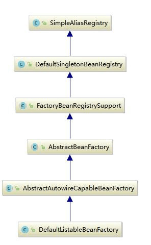
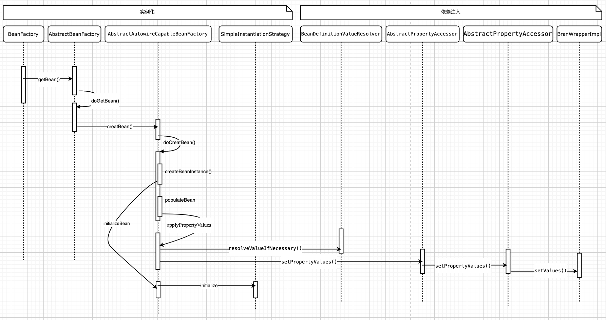
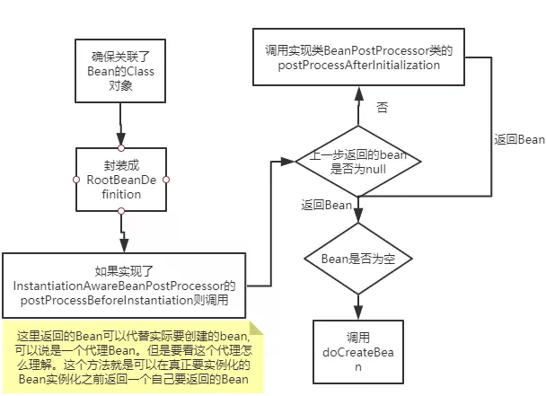
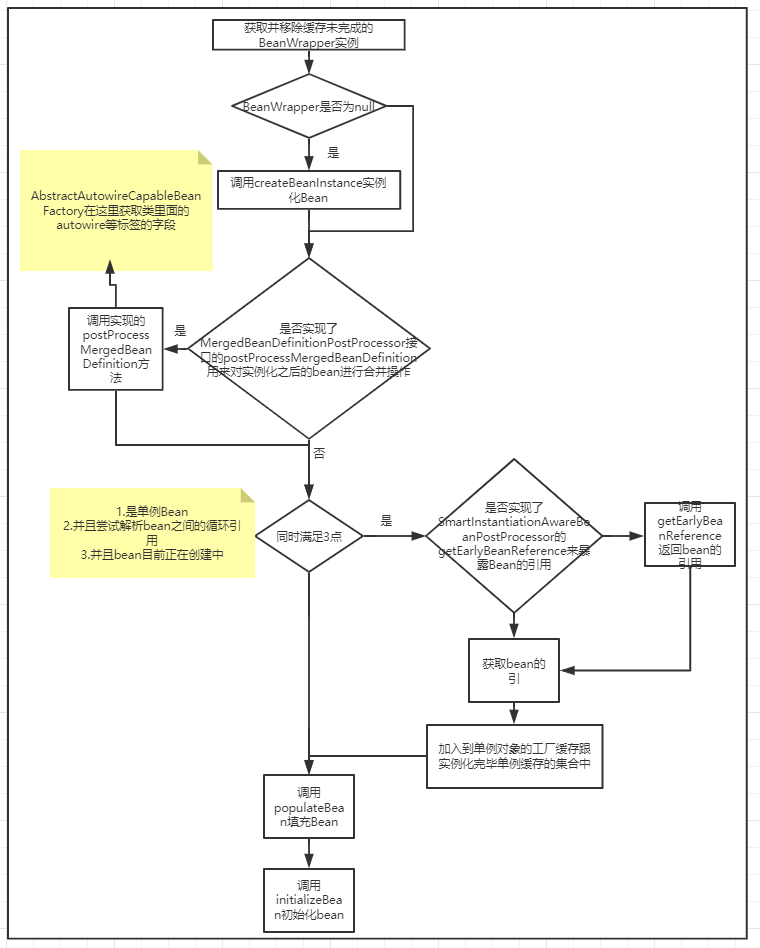
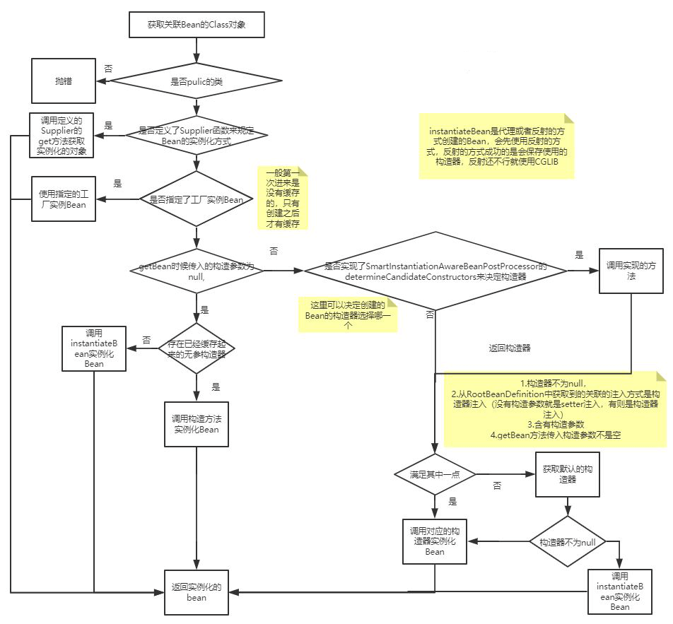
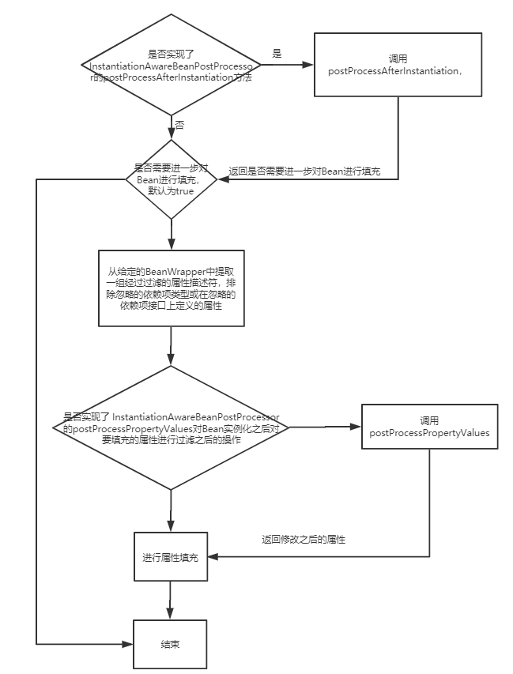
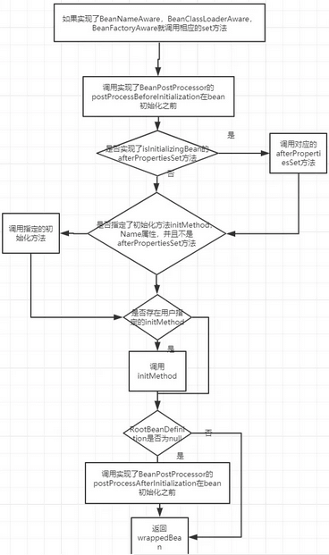

# SpringDI  
## 依赖注入发生的时间  
&emsp; 当 Spring IOC 容器完成了Bean定义资源的定位、载入和解析注册以后，IOC 容器中已经管理类 Bean 定义的相关数据，但是此时 IOC 容器还没有对所管理的 Bean 进行依赖注入，依赖注入在以下两种情况发生：  
&emsp; 1)、用户第一次调用getBean()方法时，IOC容器触发依赖注入。  
&emsp; 2)、当用户在配置文件中将<bean>元素配置了 lazy-init=false 属性，即让容器在解析注册 Bean 定义时进行预实例化，触发依赖注入。  

&emsp; getBean()方法定义在BeanFactory 接口中，可以通过分析其子类的具体实现，理解 Spring IOC 容器在用户索取 Bean 时如何完成依赖注入。  
  
&emsp; 在BeanFactory中可以看到getBean(String...)方法，但它具体实现在 AbstractBeanFactory 中。  

## SpringDI时序图：  
  
## AbstractBeanFactory#getBean()，获取Bean  
&emsp; AbstractBeanFactory 的 getBean()相关方法的源码如下：  

```java
//获取 IOC 容器中指定名称的Bean
@Override
public Object getBean(String name) throws BeansException {
    //doGetBean 才是真正向 IOC 容器获取被管理 Bean 的过程
    return doGetBean(name, null, null, false);
}

//获取 IOC 容器中指定名称和类型的Bean
@Override
public <T> T getBean(String name, @Nullable Class<T> requiredType) throws BeansException {
    //doGetBean 才是真正向 IOC 容器获取被管理 Bean 的过程
    return doGetBean(name, requiredType, null, false);
}

//获取 IOC 容器中指定名称和参数的Bean
@Override
public Object getBean(String name, Object... args) throws BeansException {
    //doGetBean 才是真正向 IOC 容器获取被管理 Bean 的过程
    return doGetBean(name, null, args, false);
}

//获取 IOC 容器中指定名称、类型和参数的Bean
public <T> T getBean(String name, @Nullable Class<T> requiredType, @Nullable Object... args) throws BeansException {
    //doGetBean 才是真正向 IOC 容器获取被管理 Bean 的过程
    return doGetBean(name, requiredType, args, false);
}
```  
&emsp; #getBean()调用#doGetBean()方法。  
### AbstractBeanFactory.#deGetBean()，获取Bean  
  
&emsp; ***主要流程：***  
&emsp; 1、先处理Bean 的名称，因为如果以“&”开头的Bean名称表示获取的是对应的FactoryBean对象；  
&emsp; 2、从缓存中获取单例Bean，有则进一步判断这个Bean是不是在创建中，如果是的就等待创建完毕，否则直接返回这个Bean对象  
&emsp; 3、如果不存在单例Bean缓存，则先进行循环依赖的解析  
&emsp; 4、解析完毕之后先获取父类BeanFactory，获取到了则调用父类的getBean方法，不存在则先合并然后创建Bean  

&emsp; ***源码解析：***  

```java
@SuppressWarnings("unchecked")
//真正实现向 IOC 容器获取Bean 的功能，也是触发依赖注入功能的地方
protected <T> T doGetBean(final String name, @Nullable final Class<T> requiredType, @Nullable final Object[] args, boolean typeCheckOnly) throws BeansException {

    //根据指定的名称获取被管理 Bean 的名称，剥离指定名称中对容器的相关依赖
    //如果指定的是别名，将别名转换为规范的 Bean 名称
    final String beanName = transformedBeanName(name);
    Object bean;

    //先从缓存中取是否已经有被创建过的单态类型的 Bean
    //对于单例模式的 Bean 整个 IOC 容器中只创建一次，不需要重复创建
    Object sharedInstance = getSingleton(beanName);
    //IOC 容器创建单例模式 Bean 实例对象
    if (sharedInstance != null && args == null) {
        if (logger.isDebugEnabled()) {
            //如果指定名称的 Bean 在容器中已有单例模式的 Bean 被创建
            //直接返回已经创建的 Bean
            if (isSingletonCurrentlyInCreation(beanName)) {
                logger.debug("Returning eagerly cached instance of singleton bean '" + beanName +
                        "' that is not fully initialized yet - a consequence of a circular reference");
            } else {
                logger.debug("Returning cached instance of singleton bean '" + beanName + "'");
            }
        }

        //获取给定 Bean 的实例对象，主要是完成 FactoryBean 的相关处理
        //注意：BeanFactory 是管理容器中 Bean 的工厂，而 FactoryBean 是
        //创建创建对象的工厂 Bean，两者之间有区别
        bean = getObjectForBeanInstance(sharedInstance, name, beanName, null);
    } else {
        //缓存没有正在创建的单例模式 Bean
        //缓存中已经有已经创建的原型模式 Bean
        //但是由于循环引用的问题导致实例化对象失败
        if (isPrototypeCurrentlyInCreation(beanName)) {
            throw new BeanCurrentlyInCreationException(beanName);
        }

        //对 IOC 容器中是否存在指定名称的BeanDefinition 进行检查，首先检查是否
        //能在当前的 BeanFactory 中获取的所需要的Bean，如果不能则委托当前容器
        //的父级容器去查找，如果还是找不到则沿着容器的继承体系向父级容器查找BeanFactory parentBeanFactory = getParentBeanFactory();
        //当前容器的父级容器存在，且当前容器中不存在指定名称的 Bean
        if (parentBeanFactory != null && !containsBeanDefinition(beanName)) {
            //解析指定 Bean 名称的原始名称
            String nameToLookup = originalBeanName(name);
            if (parentBeanFactory instanceof AbstractBeanFactory) {
                return ((AbstractBeanFactory) parentBeanFactory).doGetBean(
                        nameToLookup, requiredType, args, typeCheckOnly);
            } else if (args != null) {
                //委派父级容器根据指定名称和显式的参数查找
                return (T) parentBeanFactory.getBean(nameToLookup, args);
            } else {
                //委派父级容器根据指定名称和类型查找
                return parentBeanFactory.getBean(nameToLookup, requiredType);
            }
        }
        //创建的 Bean 是否需要进行类型验证，一般不需要
        if (!typeCheckOnly) {
            //向容器标记指定的 Bean 已经被创建
            markBeanAsCreated(beanName);
        }

        try {
            //根据指定 Bean 名称获取其父级的 Bean 定义
            //主要解决 Bean 继承时子类合并父类公共属性问题
            final RootBeanDefinition mbd = getMergedLocalBeanDefinition(beanName);
            checkMergedBeanDefinition(mbd, beanName, args);

            //获取当前 Bean 所有依赖 Bean 的名称
            String[] dependsOn = mbd.getDependsOn();
            //如果当前 Bean 有依赖 Bean
            if (dependsOn != null) {
                for (String dep : dependsOn) {
                    if (isDependent(beanName, dep)) {
                        throw new BeanCreationException(mbd.getResourceDescription(), beanName,
                                "Circular depends-on relationship between '" + beanName + "' and '" + dep + "'");
                    }
                    //递归调用 getBean 方法，获取当前 Bean 的依赖Bean registerDependentBean(dep, beanName);
                    //把被依赖 Bean 注册给当前依赖的 Bean getBean(dep);
                }
            }

            //创建单例模式 Bean 的实例对象
            if (mbd.isSingleton()) {
                //这里使用了一个匿名内部类，创建 Bean 实例对象，并且注册给所依赖的对象
                sharedInstance = getSingleton(beanName, () -> {
                    try {
                        //创建一个指定 Bean 实例对象，如果有父级继承，则合并子类和父类的定义
                        return createBean(beanName, mbd, args);
                    } catch (BeansException ex) {
                        //显式地从容器单例模式 Bean 缓存中清除实例对象
                        destroySingleton(beanName);
                        throw ex;
                    }
                });
                //获取给定 Bean 的实例对象
                bean = getObjectForBeanInstance(sharedInstance, name, beanName, mbd);
            }
            //IOC 容器创建原型模式 Bean 实例对象
            else if (mbd.isPrototype()) {
                //原型模式(Prototype)是每次都会创建一个新的对象
                Object prototypeInstance = null;
                try {
                    //回调 beforePrototypeCreation 方法，默认的功能是注册当前创建的原型对象
                    beforePrototypeCreation(beanName);
                    //创建指定 Bean 对象实例
                    prototypeInstance = createBean(beanName, mbd, args);
                } finally {
                    //回调 afterPrototypeCreation 方法，默认的功能告诉 IOC 容器指定 Bean 的原型对象不再创建
                    afterPrototypeCreation(beanName);
                }
                //获取给定 Bean 的实例对象
                bean = getObjectForBeanInstance(prototypeInstance, name, beanName, mbd);
            }

            //要创建的 Bean 既不是单例模式，也不是原型模式，则根据 Bean 定义资源中
            //配置的生命周期范围，选择实例化 Bean 的合适方法，这种在 Web 应用程序中
            //比较常用，如：request、session、application 等生命周期
            else {
                String scopeName = mbd.getScope();
                final Scope scope = this.scopes.get(scopeName);
                //Bean 定义资源中没有配置生命周期范围，则 Bean 定义不合法
                if (scope == null) {
                    throw new IllegalStateException("No Scope registered for scope name '" + scopeName + "'");
                }
                try {
                    //这里又使用了一个匿名内部类，获取一个指定生命周期范围的实例
                    Object scopedInstance = scope.get(beanName, () -> {
                        beforePrototypeCreation(beanName);
                        try {
                            return createBean(beanName, mbd, args);
                        } finally {
                            afterPrototypeCreation(beanName);
                        }
                    });
                    //获取给定 Bean 的实例对象
                    bean = getObjectForBeanInstance(scopedInstance, name, beanName, mbd);
                } catch (IllegalStateException ex) {
                    throw new BeanCreationException(beanName,
                            "Scope '" + scopeName + "' is not active for the current thread; consider " + "defining a scoped proxy for this bean if you intend to refer to it from a singleton", ex);
                }
            }
        } catch (BeansException ex) {
            cleanupAfterBeanCreationFailure(beanName);
            throw ex;
        }
    }


    //对创建的 Bean 实例对象进行类型检查
    if (requiredType != null && !requiredType.isInstance(bean)) {
        try {
            T convertedBean = getTypeConverter().convertIfNecessary(bean, requiredType);
            if (convertedBean == null) {
                throw new BeanNotOfRequiredTypeException(name, requiredType, bean.getClass());
            }
            return convertedBean;
        } catch (TypeMismatchException ex) {
            if (logger.isDebugEnabled()) {
                logger.debug("Failed to convert bean '" + name + "' to required type '" + ClassUtils.getQualifiedName(requiredType) + "'", ex);
            }
            throw new BeanNotOfRequiredTypeException(name, requiredType, bean.getClass());
        }
    }
    return (T) bean;
}
```  
&emsp; 通过上面对向 IOC 容器获取 Bean 方法的分析，可以看到在 Spring 中，如果 Bean 定义的单例模式(Singleton)，则容器在创建之前先从缓存中查找，以确保整个容器中只存在一个实例对象。如果 Bean 定义的是原型模式(Prototype)，则容器每次都会创建一个新的实例对象。除此之外，Bean 定义还可以扩展为指定其生命周期范围。  
&emsp; 上面的源码只是定义了根据 Bean 定义的模式，采取的不同创建 Bean 实例对象的策略，具体的 Bean 实例对象的创建过程由实现了 ObjectFactory 接口的匿名内部类的 createBean() 方法完成，ObjectFactory 使 用 委 派 模 式 ， 具 体 的 Bean 实 例 创 建 过 程 交 由 其 实 现 类AbstractAutowireCapableBeanFactory 完成，继续分析AbstractAutowireCapableBeanFactory 的 createBean()方法的源码，理解其创建 Bean 实例的具体实现过程。  

## AbstractAutowireCapableBeanFactory#createBean()，实例化Bean  
&emsp; ***主要流程：***  
  
1. 这里会先获取 RootBeanDefinition对象中的Class对象并确保已经关联了要创建的Bean的Class 。  
2. 这里会检查3个条件  
（1）Bean的属性中的 beforeInstantiationResolved字段是否为true，默认是false。  
（2）Bean是原生的Bean  
（3）Bean的 hasInstantiationAwareBeanPostProcessors属性为true，这个属性在Spring准备刷新容器钱转杯BeanPostProcessors的时候会设置，如果当前Bean实现了 InstantiationAwareBeanPostProcessor则这个就会是true。  
&emsp; 当三个条件都存在的时候，就会调用实现的 InstantiationAwareBeanPostProcessor接口的 postProcessBeforeInstantiation方法，然后获取返回的Bean，如果返回的Bean不是null还会调用实现的 BeanPostProcessor接口的 postProcessAfterInitialization方法。  
3. 如果上面3个条件其中一个不满足就不会调用实现的方法。默认这里都不会调用的这些BeanPostProcessors的实现方法。然后继续执行后面的 doCreateBean方法。  

&emsp; ***源码解析：***  

```java
//创建 Bean 实例对象
@Override
protected Object createBean(String beanName, RootBeanDefinition mbd, @Nullable Object[] args) throws BeanCreationException {
    if (logger.isDebugEnabled()) {
        logger.debug("Creating instance of bean '" + beanName + "'");
    }
    RootBeanDefinition mbdToUse = mbd;

    //判断需要创建的 Bean 是否可以实例化，即是否可以通过当前的类加载器加载
    Class<?> resolvedClass = resolveBeanClass(mbd, beanName);
    if (resolvedClass != null && !mbd.hasBeanClass() && mbd.getBeanClassName() != null) {
        mbdToUse = new RootBeanDefinition(mbd);
        mbdToUse.setBeanClass(resolvedClass);
    }

    //校验和准备 Bean 中的方法覆盖
    try {
        mbdToUse.prepareMethodOverrides();
    } catch (BeanDefinitionValidationException ex) {
        throw new BeanDefinitionStoreException(mbdToUse.getResourceDescription(), beanName, "Validation of Method overrides failed", ex);
    }

    try {
        //如果 Bean 配置了初始化前和初始化后的处理器，则试图返回一个需要创建 Bean 的代理对象
        Object bean = resolveBeforeInstantiation(beanName, mbdToUse);
        if (bean != null) {
            return bean;
        }
    } catch (Throwable ex) {
        throw new BeanCreationException(mbdToUse.getResourceDescription(), beanName, "BeanPostProcessor before instantiation of bean failed", ex);
    }

    try {
        //创建 Bean 的入口
        Object beanInstance = doCreateBean(beanName, mbdToUse, args);
        if (logger.isDebugEnabled()) {
            logger.debug("Finished creating instance of bean '" + beanName + "'");
        }
        return beanInstance;
    } catch (BeanCreationException ex) {
        throw ex;
    } catch (ImplicitlyAppearedSingletonException ex) {
        throw ex;
    } catch (Throwable ex) {
        throw new BeanCreationException(
                mbdToUse.getResourceDescription(), beanName, "Unexpected exception during bean creation", ex);
    }
}
```  
### doCreateBean()  
  
&emsp; ***主要流程：***  
1. 先检查 instanceWrapper变量是不是null，这里一般是null，除非当前正在创建的Bean在 factoryBeanInstanceCache中存在这个是保存还没创建完成的FactoryBean的集合。  
2. ***调用createBeanInstance方法实例化Bean***  
3. 如果当前 RootBeanDefinition对象还没有调用过实现了的 MergedBeanDefinitionPostProcessor接口的方法，则会进行调用 。  
4. 当满足以下三点  
（1）是单例Bean  
（2）尝试解析bean之间的循环引用  
（3）bean目前正在创建中  
则会进一步检查是否实现了 SmartInstantiationAwareBeanPostProcessor接口如果实现了则调用是实现的 getEarlyBeanReference方法  
5. ***调用 populateBean方法进行属性填充***  
6. ***调用 initializeBean处理Bean初始化之后的各种回调事件***  

&emsp; Spring IoC依赖注入的阶段，创建Bean有三个关键步骤：2.createBeanInstance()实例化、5.populateBean()属性填充、6.initializeBean() 处理Bean初始化之后的各种回调事件。  

&emsp; ***源码解析：***  

```java
//真正创建 Bean 的方法
protected Object doCreateBean(final String beanName, final RootBeanDefinition mbd, final @Nullable Object[] args) throws BeanCreationException {

    //封装被创建的 Bean 对象
    BeanWrapper instanceWrapper = null;
    if (mbd.isSingleton()) {
        instanceWrapper = this.factoryBeanInstanceCache.remove(beanName);
    }
    if (instanceWrapper == null) {
        instanceWrapper = createBeanInstance(beanName, mbd, args);
    }
    final Object bean = instanceWrapper.getWrappedInstance();
    //获取实例化对象的类型
    Class<?> beanType = instanceWrapper.getWrappedClass();
    if (beanType != NullBean.class) {
        mbd.resolvedTargetType = beanType;
    }
    //调用 PostProcessor 后置处理器
    synchronized (mbd.postProcessingLock) {
        if (!mbd.postProcessed) {
            try {
                applyMergedBeanDefinitionPostProcessors(mbd, beanType, beanName);
            } catch (Throwable ex) {
                throw new BeanCreationException(mbd.getResourceDescription(), beanName, "Post-processing of merged bean definition failed", ex);
            }
            mbd.postProcessed = true;
        }
    }

    //向容器中缓存单例模式的 Bean 对象，以防循环引用
    boolean earlySingletonExposure = (mbd.isSingleton() && this.allowCircularReferences && isSingletonCurrentlyInCreation(beanName));
    if (earlySingletonExposure) {
        if (logger.isDebugEnabled()) {
            logger.debug("Eagerly caching bean '" + beanName +
                    "' to allow for resolving potential circular references");
        }
        //这里是一个匿名内部类，为了防止循环引用，尽早持有对象的引用
        addSingletonFactory(beanName, () -> getEarlyBeanReference(beanName, mbd, bean));
    }

    //Bean 对象的初始化，依赖注入在此触发
    //这个 exposedObject 在初始化完成之后返回作为依赖注入完成后的Bean 
    Object exposedObject = bean;
    try {
        //将 Bean 实例对象封装，并且 Bean 定义中配置的属性值赋值给实例对象
        populateBean(beanName, mbd, instanceWrapper);
        //初始化 Bean 对象
        exposedObject = initializeBean(beanName, exposedObject, mbd);
    } catch (Throwable ex) {
        if (ex instanceof BeanCreationException && beanName.equals(((BeanCreationException) ex).getBeanName())) {
            throw (BeanCreationException) ex;
        } else {
            throw new BeanCreationException(
                    mbd.getResourceDescription(), beanName, "Initialization of bean failed", ex);
        }
    }

    if (earlySingletonExposure) {
        //获取指定名称的已注册的单例模式 Bean 对象
        Object earlySingletonReference = getSingleton(beanName, false);
        if (earlySingletonReference != null) {
            //根据名称获取的已注册的 Bean 和正在实例化的 Bean 是同一个
            if (exposedObject == bean) {
                //当前实例化的 Bean 初始化完成
                exposedObject = earlySingletonReference;
            }
            //当前 Bean 依赖其他 Bean，并且当发生循环引用时不允许新创建实例对象
            else if (!this.allowRawInjectionDespiteWrapping && hasDependentBean(beanName)) {
                String[] dependentBeans = getDependentBeans(beanName);
                Set<String> actualDependentBeans = new LinkedHashSet<>(dependentBeans.length);
                //获取当前 Bean 所依赖的其他 Bean
                for (String dependentBean : dependentBeans) {
                    //对依赖 Bean 进行类型检查
                    if (!removeSingletonIfCreatedForTypeCheckOnly(dependentBean)) {
                        actualDependentBeans.add(dependentBean);
                    }
                }
                if (!actualDependentBeans.isEmpty()) {
                    throw new BeanCurrentlyInCreationException(beanName,
                            "Bean with name '" + beanName + "' has been injected into other beans [" + StringUtils.collectionToCommaDelimitedString(actualDependentBeans) +
                                    "] in its raw version as part of a circular reference, but has eventually been " + "wrapped. This means that said other beans do not use the final version of the " + "bean. This is often the result of over-eager type matching - consider using " + "'getBeanNamesOfType' with the 'allowEagerInit' flag turned off, for example.");
                }
            }
        }
    }

    //注册完成依赖注入的 Bean 
    try {
        registerDisposableBeanIfNecessary(beanName, bean, mbd);
    } catch (
            BeanDefinitionValidationException ex) {
        throw new BeanCreationException(
                mbd.getResourceDescription(), beanName, "Invalid destruction signature", ex);
    }
    return exposedObject;
}
```  
####  createBeanInstance  
  
&emsp; ***主要流程：***  
1. 先检查Class是否已经关联了，并且对应的修饰符是否是public的  
2. 如果用户定义了Bean实例化的函数，则调用并返回  
3. 如果当前Bean实现了 FactoryBean接口则调用对应的 FactoryBean接口的 getObject方法  
4. 根据getBean时候是否传入构造参数进行处理  
&emsp; 4.1. 如果没有传入构造参数，则检查是否存在已经缓存的无参构造器，有则使用构造器直接创建，没有就会调用 instantiateBean方法先获取实例化的策略默认是 CglibSubclassingInstantiationStrategy，然后实例化Bean。最后返回  
&emsp; 4.2. 如果传入了构造参数，则会先检查是否实现了 SmartInstantiationAwareBeanPostProcessor接口，如果实现了会调用 determineCandidateConstructors获取返回的候选构造器。  
&emsp; 4.3. 检查4个条件是否满足一个  
（1）构造器不为null，  
（2）从RootBeanDefinition中获取到的关联的注入方式是构造器注入（没有构造参数就是setter注入，有则是构造器注入）  
（3）含有构造参数  
（4）getBean方法传入构造参数不是空  
&emsp; 满足其中一个则会调用返回的候选构造器实例化Bean并返回，如果都不满足，则会根据构造参数选则合适的有参构造器然后实例化Bean并返回  
5. 如果上面都没有合适的构造器，则直接使用无参构造器创建并返回Bean。  

&emsp; ***源码解析：***  

```java
//创建 Bean 的实例对象
protected BeanWrapper createBeanInstance(String beanName, RootBeanDefinition mbd, @Nullable Object[] args) {
    //检查确认 Bean 是可实例化的
    Class<?> beanClass = resolveBeanClass(mbd, beanName);

    //使用工厂方法对 Bean 进行实例化
    if (beanClass != null && !Modifier.isPublic(beanClass.getModifiers()) && !mbd.isNonPublicAccessAllowed()) {
        throw new BeanCreationException(mbd.getResourceDescription(), beanName,
                "Bean class isn't public, and non-public access not allowed: " + beanClass.getName());
    }

    Supplier<?> instanceSupplier = mbd.getInstanceSupplier();
    if (instanceSupplier != null) {
        return obtainFromSupplier(instanceSupplier, beanName);
    }

    if (mbd.getFactoryMethodName() != null) {
        //调用工厂方法实例化
        return instantiateUsingFactoryMethod(beanName, mbd, args);
    }


    //使用容器的自动装配方法进行实例化
    boolean resolved = false;
    boolean autowireNecessary = false;
    if (args == null) {
        synchronized (mbd.constructorArgumentLock) {
            if (mbd.resolvedConstructorOrFactoryMethod != null) {
                resolved = true;

                autowireNecessary = mbd.constructorArgumentsResolved;
            }
        }
    }
    if (resolved) {
        if (autowireNecessary) {
            //配置了自动装配属性，使用容器的自动装配实例化
            //容器的自动装配是根据参数类型匹配 Bean 的构造方法
            return autowireConstructor(beanName, mbd, null, null);
        } else {
            //使用默认的无参构造方法实例化
            return instantiateBean(beanName, mbd);
        }
    }

    //使用 Bean 的构造方法进行实例化
    Constructor<?>[] ctors = determineConstructorsFromBeanPostProcessors(beanClass, beanName);
    if (ctors != null ||
            mbd.getResolvedAutowireMode() == RootBeanDefinition.AUTOWIRE_CONSTRUCTOR || mbd.hasConstructorArgumentValues() || !ObjectUtils.isEmpty(args)) {
        //使用容器的自动装配特性，调用匹配的构造方法实例化
        return autowireConstructor(beanName, mbd, ctors, args);
    }

    //使用默认的无参构造方法实例化
    return instantiateBean(beanName, mbd);
}

//使用默认的无参构造方法实例化 Bean 对象
protected BeanWrapper instantiateBean(final String beanName, final RootBeanDefinition mbd) {
    try {
        Object beanInstance;
        final BeanFactory parent = this;
        //获取系统的安全管理接口，JDK 标准的安全管理 API 
        if (System.getSecurityManager() != null) {
            //这里是一个匿名内置类，根据实例化策略创建实例对象
            beanInstance = AccessController.doPrivileged((PrivilegedAction<Object>) () -> getInstantiationStrategy().instantiate(mbd, beanName, parent), getAccessControlContext());
        } else {
            //将实例化的对象封装起来
            beanInstance = getInstantiationStrategy().instantiate(mbd, beanName, parent);
        }
        BeanWrapper bw = new BeanWrapperImpl(beanInstance);
        initBeanWrapper(bw);
        return bw;
    } catch (
            Throwable ex) {
        throw new BeanCreationException(
                mbd.getResourceDescription(), beanName, "Instantiation of bean failed", ex);
    }
}
```  
#### populateBean  
  
1. 检查当前Bean是否实现了 InstantiationAwareBeanPostProcessor的 postProcessAfterInstantiation方法则调用，并结束Bean的填充。  
2. 将按照类型跟按照名称注入的Bean分开，如果注入的Bean还没有实例化的这里会实例化，然后放到 PropertyValues对象中。  
3. 如果实现了 InstantiationAwareBeanPostProcessor类的 postProcessProperties则调用这个方法并获取返回值，如果返回值是null，则有可能是实现了过期的 postProcessPropertyValues方法，这里需要进一步调用 postProcessPropertyValues方法  
4. 进行参数填充  

```java
//将 Bean 属性设置到生成的实例对象上
protected void populateBean(String beanName, RootBeanDefinition mbd, @Nullable BeanWrapper bw) { 
    if (bw == null) {
        if (mbd.hasPropertyValues()) { throw new BeanCreationException(
                mbd.getResourceDescription(), beanName, "Cannot apply property values to null instance");
        }
        else {
            return;
        }
    }

    boolean continueWithPropertyPopulation = true;
    if (!mbd.isSynthetic() && hasInstantiationAwareBeanPostProcessors()) { 
        for (BeanPostProcessor bp : getBeanPostProcessors()) {
            if (bp instanceof InstantiationAwareBeanPostProcessor) { 
                InstantiationAwareBeanPostProcessor ibp = (InstantiationAwareBeanPostProcessor) bp; 
                if (!ibp.postProcessAfterInstantiation(bw.getWrappedInstance(), beanName)) {
                    continueWithPropertyPopulation = false; break;
                }
            }
        }
    }

    if (!continueWithPropertyPopulation) { 
        return;
    }
    //获取容器在解析 Bean 定义资源时为 BeanDefiniton 中设置的属性值
    PropertyValues pvs = (mbd.hasPropertyValues() ? mbd.getPropertyValues() : null);

    if (mbd.getResolvedAutowireMode() == RootBeanDefinition.AUTOWIRE_BY_NAME || mbd.getResolvedAutowireMode() == RootBeanDefinition.AUTOWIRE_BY_TYPE) {
        MutablePropertyValues newPvs = new MutablePropertyValues(pvs);

        if (mbd.getResolvedAutowireMode() == RootBeanDefinition.AUTOWIRE_BY_NAME) { 
            autowireByName(beanName, mbd, bw, newPvs);
        }

        if (mbd.getResolvedAutowireMode() == RootBeanDefinition.AUTOWIRE_BY_TYPE) { 
            autowireByType(beanName, mbd, bw, newPvs);
        }

        pvs = newPvs;
    }

    boolean hasInstAwareBpps = hasInstantiationAwareBeanPostProcessors();
    boolean needsDepCheck = (mbd.getDependencyCheck() != RootBeanDefinition.DEPENDENCY_CHECK_NONE);

    if (hasInstAwareBpps || needsDepCheck) { if (pvs == null) {
        pvs = mbd.getPropertyValues();
    }
        PropertyDescriptor[] filteredPds = filterPropertyDescriptorsForDependencyCheck(bw, mbd.allowCaching); if (hasInstAwareBpps) {
            for (BeanPostProcessor bp : getBeanPostProcessors()) {
                if (bp instanceof InstantiationAwareBeanPostProcessor) { 
                    InstantiationAwareBeanPostProcessor ibp = (InstantiationAwareBeanPostProcessor) bp;
                    pvs = ibp.postProcessPropertyValues(pvs, filteredPds, bw.getWrappedInstance(), beanName); if (pvs == null) {
                        return;
                    }
                }
            }
        }
        if (needsDepCheck) {
            checkDependencies(beanName, mbd, filteredPds, pvs);
        }
    }

    if (pvs != null) {
    // 对 属 性 进 行 注 入
    applyPropertyValues(beanName, mbd, bw, pvs);
    }
}
```  
#### initializeBean  
  
&emsp; ***流程解析：***  
1. 如果Bean实现了BeanNameAware,BeanClassLoaderAware,BeanFactoryAware则调用对应实现的方法  
2. Bean不为null并且bean不是合成的，如果实现了BeanPostProcessor的postProcessBeforeInitialization则会调用实现的postProcessBeforeInitialization方法。在ApplicationContextAwareProcessor类中实现了postProcessBeforeInitialization方法。而这个类会在Spring刷新容器准备beanFactory的时候会加进去，这里就会被调用，而调用里面会检查Bean是不是EnvironmentAware,EmbeddedValueResolverAware,ResourceLoaderAware,ApplicationEventPublisherAware,MessageSourceAware,ApplicationContextAware的实现类。这里就会调用对应的实现方法。  
1). 实例化Bean然后，检查是否实现了InitializingBean的afterPropertiesSet方法，如果实现了就会调用  
2). Bean不为null并且bean不是合成的，如果实现了BeanPostProcessor的postProcessBeforeInitialization则会调用实现的postProcessAfterInitialization方法。  

&emsp; ***源码解析：***  

```java
protected Object initializeBean(final String beanName, final Object bean, RootBeanDefinition mbd) {
    if (System.getSecurityManager() != null) {
        AccessController.doPrivileged(new PrivilegedAction<Object>() {
            @Override
            public Object run() {
                invokeAwareMethods(beanName, bean);
                return null;
            }
        }, getAccessControlContext());
    }
    else {
        // 涉及到的回调接口点进去一目了然，代码都是自解释的
        // BeanNameAware、BeanClassLoaderAware或BeanFactoryAware
        invokeAwareMethods(beanName, bean);
    }

    Object wrappedBean = bean;
    if (mbd == null || !mbd.isSynthetic()) {
        // BeanPostProcessor 的 postProcessBeforeInitialization 回调
        wrappedBean = applyBeanPostProcessorsBeforeInitialization(wrappedBean, beanName);
    }

    try {
        // init-methods
        // 或者是实现了InitializingBean接口，会调用afterPropertiesSet() 方法
        invokeInitMethods(beanName, wrappedBean, mbd);
    }
    catch (Throwable ex) {
        throw new BeanCreationException(
                (mbd != null ? mbd.getResourceDescription() : null),
                beanName, "Invocation of init method failed", ex);
    }
    if (mbd == null || !mbd.isSynthetic()) {
        // BeanPostProcessor 的 postProcessAfterInitialization 回调
        wrappedBean = applyBeanPostProcessorsAfterInitialization(wrappedBean, beanName);
    }
    return wrappedBean;
}
```  
