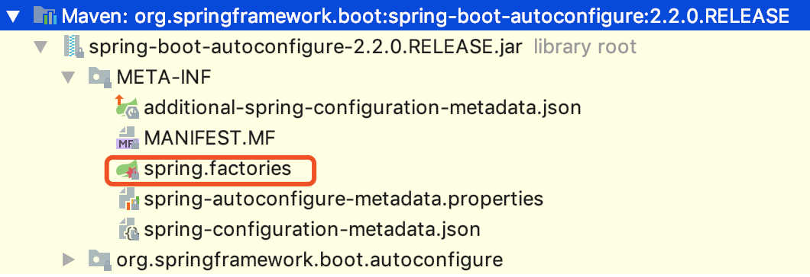
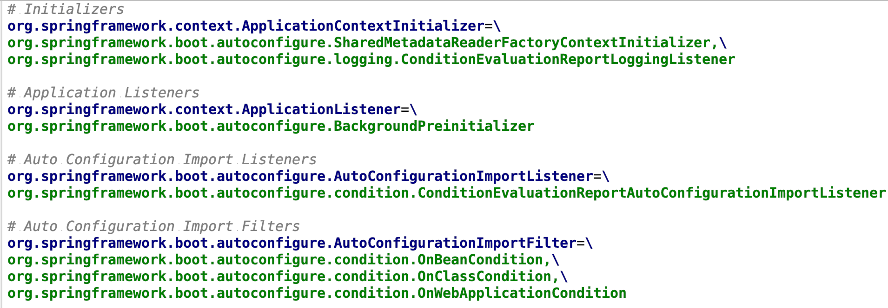
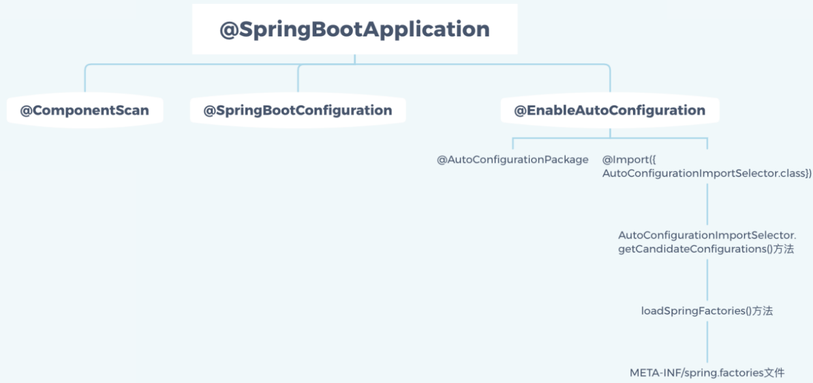

&emsp; springboot的自动配置，指的是只需要引用功能的包，相关的配置完全不用管，springboot会自动将一些配置类的bean注册进ioc容器，在需要的地方使用@autowired或者@resource等注解来使用它。  
### @SpringBootApplication
&emsp; @SpringBootApplication注解是Spring Boot的核心注解，它是一个组合注解：  

```java
@Target(ElementType.TYPE)
@Retention(RetentionPolicy.RUNTIME)
@Documented
@Inherited
@SpringBootConfiguration
@EnableAutoConfiguration
@ComponentScan(excludeFilters = {
        @Filter(type = FilterType.CUSTOM, classes = TypeExcludeFilter.class),
        @Filter(type = FilterType.CUSTOM, classes = AutoConfigurationExcludeFilter.class) })
public @interface SpringBootApplication {
...
}
```
&emsp; 重要的有三个Annotation：@SpringBootConfiguration、@EnableAutoConfiguration、@ComponentScan。  
### @ComponentScan  
&emsp; @ComponentScan，开启组件扫描，用于指定当前应用所要扫描的包，默认扫描SpringApplication的run方法里的Booter.class所在的包路径下文件，所以最好将该启动类放到根包路径下。  
&emsp; 注意，其仅仅是指定包，而并没有扫描这些包，更没有装配其中的类，这个真正扫描并装配这些类是@EnableAutoConfiguration完成的。  
&emsp; 源码：  

```java
@Retention(RetentionPolicy.RUNTIME)
@Target({ElementType.TYPE})
@Documented
@Repeatable(ComponentScans.class)
public @interface ComponentScan {
    
}
```
&emsp; 该注解有三个重要属性：  
* basePackages 属性：用于指定要扫描的组件包，若没有指定则扫描当前注解所标的类所在的包及其子孙包。  
* includeFilters 属性：用于进一步缩小要扫描的基本包中的类，通过指定过滤器的方式进行缩小范围。  
* excludeFilters 属于：用于过滤掉那些不适合做组件的类。  

### @SpringBootConfiguration  

```java
@Target({ElementType.TYPE})
@Retention(RetentionPolicy.RUNTIME)
@Documented
@Configuration
public @interface SpringBootConfiguration {
}
```
&emsp; SpringBootConfiguration其实就携带了一个@Configuration注解，代表自己是一个Spring的配置类，即@SpringBootConfiguration = @Configuration。  

### @EnableAutoConfiguration  
&emsp; @EnableAutoConfiguration使用@Import将所有符合自动配置条件的bean定义加载到IoC容器。  

```java
@SuppressWarnings("deprecation")
@Target(ElementType.TYPE)
@Retention(RetentionPolicy.RUNTIME)
@Documented
@Inherited
@AutoConfigurationPackage //自动配置包
@Import(EnableAutoConfigurationImportSelector.class)//自动配置导入选择
public @interface EnableAutoConfiguration {
    ...
}
```
&emsp; @AutoConfigurationPackage注解将主配置类（@SpringBootConfiguration标注的类）的所在包及下面所有子包里面的所有组件扫描到Spring容器中。  
&emsp; @Import({AutoConfigurationImportSelector.class})，开启自动配置，导入了AutoConfigurationImportSelector类。这个类中存在一个方法可以获取所有的配置，代码如下。  

```java
/*
  所有的配置都存放在configurations中，
  而这些配置都从getCandidateConfiguration中获取，
  这个方法是用来获取候选的配置。
*/
List<String> configurations = getCandidateConfigurations(annotationMetadata, attributes);
```

#### AutoConfigurationImportSelector.getCandidateConfigurations()方法：  
&emsp; 这个方法获取所有候选的配置，剔除重复部分，再剔除@SpringbootApplication注解里exclude掉的配置，才得到最终的配置类名集合。源码如下：  

```java
//*获取候选的配置*/
protected List<String> getCandidateConfigurations(AnnotationMetadata metadata, AnnotationAttributes attributes) {
    List<String> configurations = SpringFactoriesLoader.loadFactoryNames(this.getSpringFactoriesLoaderFactoryClass(), this.getBeanClassLoader());
    Assert.notEmpty(configurations, "No auto configuration classes found in META-INF/spring.factories. If you are using a custom packaging, make sure that file is correct.");
    return configurations;
}
```
&emsp; SpringFactoriesLoader.loadFactoryNames()方法，调用了本类中loadSpringFactories()方法来获取配置信息。  
##### loadSpringFactories()方法：  

```java
private static Map<String, List<String>> loadSpringFactories(@Nullable ClassLoader classLoader) {
    // 若缓存里有直接返回缓存的值
    MultiValueMap<String, String> result = (MultiValueMap)cache.get(classLoader);
    if (result != null) {
        return result;
    } else {
        try {
            // 类加载器对象存在则用这个加载器获取上面说的META-INF/spring.factories的资源，不存在则用系统类加载器去获取
            //当前classloader是appclassloader，getResources能获取所有依赖jar里面的META-INF/spring.factories的完整路径
            Enumeration<URL> urls = classLoader != null ? classLoader.getResources("META-INF/spring.factories") : ClassLoader.getSystemResources("META-INF/spring.factories");
            LinkedMultiValueMap result = new LinkedMultiValueMap();

            while(urls.hasMoreElements()) {
                URL url = (URL)urls.nextElement();// 遍历上述返回的url集合
                UrlResource resource = new UrlResource(url);// URL类可以获取来自流，web，甚至jar包里面的资源
                Properties properties = PropertiesLoaderUtils.loadProperties(resource);
                Iterator var6 = properties.entrySet().iterator();

                while(var6.hasNext()) {// 解析spring.factories
                    Entry<?, ?> entry = (Entry)var6.next();
                    String factoryTypeName = ((String)entry.getKey()).trim();
                    String[] var9 = StringUtils.commaDelimitedListToStringArray((String)entry.getValue());
                    int var10 = var9.length;

                    for(int var11 = 0; var11 < var10; ++var11) {
                        String factoryImplementationName = var9[var11];
                        // spring.facories中配置的不仅仅有自动配置相关的内容，还有其他比如ApplicationContextInitializer等各种springboot启动的时候，初始化spring环境需要的配置,自动配置只是其中一项。这个cache也是在springboot启动阶段就赋值的
                        result.add(factoryTypeName, factoryImplementationName.trim());
                    }
                }
            }

            cache.put(classLoader, result);
            return result;
        } catch (IOException var13) {
            throw new IllegalArgumentException("Unable to load factories from location [META-INF/spring.factories]", var13);
        }
    }
}
```
###### spring.factories、@ConditionOnxxx注解和spring.provides：  

&emsp; 自动配置都在spring-boot-autoconfigure.jar包中。  
  
&emsp; 里面包含了很多自动配置属性。  
  
&emsp; spring.factories中的配置，不是全量加载。例如：查看WebMvcAutoConfiguration源码，是否加载是通过@ConditionalOnClass注解进行判断条件是否成立来判断。  

```java
@Configuration(
        proxyBeanMethods = false
)
@ConditionalOnWebApplication(
        type = Type.SERVLET
)
@ConditionalOnClass({Servlet.class, DispatcherServlet.class, WebMvcConfigurer.class})
@ConditionalOnMissingBean({WebMvcConfigurationSupport.class})
@AutoConfigureOrder(-2147483638)
@AutoConfigureAfter({DispatcherServletAutoConfiguration.class, TaskExecutionAutoConfiguration.class, ValidationAutoConfiguration.class})
public class WebMvcAutoConfiguration {
    
}
```
### 总结：  
 
